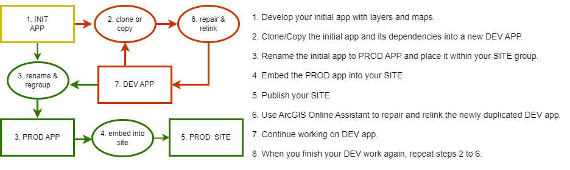
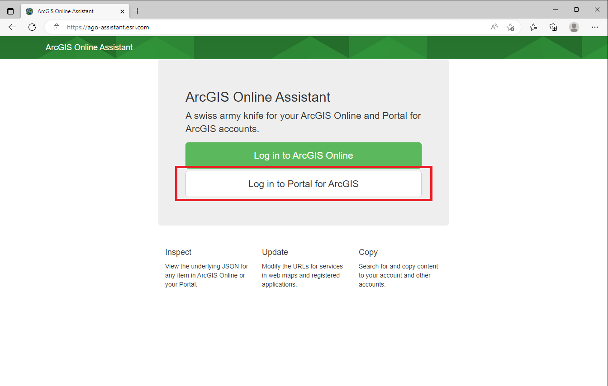
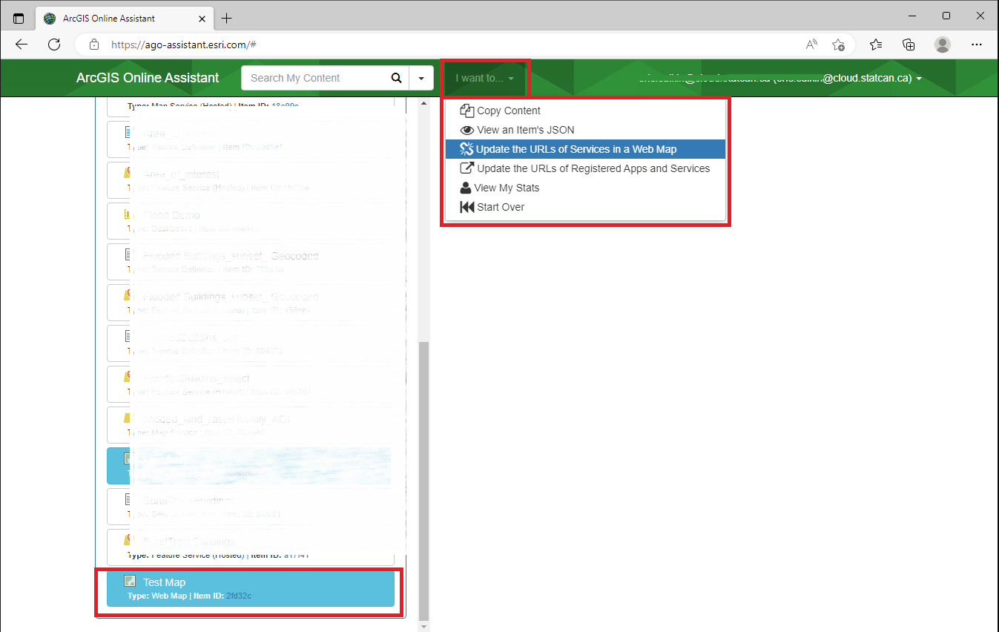
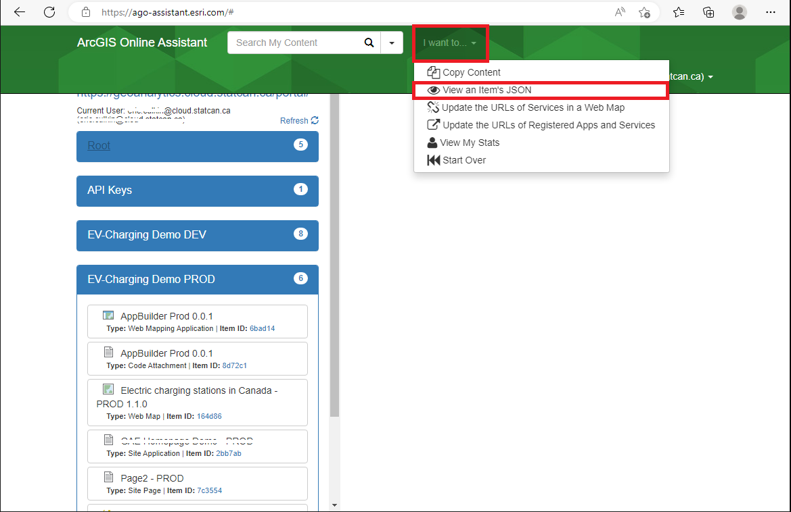
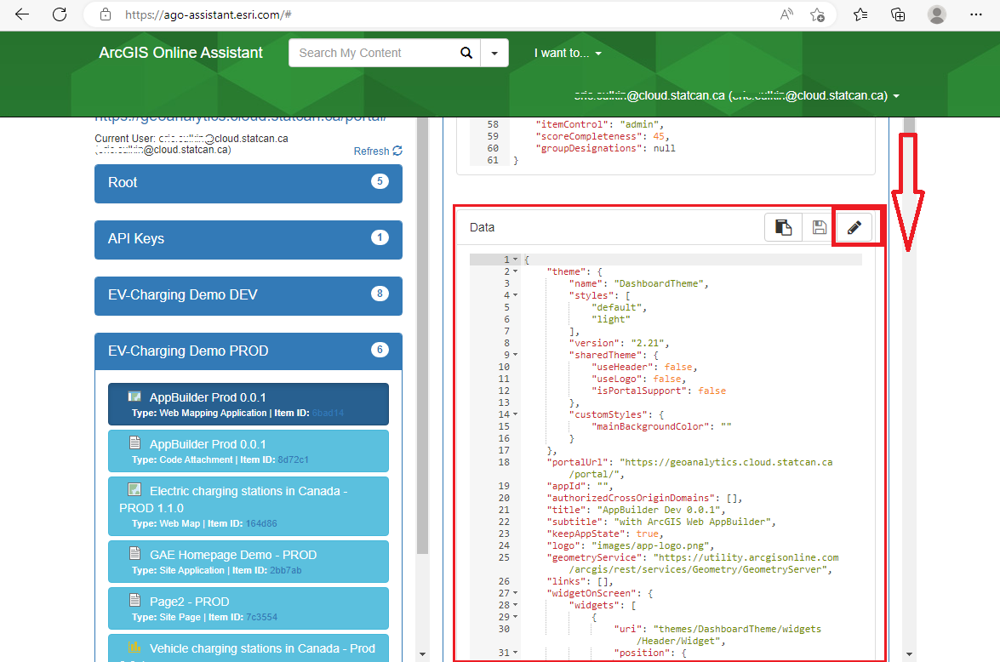
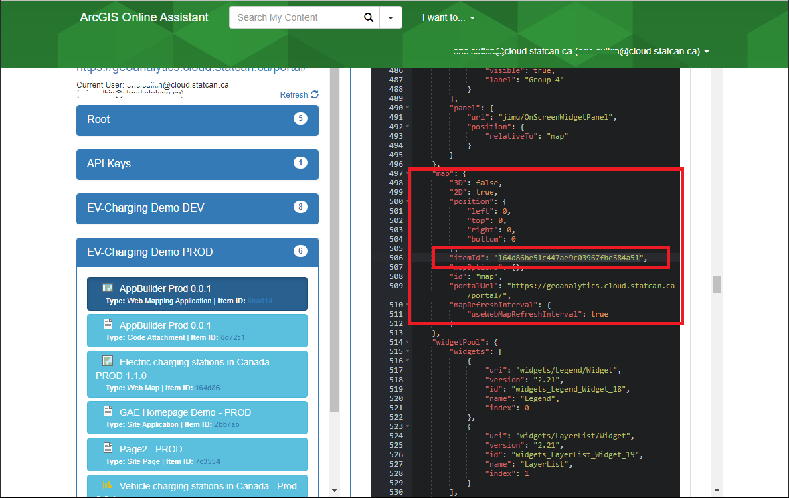

#Build and Share Spatial-Apps

??? success "Before you begin: ArcGIS Portal Intro"
	To create a web map in Portal, start by self-registering for an Enterprise account and then publishing data into the Portal. 
	For detailed instructions, refer to this page which provides a complete step-by-step guide: [GAE Storage- ArcGIS Portal](/portal)	

ArcGIS Enterprise offers a range of no-code apps that allow users to create and share interactive geospatial applications without coding skills. 

Both **Apps** and **Sites** are made from your published data-layers and maps.  The first step to creating an App/Site is to have you analysis completed, and all your layers and maps published.  	
	
>Data goes into Layers;
>>Layers go into Maps;
>>>Maps and Layers go into Apps;
>>>>Maps and Apps go into Sites (data can be downloaded from Sites). 
	
##No-Code Apps
These **Apps** enhance data visualization, and support data-driven decision-making. 

??? example "Creating Interactive Apps"

	To create an app, navigate to the **Content** tab in the main ribbon and click **My Content**. </br> There is a **Create app** button that will allow you to work with different types of interactive apps. 
		
	
	
	
	1. **Instant Apps**: Enables quick building and configuration of templated web apps with streamlined and customizable options.

	2. **Experience Builder**: Build and create engaging app experiences by combining maps, media, and other content with customizable layouts and themes.

	3. **StoryMaps**: Create narrative-driven stories by combining maps, text, images, and multimedia to engage and inform the audience.

	4. **Dashboards**: Visualize real-time data with dynamic charts, maps, and gauges to monitor key performance indicators and communicate insights effectively.

	- **Web AppBuilder**:warning: : Build web applications by configuring pre-built widgets and templates, with a drag-and-drop interface.
		
		:warning: *AppBuilder as part of ArcGIS Enterprise is considered deprecated. Although still available, users should switch to Experience Builder moving forward*

	- **Configurable Apps**:warning: :  Build web apps from your web maps, scenes, and groups without having to write code
		
		:warning: *Configurable Apps as although still available in Enterprise, uses JavaScript 3.x and should be avoided, Instant Apps is better*

	**Learn More: [Get started with apps—Portal for ArcGIS | Documentation for ArcGIS Enterprise](https://enterprise.arcgis.com/en/portal/latest/use/get-started-with-apps.htm)**

##No-Code Sites/Pages

**Sites** enables users to create interactive web pages and websites without coding, showcasing maps, data, and multimedia content with customizable templates and seamless integration.

??? quote "What is an Enterprise Site?"
	ArcGIS Enterprise Sites allows you to create a tailored web page experience to help you share your GIS products to others  more easily, even if they are not used to working in your GIS. Instead of learning to navigate the portal and access groups, consumers can go directly to the custom web page you create to navigate the content relevant to them.  Consumers will require a *Viewer* role.

	Sites features a built-in web page designer that integrates a drag-and-drop experience with HTML markup, giving you absolute control over the design of the web pages you create. You can also add non-GIS content, such as videos and documents, to your Site to create a central place for material relevant to your users to be hosted and accessed.
		
	Users more familiar with ArGIS Online deployment/portal will known this feature as *Hubs*

??? example "Creating an Enterprise Site" 

	**To Begin:**
	
	To request (initialize) a Site, contact the DAS-GAE team via the Jira Board.  [How to submit a technical request or report a problem](/english/faq/). 

	Please include what you would prefer the URL to be.  The URL will be formatted as:
		```https://geoanalytics.cloud.statcan.ca/portal/apps/sites/#/{YOUR_CHOSEN_URL}```

	Along with your Site, 2 groups will be created.  One for editors, and one for viewers only.  These groups will control who has access to your site, and which items they can interact with.

	**Once your site is initialized:**
	
	1. Access the ArcGIS Sites application.
	2. Choose a template or layout that suits your needs.
	3. Customize the site by adding maps, data, multimedia content, and text.
	4. Configure the appearance of the site by selecting colors, fonts, and branding elements.
	
		>ESRI leverages a custom theme and build of the Bootstrap(3) system for page design.  
		Knowledgeable users who want to use custom HTML in the SiteApp should reference this resource: [Calcite Bootstrap Theme by ESRI](http://esri.github.io/calcite-bootstrap/index.html)
			
	5. Embed additional ArcGIS content such as maps, apps, and dashboards if desired.
	6. Preview and review the site to ensure it meets your requirements.
	7. Publish the site to make it accessible to others.
	8. Share the site URL or embed it on other web pages to reach your intended audience.

##Working with Multiple Versions (DEV-PROD)  

Creating separate test and production workspaces can provide significant benefits to project, including improving their development processes, reducing risk, and enhancing the reliability and security of their systems. 

However, physical separation of dev-test-prod workspaces is not feasible on DAS. Nonetheless, GAE can help by creating separate groups that emulate separate workspaces. Since each project has unique needs, there is no one-size-fits-all solution. 

??? info "Typical process flow"
	

	If you are using an ArcGIS Site to share your app, the workflow will typically look like this:
	
	<br>
	

	Users can use the ArcGIS Online Assistant to repair/relink layers and maps as needed.  See the next section for advice on using the tool.  **It is essential to follow best practices, especially in naming and data organization when working with multiple workspaces.**

??? abstract "Replacing a layer within an Web Map"

	There may be a scenario where you want to replace a layer in a map with an updated version or a replacement dataset.  There are several ways to accomplish this, one of the easier methods is using the **[ArcGIS Online Assistant](https://ago-assistant.esri.com/)**

	???Warning "Proceed with Caution!"
		Changing a layer in an existing map may have unintended consequences. App Widgets and controls linked to the map might break and need to be reconfigured.  Ensuring layer names and table headers match old versions will help keep compatibility, but there is no guarantee.  
		<br>  
		**Risks include: Corrupting content, losing access to items, breaking apps built ontop of the map.**

	1. Log in to Portal for ArgGIS
	

	2. Enter the Portal URL https://geoanalytics.cloud.statcan.ca/portal ,and, your APP ID (API Key) from the ArcGIS Portal
	

	3. A pop-up window will appear, **select StatCan Azure Cloud Login**
	

	4. In the Assistant Home page, **Select the folder** where you map is saved on the Portal
	

	5. Select **I want to**, then **Update the URLs of Services in a Web Map**
	
		
	6.In the *Find* file, enter the URL of the old layer you want to replace.  In *replace* enter the new URL. Scroll down and select **Update** Then wait for the *Success* message.	
	

	??? info "Where to find the Feature Service URL"
		The URL Can be found in the Portal, on the Feature Services Overview Page:
	

	The data in your map will now reflect the new service.  You will may need to adjust the *Name* of the layer on your map, as it will reflect the origina layer.

	For those who prefer to do things via Python API; [follow these instructions provided by ESRI](https://enterprise.arcgis.com/en/portal/10.8/administer/linux/example-update-the-url-of-a-service-in-a-web-map.htm)

??? Abstract "Replacing a Web Map within a Web App" 

	???Warning "Proceed with Caution!"
		Changing a map in an existing web app may have unintended consequences. Widgets and controls might break and need to be reconfigured.  Ensuring layer names and table headers match old versions will help keep compatibility, but there is no guarantee.  DAS-GAE recommends experimenting on a demo/copied app first.
		<br>
		**Risks include: Corrupting content, losing access to items, breaking apps built ontop of the map.**

	There may be a scenario where you want to replace a web map with a new map in an already built web app.  We will walk you through how to do this using the AGO Assistant.  We will use the same ArcGIS Online Assistant tool as above, but with a different workflow.

	1. Log in to Portal for ArgGIS
	

	2. Enter the Portal URL https://geoanalytics.cloud.statcan.ca/portal ,and, your APP ID (API Key) from the ArcGIS Portal
	

	3. A pop-up window will appear, **select StatCan Azure Cloud Login**
	

	4. In the Assistant Home page, **Select the folder** where you map is saved on the Portal
	

	5. From the *I want to...* button, **select View an Item's JSON**, then select the desired app from the highlighted list.  The JSON data will appear on the right.
	

	6. **Scroll down** on the JSON data pane, to the *Data* category, and **Select the Edit icon**.  The data tile will turn to dark-mode, signifying it is in edit mode.
	

	7. In the data tile, **locate the *map* attribute, and replace the *itemID* field with the new maps ID. 
	

		???info "How to find a Map Id"
			The Map Id can be obtained by visiting the Map's overview page, and copying it from the URL
			
		

	8. Scroll up to the beginning of the data tile and **select Save**.  
	Confirm the changes in your app, and reconfigure widgets as needed.  

??? abstract "Cloning with the API"
	??? warning "Proceed with Caution: CLONE vs COPY"
		This clone method does not always work.  Some dataset, layers, items, etc, will be COPIED instead of CLONED. Copies reference back to the original item, pay close attention to the items ID.  It will **NOT** work for 'map image layers'.

	```python
	# Connect to the source portal
	source_gis = GIS("https://geoanalytics.cloud.statcan.ca/portal", client_id='')

	# Connect to the destination portal
	target_gis = GIS("https://geoanalytics.cloud.statcan.ca/portal",client_id='')

	# Get source content
	item_id = source_gis.content.get("#################")
	
	# Clone the item to the target portal
	cloned_item = target_gis.content.clone_items(items=[item_id], copy_data=True)
	```
