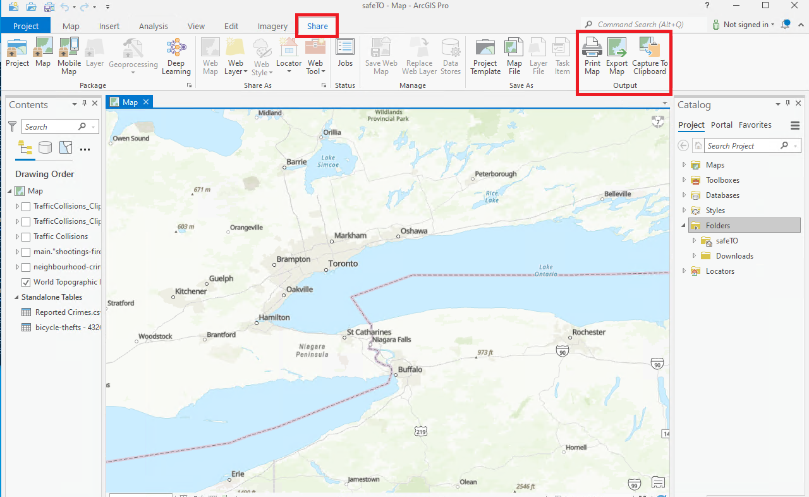

##ArcGIS Pro Static Maps Overview

In ArcGIS Pro, you can create static maps by exporting the current view or layout to a static image format, such as PNG, JPEG, or TIFF. This allows you to capture and save a snapshot of the map display without the need for interactive functionality. Here's how you can generate static maps in ArcGIS Pro:

??? Example "View-based static maps"
	To create a static map based on the current view in the map window, follow these steps:

	1. Navigate to the desired extent, zoom level, and map layers in the map window.
	2. Go to the "Share" tab in the ribbon.
	3. Click on the "Map" button in the "Export" group.
	
	4. Specify the export settings, such as image format, resolution, output location, and file name.
	5. Click "Export" to generate the static map image based on the current view.

??? Example " Layout-based static maps"
	If you have a map layout set up with specific elements, such as title, legend, and scale bar, you can export the layout as a static map using the following steps:

	1. Switch to the "Layout" view in ArcGIS Pro.
	
	2. Arrange and design the map elements and components in the layout.
	3. Go to the "Share" tab in the ribbon.
	4. Click on the "Layout" button in the "Export" group.
	5. Specify the export settings, such as image format, resolution, output location, and file name.
	6. Click "Export" to generate the static map image based on the configured layout.
	
	Adjusting Map Layout
	
	1. Switch to the Layout view in ArcGIS Pro.
	2. Add and position the map frame to define the area where the map will be displayed.
	3. Insert additional elements such as titles, legends, scale bars, north arrows, and other annotations as needed.
	4. Use the layout tools to align and arrange the map elements for a visually pleasing composition.
	5. Adjust the size and position of the elements to create a balanced and organized layout.

ArcGIS Pro offers more advanced capabilities such as customizing symbology, labeling, and other cartographic elements. You can leverage the styling options to create visually appealing and informative static maps.

??? Example "Customizing Symbology"
	1. Select the desired map layer in the Table of Contents pane.
	2. Right-Click to access the Symbology tab in the Layer Properties pane.
	3. Choose the appropriate symbology type (e.g., Simple Fill, Unique Values, Graduated Colors).
	4. Configure the symbology properties such as color, size, outline, transparency, and other relevant options.
	5. Preview and refine the symbology until you achieve the desired representation of your data.

??? Example "Configuring Labels"
	1. Select the desired map layer in the Table of Contents pane.
	2. Access the Labeling tab in the Layer Properties pane.
	3. Enable labeling for the layer and specify the attribute or expression to be used for labeling.
	4. Customize the label placement, font styles, and other visual properties.
	5. Use advanced options to control label visibility, label priority, and collision avoidance.
	6. Preview and fine-tune the labels until they are legible and provide valuable information.

##ArcGIS Web Maps Overview

Web maps in ArcGIS Portal (Enterprise) enable users to explore, analyze, and share spatial information. By creating web maps, users can organize data layers, customize symbology, and configure interactive behaviors. 

Features include customizable symbology, layer visibility control, configurable pop-ups, bookmarks for navigation, and collaboration tools. Web maps are powerful tools for analyzing and communicating geospatial information effectively.

??? success "Before you begin: ArcGIS Portal Intro"
	To create a web map in Portal, start by self-registering for an Enterprise account and then publishing data into the Portal. 
	For detailed instructions, refer to this page which provides a complete step-by-step guide: [GAE Storage- ArcGIS Portal](portal.md)

??? example "Creating Web Maps"

	1. Click the 'Map' tab in the GAE Portal.

	2. Click on the "Add layer" button to add data layers from various sources, such as your portal content, online services, files, or by searching for available data.

	3. Configure Layer Properties: Once you have added the data layers, you can configure their properties, such as symbology, labeling, and pop-ups, to customize their appearance and behavior on the map.

	4. Perform Map Styling: Use the available tools and options in the Map Viewer to style and enhance your map. This includes changing basemaps, adjusting the extent and scale, setting the map layout, and applying other cartographic elements.

	5. Add Additional Elements: Enhance your map by adding additional elements such as legends, scale bars, north arrows, titles, or text annotations. These can be inserted using the Map Viewer's interface.

	6. Save and Share: Once you are satisfied with your map, save it in your ArcGIS Enterprise portal. Give it a meaningful name and provide any necessary tags or descriptions. You can also choose to share the map with specific individuals or groups within your organization or make it publicly accessible.

**Learn More about WebMaps**: 
[Get started with Map Viewer—Portal for ArcGIS | Documentation for ArcGIS Enterprise](https://enterprise.arcgis.com/en/portal/latest/use/get-started-with-mv.htm)