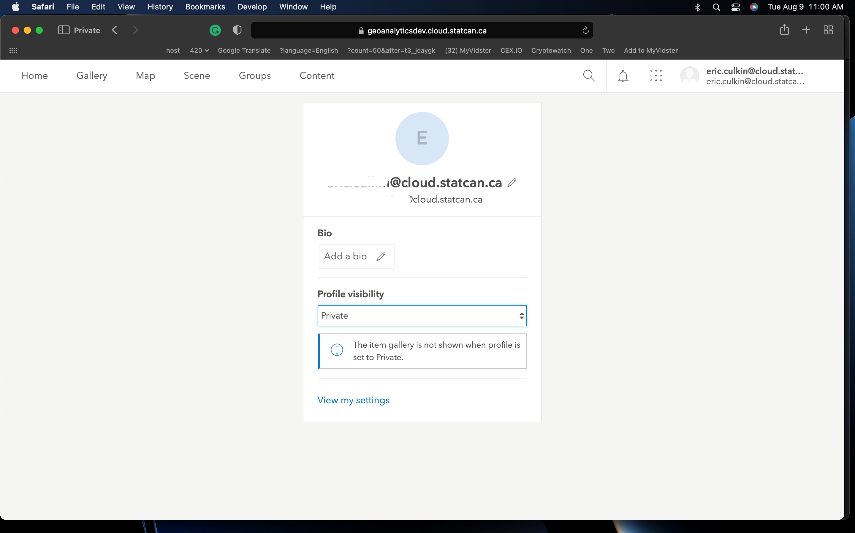

## Becoming a User

??? Success "Register and Create Account"
	1. Visit **[DAaaS GAE Enterprise Portal](https://geoanalytics.cloud.statcan.ca)** to sign on to the ArcGIS Enterprise Portal

	2. Select the *StatCan Azure Login* button

		

	3. If your password was not remembered by Azure you will be asked to enter it and verify by phone

		 

	4. You will then be presented with this screen:
		


	5. For security reasons, your default role will be *Viewer Only*. Contact the DAaaS Geo Team to have your permissions adjusted.
	See the **[Contact](contact.md)** section for help on how to contact DAS-GAE
 

??? info "About User Roles"
	You will be assigned either a *Project Viewer* or *Project Member* user role depending on your needs. 

	- **Project Viewer**<br/>
	  View items such as maps, apps, scenes, and layers that have been shared with the public, the organization, or a group to which the member belongs. Join groups owned by the organization. Drag CSV, text, or GPX files into Map Viewer Classic (formerly Map Viewer) to geocode addresses or place names. Get directions in a map viewer and apps. Members assigned the Viewer role cannot create or share content, or perform analysis.

	- **Project Member**<br/>
	  Project Viewer privileges plus the ability to create, update and delete their own content. Users can publish hosted feature layers, hosted tile layers, hosted scene layers, and server-based layers. Share content to assigned groups. Create content such as Maps (including feature analysis tasks), Dashboards, Apps, and Story Maps.  


??? info "About Your Groups"
	The groups you belong to are where you can collaborate with other users on the same project or team. In the main header, click Groups. This is where you can see the groups you have been added to. 
	
	Click on the group name to see all the shared content.

	You may notice there are two groups for the same project. These two groups cater to different user roles, ensuring efficient collaboration and controlled access to data within the ArcGIS portal.
	  
	The first group, **Editors** is designated for members who have editing privileges. This means they are granted the ability to modify and update the items within the group. They can add, edit, or delete content, as well as make changes to existing items. 
	  
	The second group, **Viewers** is a view-only group. Its members have restricted permissions and are limited to viewing the items available in the group. They can explore and access the content, but they do not possess the authority to make any alterations or edits. 


## Uploading/Publishing Content

??? example "Uploading from ArcGIS Pro"
	Please refer to this section:[ArcGIS Pro- Sharing Results](pro.md#sharing-results)

??? example "Uploading Content using Portal Interface"
	Shapefiles and File Geodatabases are the most common files that will be uploaded to the Portal. However a full list of supported items can be found by clicking the question mark as seen in the figure below.<br/>

	Click the Content tab and under My Content, click Add Item. Select From your computer. Select Choose File and navigate to the zipped folder of the content you want to upload. Ensure the correct file types is selected from the drop down menu and Publish this file as a hosted layer is selected. Assign the content a title and tags. Click Add Item.<br/>

	Note: Selecting Publish this file as a hosted layer will also publish the content as a hosted layer that can be used and shared between your group members. If the option is not selected, then the file itself (ex. File Geodatabase) will be uploaded and available for download by other group members but not useable by group members until it has been published as a hosted layer. 
	

	Similar steps can be followed to upload content via a URL to a layer or document on the web, or a URL to an application on the web.<br/>

	Content can also be uploaded directly to a Web Map using the same means as outlined above. 

	**Learn More: [ArcGIS Portal; Add Items](https://enterprise.arcgis.com/en/portal/latest/use/add-items.htm)**

??? example "Publishing Content- Portal Upload"
	1. Items can be published directly from your files as seen in the Uploading Content section. 
	2. If the item file is directly uploaded to the portal such as a shapefile or geodatabase, the user can manually publish the item 
	
	3. Items can also be directly imported into a Web Map (see Web Map section for more information) and published to the portal individually.  
	

	**Learn More: [ArcGIS Portal; Publishing](https://enterprise.arcgis.com/en/portal/latest/use/data-publishing-and-enterprise.htm)**


??? example "Via API"

	Your project group will be provided with a Client ID upon onboarding which will be used to connect to the ArcGIS Enterprise Portal. Paste the Client ID in-between the quotations. 

	###Connecting
	```python
		gis = GIS("https://geoanalyticsdev.cloud.statcan.ca/portal", client_id=' ')
		print("Successfully logged in as: " + gis.properties.user.username)
	```
	The output will redirect you to a web page where you can login to the Portal using the StatCan Azure Login option. After successful login, you will recive a code to sign in using SAML. Paste this code into the output. 

	


	###Uploading Content
	```python
		# Define the path to the file you want to upload
		file_path = "/path/to/your/file"

		# Upload the file to your ArcGIS Enterprise instance
		item_properties = {"title": "My Uploaded File", "tags": "file, upload"} # replace with your desired item properties
		item = gis.content.add(item_properties, data=file_path)

		# Print out the URL of the uploaded item
		print("Uploaded item URL: {}".format(item.url))
		```
		
		[Learn More about the API; ESRI Documentation](https://developers.arcgis.com/python/)

??? tip "Best Practices"
	- Items should only be shared to your group. Do not share to the enterprise or public level.

	- Use many appropriate tags - this is how most people will find your work. 

	- Use common tags for items that are related.

	- Organize content: Use a structured and logical system to organize content in the portal. This can include creating folders, groups, and categories to make it easier for users to find and access content.

	- Use metadata: Include comprehensive metadata for all items in the portal to make it easier for users to discover, understand, and use the content

	- Use a Naming Convention
		- Use *Semantic Versioning*
			- A three-part version number (Major.Minor.Patch)
			- ex: My Map v1.2.4,  EV_Viewer_App DEV v0.0.2
			- add a *Last Updated:* attribute to the details in the item's overview page 
