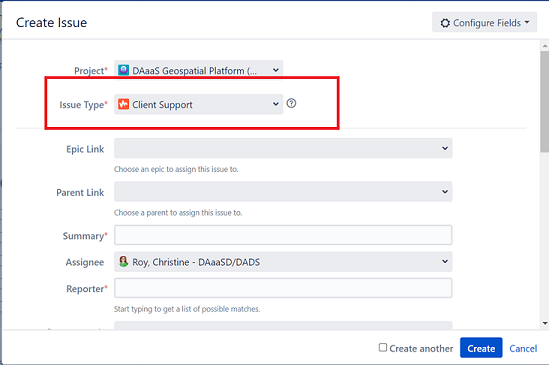

#Contact DAS Customer Success Team

For business and onboarding inquiries, or to receive technical support:

**statcan.dassupport-soutiendelads.statcan@statcan.gc.ca**
	

??? abstract "Internal - Statistics Canada Employees" 
	<b>How to submit a technical request or report a problem </b>
	For technical support please submit a ticket via Jira:

	1. Open Statistics Canada Jira software: [DAS Support (DASSR)](https://jirab.statcan.ca/projects/DASSR/summary)
	2. From the Menu Bar, select the button **Create**:
		
	3. In the Jira Create Issue Window, Select the Issue Type = **Client Support**:
		
	4. In the Jira Create Issue window, enter the information related to your request:
		- **Summary** (mandatory): Type a short summary definition of you request
		- **Assignee** (mandatory): Select “automatic”
		- **Component** (mandatory): Select “GAE”
		- **Description** (mandatory): Type a detailed description of your request.
		- **Attachment** (optional): Supporting documentation relating to your request (ex: screen caps of errors)
		
	DAS Support will complete the rest of information in the jira ticket if necessary.  You will receive updates about the ticket via email. 

---

<!-----------------------------------section needs work-------------------------------------------------------

			## How to Amend your DAS Project Requirements 

--------------------------------------------------------------------------------------------------------------->

More DAS Contacts:

- [DAS Portal Homepage](https://www.statcan.gc.ca/data-analytics-services/overview)

- [Advanced Analytics Workspace (AAW) Guidebook](https://statcan.github.io/aaw/)

- [AAW Slack Channel](https://app.slack.com/client/T013KCYQB4G)

- [Collaborative Analytics Environment (CAE) Guidebook](https://statcan.github.io/cae-eac/)

- [CAE Slack Channel](https://app.slack.com/client/T013XR48YDQ)

