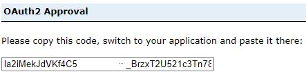

# Leveraging GAE from within AAW or CAE; <br> *Cross-Platform Analysis*

??? quote "What is AAW?"
	The Advanced Analytics Workspace (AAW) provides emerging state-of-the-art open source analytics and artificial intelligence tools, and compute capacity for modern data science workloads. <br>
	AAW has a focus on Open Source products and services.
	
	
??? quote "What is CAE"
	The Collaborative analytics Environment (CAE) provides cloud services for data ingestion, transformation and preparation, as well as data exploration and computation. It includes tools for collaborative analytics, machine learning environments, and data visualization capabilities. <br>
	CAE has a focus on Azure Cloud Native products.
	
??? success "Prerequisites"
	1) An onboarded project in both spaces (AAW and/or CAE, ___AND___, GAE)<br>
	2) An ArcGIS Portal Client Id (API Key)

## Connecting to Spatial Data - GAE Enterprise Portal
The ArcGIS Enterprise Portal can be accessed in either the AAW or CAE using the API, from any service which leverages the Python programming language. 

For example, in AAW and the use of [Jupyter Notebooks](https://statcan.github.io/aaw/en/1-Experiments/Jupyter/) within the space, or in CAE the use of [Databricks](https://statcan.github.io/cae-eac/en/DataBricks/), DataFactory, etc.


??? example "Connecting to GAE Portal using ArcGIS API"
	1. Install packages:

		```python
		conda install -c esri arcgis
		```

		or using Artifactory

		```python
		conda install -c https://jfrog.aaw.cloud.statcan.ca/artifactory/api/conda/esri-remote arcgis
		```

	2. Import the necessary libraries that you will need in the Notebook.
		```python
		from arcgis.gis import GIS
		from arcgis.gis import Item
		```
		
	3. Access the Portal
		Your project group will be provided with a Client ID upon onboarding. Paste the Client ID inbetween the quoatations ```client_id='######'```. 
		
		```python
		gis = GIS("https://geoanalytics.cloud.statcan.ca/portal", client_id=' ')
		print("Successfully logged in as: " + gis.properties.user.username)
		```

	4. - The output will redirect you to a login Portal.
		- Use the StatCan Azure Login option, and your Cloud ID 
		- After successful login, you will receive a code to sign in using SAML. 
		- Paste this code into the output. 

		

<!---I don't think this section below is needed:

### Display user information
Using the 'me' function, we can display various information about the user logged in.
```python
me = gis.users.me
username = me.username
description = me.description
display(me)
```

--->


??? example "Search for your Content"
	**search() method**
	The search() method is used to retrieve a collection of items that match specific search criteria. It allows you to search for items based on various parameters such as keywords, item types, owners, tags, groups, and more. The search() method returns a list of items that match the specified search criteria. This method is useful when you want to retrieve multiple items that meet certain conditions.
	
	There are multiple ways to search for content depending on the amount of metadata you have filled out for your item. [Learn more about .search method here](https://developers.arcgis.com/python/api-reference/arcgis.gis.toc.html#arcgis.gis.ContentManager.search) 
	

	??? example "Search all of your items in the Portal"
		```python
		# Get the currently logged-in user
		me = gis.users.me

		# Retrieve all the items owned by the user
		my_content = me.items()

		# Print the collection of user's items
		my_content
		```
	??? example "Search content by name"	
		```Python
		# Search for items by title
		search_results = gis.content.search(query="Your Title")

		# Iterate over the search results
		for item in search_results:
		print(f"Title: {item.title}, ID: {item.id}")
		```
		
	??? example "Search content by tag"
		```python
		# Search for items by tags
		search_results = gis.content.search(query="", tags="your_tag")

		# Iterate over the search results
		for item in search_results:
			print(f"Title: {item.title}, ID: {item.id}")
		```
		
	??? example "Search content by group"
		```python
		# Specify the group ID or group name you want to search within
		group_id = "your_group_id_or_name"

		# Search for items within the specified group
		search_results = gis.content.search(query="", inGroup=group_id)

		# Iterate over the search results
		for item in search_results:
			print(f"Title: {item.title}, ID: {item.id}")
		```

??? example "Get Content (fetch/retrieve)"
	**get() method**
	
	The get() method is used to retrieve a specific item by its unique item ID. You provide the item ID as an argument to the get() method, and it returns the item with that particular ID. This method is useful when you already know the exact item ID and want to retrieve that specific item.
	
	The efficent way to retrieve content is by using the items ID:
	```Python
	# Retrieve a specific item by its ID
	item_id = "your_item_id"
	item = gis.content.get(item_id)
	```
	
	It is also possible to *.get* the content from a list created during searching (like above), however, this can become convoluted when conducting multiple searches, just be careful with your syntax.
	```python
	#from list of search results 
	item1 = gis.content.get(my_content[5].id) #[5] = index number of search 
	display(item1)
	```
## Working with Spatial Data
The choice between ArcGIS and open-source tools for spatial data depends on your specific needs and available resources. ArcGIS offers specialized functionality and support, while open-source tools are free and customizable. Consider your requirements and available expertise to make an informed decision. In some cases, a hybrid approach may be suitable, where you can leverage the strengths of both ArcGIS and open-source tools depending on the task at hand.

??? example "Convert Feature Service to Spatially Enabled DataFrame (open source)"
	Conversion of an ArcGIS feature layer into a Pandas DataFrame with spatial capabilities using the pd.DataFrame.spatial.from_layer() method.
	```python
	import pandas
	
	# Get the feature service item
	item = gis.content.get(item_id)

	# Access the feature layer within the feature service
	feature_layer = item.layers[0]
	
	#Convert
	sdf = pd.DataFrame.spatial.from_layer(feature_layer)
	```
	
??? example "Convert Feature Service to GeoDataFrame (open source)"
	Conversion of an ArcGIS feature layer into a Pandas DataFrame with spatial capabilities using the pd.DataFrame.spatial.from_layer() method.
	```python
	import geopandas as gpd
	
	# Assuming you have the item ID of the feature service
	item_id = "your_item_id"

	# Get the feature service item
	item = gis.content.get(item_id)

	# Access the feature layer within the feature service
	feature_layer = item.layers[0]

	# Query the feature layer to retrieve all features
	features = feature_layer.query().features

	# Convert the features to a GeoDataFrame
	gdf = gpd.GeoDataFrame.from_features(features)
	```

<!---
??? "Update Items"
By getting the item as we did similar to the example above, we can use the '.update' function to update exisiting item within the DAaaS GEO Portal. We can update item properties, data, thumbnails, and metadata.
```python
item1_buffer = gis.content.get('c60c7e57bdb846dnbd7c8226c80414d2')
item1_buffer.update(item_properties={'title': 'Enter Title'
									 'tags': 'tag1, tag2, tag3, tag4',
                                     'description': 'Enter description of item'}
```
--->

??? example "Publish a Spatial DataFrame as a Feature Service to GAE Portal"
	```python
	#sdf = your spatial dataframe
	
	item_properties = {'title': '<title name>', 'tags': '<tag>', 'description': '<this is my item description>'}
	published_item = gis.content.import_data(sdf, item_properties=item_properties)
	published_item.publish()

	# Retrieve the item ID and URL of the published feature service
	item_id = published_item.id
	feature_service_url = published_item.url

	# Print the item ID and URL
	print("Item ID:", item_id)
	print("Feature Service URL:", feature_service_url)
	```
	
## Visualize Your Data on an Interactive Map
To visualize the map widget within different python based tools, you may need to leverage tool-specific display functions and or widgets. For example, in Databricks use the %python magic command to switch to Python mode before creating and displaying the map widget.

??? Example "ArcGIS Map Module"
	```python
	from IPython.display import display

	# Retrieve the feature service item
	item = gis.content.get("feature_service_item_id")

	# Create a map widget
	map_widget = MapView()

	# Add the feature service layer to the map
	map_widget.add_layer(item.layers[0])

	# Display the map widget using Databricks-specific display function
	display(map_widget)
	```

??? Example "MatplotLib Library"
	```python
	import matplotlib.pyplot as plt
	# Convert the spatial dataframe to a GeoDataFrame (if needed)
	gdf = gpd.GeoDataFrame(sdf)

	# Create a figure and axis
	fig, ax = plt.subplots()

	# Plot the GeoDataFrame
	gdf.plot(ax=ax)

	# Display the plot
	plt.show()
	```

??? Example "ipyleaflet Library"
	```python
	from ipyleaflet import Map, GeoData

	# Assuming you have a GeoDataFrame called 'gdf'

	# Create a map
	m = Map(center=(gdf.geometry.centroid.y.mean(), gdf.geometry.centroid.x.mean()), zoom=10)

	# Create a GeoData layer from the GeoDataFrame
	geo_data = GeoData(geo_dataframe=gdf)

	# Add the GeoData layer to the map
	m.add_layer(geo_data)

	# Display the map
	m
	```
	
---

**Learn More about the ArcGIS API for Python**:
[Full documentation for the ArGIS API](https://developers.arcgis.com/python/)

**Learn More about DAS AAW**:
[AAW Help Guide](https://statcan.github.io/aaw/) 

**Learn More about DAS CAE**:
[CAE Help Guide](https://statcan.github.io/cae/) 
