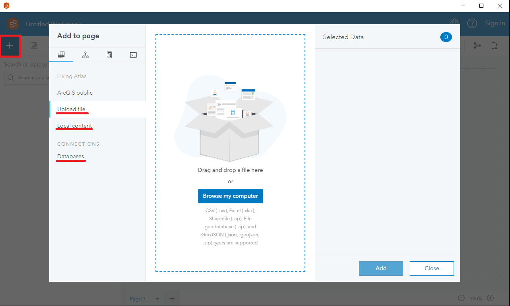
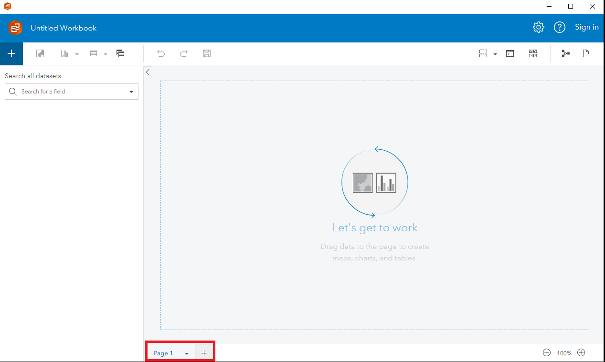

# Insights, Desktop and Portal

??? tip "This Feature is still under exploration"
	 As GAE continues to explore and learn about this product, we are excited about the possibilities it offers to improve our ability to derive insights from data.
	   
	
	 With more experience using Insights, we will be able to take advantage of its advanced capabilities and features to better support our work and deliver more value to Canadians.
	   
	 Learn with us! Share your knowledge!
	
	
<iframe width="560" height="315" src="https://www.youtube-nocookie.com/embed/40uI1zel6eo" title="YouTube video player" frameborder="0" allow="accelerometer; autoplay; clipboard-write; encrypted-media; gyroscope; picture-in-picture" allowfullscreen></iframe>
> Not loading? : https://www.youtube-nocookie.com/embed/40uI1zel6eo

---

##Information 

ArcGIS Insights is a powerful data analysis and visualization tool developed by Esri. ArcGIS Insights is available in two different versions: ArcGIS Insights Desktop and ArcGIS Insights Portal,and, there are some key differences between the two.

ArcGIS Insights Desktop is a standalone application. It provides users with a powerful suite of data analysis and visualization tools that can be used to explore data, create maps and charts, and perform complex spatial analysis. Insights Desktop is designed for individual users or small teams who need to analyze data and create reports locally, without relying on a network connection.

On the other hand, ArcGIS Insights Portal is a web-based version of the software that is hosted in the cloud. Insights Portal is designed for larger organizations that need to share data and analysis tools across multiple teams or departments. Insights Portal provides users with access to the same powerful data analysis and visualization tools as Insights Desktop, but with the added benefit of a centralized data repository and collaboration features that allow teams to work together on data analysis projects.

In summary, both ArcGIS Insights Desktop and ArcGIS Insights Portal are powerful data analysis and visualization tools that offer similar functionality. However, Insights Desktop is designed for individual users or small teams who need to work locally, while Insights Portal is designed for larger organizations that need to share data and analysis tools across multiple teams or departments.

## Analysis Examples
Here are some examples of data analysis tasks you can perform in ArcGIS Insights:

-	**Spatial Analysis**: You can use ArcGIS Insights to perform a wide range of spatial analysis tasks, including spatial clustering, proximity analysis, and more. For example, you can use the "Find Nearest" function to find the nearest locations to a given location, or use the "Spatial Aggregation" function to aggregate your data by location.

-	**Time Series Analysis**: You can use ArcGIS Insights to analyze time series data, including trends, seasonality, and more. For example, you can use the "Time Series Visualization" card to visualize your time series data, or use the "Time Series Forecasting" function to forecast future trends.

-	**Statistical Analysis**: You can use ArcGIS Insights to perform a wide range of statistical analysis tasks, including hypothesis testing, regression analysis, and more. For example, you can use the "Correlation Matrix" card to visualize the correlations between your variables, or use the "Linear Regression" function to perform a regression analysis.

-	**Data Mining**: You can use ArcGIS Insights to perform data mining tasks, including association analysis, clustering, and more. For example, you can use the "Association Rules" function to find patterns in your data, or use the "K-Means Clustering" function to cluster your data.

Overall, ArcGIS Insights is a powerful data analysis tool that can be used to analyze and visualize a wide range of spatial and non-spatial data. 

##Instructions

Here are some instructions on how to use ArcGIS Insights for data analysis:

1.	Create a New Workbook: To start using ArcGIS Insights, you need to create a new workbook. Click on the "New Workbook" button on the Insights homepage, or click on "File" > "New Workbook" in the top menu.

2.	Connect to Data: The next step is to connect to your data. Insights supports a wide range of data sources, including spreadsheets, databases, and ArcGIS Online/Enterprise. Click on "Connect to Data" to access your data sources.

3.	Create a New Page: Once you have connected to your data, you can start creating pages to analyze and visualize your data. Click on "New Page" to create a new page.

4.	Drag and Drop Data: To start analyzing your data, drag and drop your data onto the page. Insights will automatically create cards to visualize your data. You can choose from a variety of card types, including maps, charts, tables, and more.

5.	Filter and Summarize Data: You can filter and summarize your data by adding filters and summaries to your cards. For example, you can filter your data by date, location, or other attributes, and summarize your data by counting, averaging, or other statistical measures.

	You can also filter the original dataset:

	A card filter only affects the card and creates a filtered dataset while the original, unfiltered dataset is still available for use in your analysis. When you apply a filter to a dataset, no new dataset is created. All cards that use the filtered dataset change to include the filter.

6.	Create Relationships: Insights allows you to create relationships between your data sources, which can help you analyze and visualize your data more effectively. Click on "Create Relationship" to connect your data sources.

7.	Add Insights Analysis: Insights has a wide range of functions that you can use to analyze and manipulate your data. For example, you can use the "Find Similar Locations" function to find locations that are similar to a given location, or the "Add Location Data" function to add location data to your non-spatial data.

8.	Share Your Results: Once you have analyzed and visualized your data, you can share your results with others. Click on "Share" to share your workbook with other Insights users, or export your results to a variety of formats, including PDF, CSV, and more.

---

##Tips and Best Practices
-	Save often: Insights does not have an auto-save function.  It is important to save your work frequently, especially after a new dataset or card is created.

-	Plan and organize your data: Before you start analyzing your data in ArcGIS Insights, it's important to plan and organize your data properly. Make sure your data is clean, organized, and in a format that can be easily imported into Insights.

-	Use appropriate visualization techniques: ArcGIS Insights offers a wide range of visualization tools, including charts, graphs, and maps. Choose the right visualization technique for your data, and use color and labeling to make your visuals more effective.

-	Choose the right analysis tools: ArcGIS Insights offers a variety of analysis tools, including spatial analysis, statistical analysis, and predictive modeling. Choose the right tool for your analysis needs, and make sure you understand how to use it effectively.

-	Collaborate with others: ArcGIS Insights makes it easy to collaborate with others on data analysis projects. Use the sharing and collaboration features to work with team members, share data and insights, and get feedback.

-	Document your work: As you work on your analysis projects in ArcGIS Insights, make sure to document your work. Keep track of your data sources, analysis techniques, and findings, and create reports and presentations to share your insights with others.

-	Stay up-to-date: ArcGIS Insights is a powerful tool that is constantly evolving. Make sure to stay up-to-date with new features and updates, and take advantage of online resources, training, and user communities to get the most out of the software.

##[Learn More about Insights; ESRI Documentation](https://doc.arcgis.com/en/insights/latest/get-started/home-page.htm)