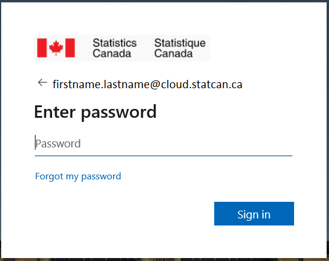

# Signing in- Accessing DAS 

??? info "External Users (non-StatCan)"
	1. Visit the following link: **[Data Analytics Services Portal](https://www.statcan.gc.ca/data-analytics-services/overview)**
	
	2. In the top right, select **Sign In**
	>
	3. Follow the prompts on the pop-up window to sign-in
	
	4. Scroll down, and your DAS VM will be listed
	
	5. Use the interface to Start, Connect, then Stop your VM
	

??? info "Internal Users (StatCan employees)"
	1. Using Chromium or Edge, open the **[Azure Portal](https://portal.azure.com/#home)** 

	2. You may then be prompted to either enter or pick an account:  

		- Upon your first time signing in, you will receive the Microsoft Sign in prompt, as shown below.  
	  
		- Enter your **cloud** account credentials (firstname.lastname@**cloud.statcan.ca**), and click on **Next**.

		- On subsequent sign-ins, you will receive the Microsoft Pick an account prompt, as shown below. Click on your **cloud.statcan.ca** account.  
	  

	3. You will then be prompted to enter your cloud account password, as shown below. Once entered, click on **Sign in**.  
	
		
		??? info "Is your first time accessing the STC Cloud?"
			- use the temporary password that was emailed to you by the cloud team
			
			- you will then be asked to set-up *2MFA* on your phone and 5 *Password Recovery* questions
			
			- follow the prompts as directed, it should take about 2-5 minutes
	   
	   
	4. Lastly, you may be asked to confirm your account via your cellular device.  
		:telephone_receiver:

	5. You should now be presented with the Azure Cloud Homepage.

