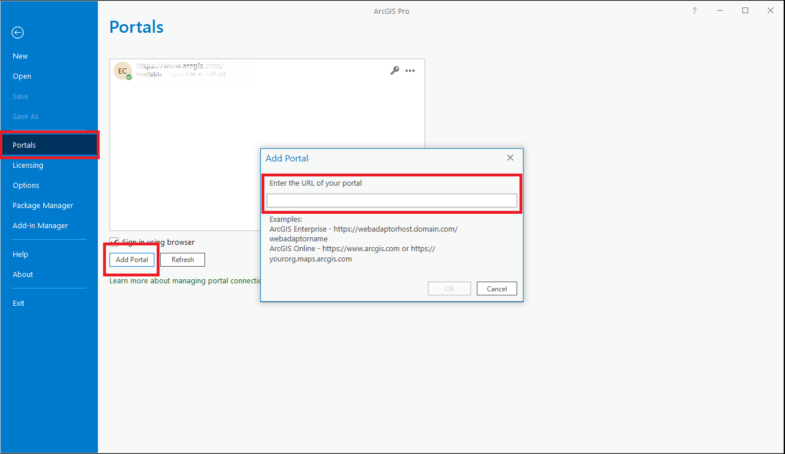
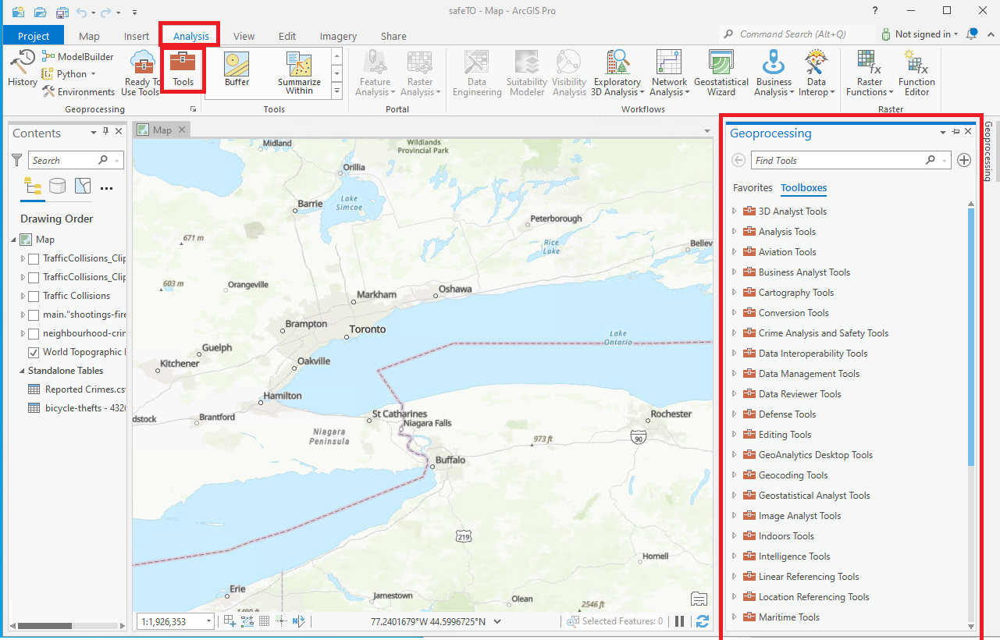

# ArcGIS Pro on DAS GAE

## Initial Set-up

??? success "Connect your ArcPro License - External Users (@ext.statcan.ca)"
	For external users, DAS is a *Bring your Own License* service.
	
	1. In the ArcGIS Pro application, go to the "Project" tab in the ribbon.

	2. Click on "Licensing" in the "Project" tab.

	3. In the Licensing pane, select the "ArcGIS Online" option.

	4. Click on the "Sign In" button and provide your ArcGIS Online credentials (username and password) to sign in to your ArcGIS Online account.

	5. Once signed in, ArcGIS Pro will verify your license entitlements and activate the software using your ArcGIS Online license.
	

??? success "Connect your ArcPro License - StatCan Employees - Internal Users"
	??? success "About your ArcGIS Pro license"
		ArcGIS Pro licenses are managed by the **StatCan GeoHelp** team.  
		This is the same license that you use to access ArcGIS Pro on NetA-B/AVD.  

	**Please contact GeoHelp for assistance: geohelp@statcan.gc.ca**

	1. In the Settings Menu, select "Licensing" from the list on the left-hand side. It is normal for the license manager to take several minutes to initialize.

	2. Click on the **Configure your licensing options**
	

	3. In the *License Type* drop-down, select the **Concurrent Use** option.

	4. In the *License Manager* field, enter the hostname: **5200@stmcapp-200statcan.ca**
	

	5. Click on the "Ok" button to save your changes.

	6. Restart ArcGIS Pro to activate the new license settings.

	Once you have connected to the concurrent license server, you should be able to see the Licenses for the ArcGIS Pro software and any extensions that are included.

??? success "Connect Pro to DAS Enterprise Portal"
	A connection to the DAaaS GEO ArcGIS Enterprise Portal needs to be established in order to publish from ArcGIS Pro to the Portal.  Follow these steps:

	1. *a:* From the ArcGIS Pro home screen select **Settings**, then select **Portals**  
		
		
		**OR**
		
		*b:* Within a project right-click your name at the top right of the window and select: **Manage Portals**
		

	2. Select **Add Portal** and enter the following URL: **https://geoanalytics.cloud.statcan.ca/portal/**
		

	3. The connection will then be listed.  Select the **more** button **'...'**, then select *Sign in*.  
		
		We also suggest after the connection is completed you select the  **Set As Active Portal** from the **more...** drop-down.
		
	4.  A browser window will open, click the **'Azure Cloud Login'** login button and follow the prompts.  Once Azure authentication is completed, you will be returned to the ArcGIS Pro screen.

		 

		Learn more about [Self-Registering in the Portal](/arcgisPortal/)
		
		Learn more: [Manage portal connections from ArcGIS Pro](https://pro.arcgis.com/en/pro-app/latest/help/projects/manage-portal-connections-from-arcgis-pro.htm)
	

## Adding Data to your Project

??? example "Adding data from a field or local folder"
	1. In the Catalog pane, which is typically located on the right side of the ArcGIS Pro interface, Right-click Folders, select Add Folder Connection, locate your desired folder, and select.
	
	2. Expand the data source that contains the data you want to add. For example, if you have shapefiles stored in a folder, expand the folder.

	3. Locate the specific dataset you want to add to your project. 

	4. To add the data to the current map, simply drag and drop the dataset onto the map view or right-click on the dataset and select "Add To Current Map" or "Add To Project." 

	5. After adding the data, it will be visible in the Contents pane, which is typically located on the left side of the ArcGIS Pro interface. You can interact with the added data by selecting it in the Contents pane and using the available tools and functionalities along the top.
	

??? example "Connect to a PostgreSQL Database"

	GAE has streamlined the ArcGIS Pro-PostgreSQL connection process by utilizing a *.sde* file connection.

	1. In the Catalog pane, right-click *Databases* and select *Add Database*
	

	2. In the new window, expand *This PC* and located your project file share (mounted as a drive)
	

	3. Select the *.sde* file, and click *Ok*

	4. The PostgreSQL database will not appear under *Databases* in the *Catalog* pane.

	Learn More: [ArcGIS Pro Documentation](https://pro.arcgis.com/en/pro-app/2.8/help/data/databases/connect-postgresql.htm)

??? example "Importing data from ArcGIS Enterprise"	
	As a member on GAE, you will have either a Project Member or Project Viewer user role. The same priviledges will carry across both ArcGIS Enterprise and ArcGIS Pro.

	Both users with the Project Member and Project Viewer roles will have the ability to consume (view) shared data from their project groups in ArcGIS Pro asd well as perosnal data.

	In the **Catalog** pane (if the **Catalog** pane is closed, click the **View** tab on the main ribbon. In the **Windows** group, click **Catalog Pane**), select the **Portal** tab. The same **Content** tabs from ArcGIS Enterprise will appear; *My Content*, *My Favorites*, *My Groups*, *My Organization*, *ArcGIS Enterprise*, and *Living Atlas*. 
	
	
## Conducting Analysis

??? example "Analysis via Toolbar"
	Once you have added the necessary data to your project:
	
	1. In the Analysis tab of the ArcGIS Pro ribbon, click on the "Toolboxes" button. The Toolboxes button provides access to various geoprocessing toolboxes.

	2. Browse and explore the available toolboxes to find the one that contains the specific tools you need for your analysis. Toolboxes are organized based on their functionality, such as Data Management, Spatial Statistics, Conversion, and more.
	

	3. Expand the selected toolbox to view its contents, which include individual geoprocessing tools.

	4. Locate the tool that you want to use for your analysis. Each tool performs a specific function and may require specific input parameters.

	5. Double-click on the tool to open its dialog box. The dialog box allows you to set the input parameters and configure the tool settings.

	6. Fill in the required parameters, such as input data, output locations, and any other relevant information. The parameter names and options will vary based on the selected tool.

	7. Review the tool's documentation or help resources if you need more information about the parameters or how the tool works.

	8. Once you have set the parameters, click on the "Run" or "Execute" button to start the analysis using the selected tool. The tool will process the data and generate the output based on your specified parameters.

	9. After the analysis is complete, you can examine and explore the results. The output may be displayed on the map, in the Geoprocessing pane, or in a new layer or table.
	
	[Learn more about the available tools here](https://pro.arcgis.com/en/pro-app/latest/tool-reference/main/arcgis-pro-tool-reference.htm)

??? example "Analysis via ModelBuilder (reusable)"
	
	??? quote "What is ModelBuilder?"
		
		ModelBuilder in ArcGIS Pro is a visual tool for creating automated spatial analysis workflows. It simplifies complex tasks, allowing you to connect tools and data visually. With ModelBuilder, you can customize your workflows, collaborate with others, and conveniently reuse your models for consistent and efficient analysis.
	
	1. In the Analysis tab of the ArcGIS Pro ribbon, click on the "ModelBuilder" button. This will open the ModelBuilder interface; you'll see a blank canvas where you can create your geoprocessing workflow.
	
	
	2. Start building your model by adding tools to the canvas. To add a tool, you can either search for it in the search bar located on the ModelBuilder interface or navigate through the toolboxes by clicking on the "Toolboxes" button in the Analysis tab and selecting the desired tool.

	3. Drag and drop the selected tool onto the canvas. Connect the tools by clicking on the output connector of one tool and dragging it to the input connector of another tool. This represents the flow of data between the tools.

	4. Configure the parameters of each tool by right-clicking on it and selecting "Properties." Fill in the required parameters and adjust any other settings as needed.

	5. Continue adding tools and connecting them until you have constructed your desired workflow.

	6. Test your model by clicking on the "Run" button in the ModelBuilder interface. This will execute the workflow and process the data based on your specified parameters.

	7. Once the model has executed successfully and produced the desired output, you can save it for future use. To save the model, go to the File menu and select "Save" or "Save As." Choose a location and provide a name for the model, then click "Save." The model will be saved with a .tbx file extension, which represents a ModelBuilder toolbox.

	TIP: You can also create model parameters to make your model more flexible and reusable. Parameters allow you to specify input and output data locations and other variables when running the model. To create a model parameter, right-click on a tool or connector, select "Model Parameter," and set the parameter properties.

	TIP: To run the model with different input data or parameter values, you can open it from the Catalog pane or the Geoprocessing pane, modify the input values or parameters, and then run it again.
	
??? example "Analysis via Python & Notebook within Pro"

	??? quote "What is a Python Notebook and why use it"
		A Python Notebook in ArcGIS Pro combines code, documentation, and visualizations, providing an interactive environment for spatial analysis. It offers flexibility, advanced scripting capabilities, and integration with external Python packages, making it ideal for custom workflows and advanced analysis techniques.
	Within the notebook interface, you can start writing and executing Python code to perform your analysis. You can use various ArcPy functions, libraries, and other Python packages for spatial analysis.

	1. From the Analysis tab, slect Python, then select either Notebook or Python Window, depending on your preference. You can start writing and executing Python code to perform your analysis in the newly opened Notebook or Python window. You can use various ArcPy functions, libraries, and other Python packages for spatial analysis.
	
	
	2. Import necessary libraries and modules by including import statements at the beginning of the notebook.  [Learn how to install packages here](https://pro.arcgis.com/en/pro-app/latest/arcpy/get-started/what-is-conda.htm)

	3. Utilize ArcPy functions and geoprocessing tools to perform spatial analysis tasks. You can access and manipulate spatial datasets, perform calculations, run geoprocessing tools, create maps, and generate outputs. [Learn more about Arcpy](https://developers.arcgis.com/documentation/arcgis-add-ins-and-automation/arcpy/)

	4. Write your analysis code in separate cells within the notebook. Each cell can be individually executed by clicking the "Run" button or using the Shift + Enter shortcut.

	5. Execute the cells sequentially to run your analysis step by step, reviewing the outputs and intermediate results as you proceed.

	6. You can add markdown cells to include explanatory text, documentation, or visualizations within the notebook to enhance readability and clarity.

	7. Save your Python Notebook periodically to preserve your code and analysis progress. Use the "Save" option in the notebook interface to save your changes.

	TIP: After completing your analysis, you can export the Python Notebook as a standalone .ipynb file for sharing or archiving purposes.
	
	
## Sharing Results

??? Abstract "Sharing data to ArcGIS Enterprise"
	Only users with the Project Member role will have the ability upload and share content to the Portal.

	Right click on a layer in the **Contents** pane (if the **Contents** pane is closed, click the **View** tab on the main ribbon. In the **Windows** group, click **Contents**) and select **Sharing** > **Share as Web Layer** from the drop down menu. A new **Share As Web Layer** window will appear. 
	

??? Abstract "Archiving your Project"
	**Add Metadata!**
	
	Data Layers and Tables:
	
	1. Right-click layer/table in Contents pane.
	2. Select "Properties.", Go to "Metadata" tab.
	3. Click "Edit" and fill in details. Save .
	
	ModelBuilder:
	
	1. Go to "Model" menu, Go to "Model Properties.", Open "Metadata" tab.
	2. Click "Edit" and provide details. Save metadata.
	
	Python Notebooks/Scripts:
	
	- Notebooks: Add markdown cells with metadata (title, description, author).
	- Scripts: Include comments at the beginning for metadata (purpose, author, description).

	**Package Your Project**
	
	ArcGIS Pro provides a packaging tool that allows you to create a project package containing all the project data, maps, and analysis settings. 
	
	To package your project, go to the Share tab in the ArcGIS Pro ribbon and click on the "Project" button. 
	
	Follow the prompts to specify the package settings, including the output location, package name, and any data or analysis options you wish to include. This package will serve as a self-contained archive of your project.
	
	**Export Data**
	
	If you have specific data layers or analysis results that you want to archive separately, you can export them from ArcGIS Pro. 
	
	Right-click on the data layer or result in the Contents pane, select "Data" or "Export," and choose the desired export format. 
	
	Save the exported data to a location of your choice for archiving.
---

## Learn More:

??? info "Best Practices"

	-	Organize your data: Create a logical folder structure and use descriptive names for your layers and datasets to make them easy to find and understand.

	-	Limit the number of folders: Don't create too many levels of folders within your project, as this can make it difficult to navigate and locate items. Limit the number of levels to no more than three or four.

	-	Use subfolders sparingly: Use subfolders only when necessary, such as when you have a large number of items or need to organize them by location or theme.

	-	Separate working data from published data: Keep your working data separate from your published data. This can help prevent accidental modification or deletion of important data.

	-	Use the project pane: Use the Project pane to manage your data, maps, and layouts. This makes it easy to switch between different parts of your project.

	-	Use bookmarks: Use bookmarks to save specific views of your map. This makes it easy to return to a specific location and zoom level.

	-	Use labeling wisely: Use labeling sparingly and make sure it is clear and easy to read. Consider using halo or background fills to make labels stand out.

	-	Use symbology consistently: Use consistent symbology across your maps to make them easier to read and understand.

	-	Document your work: Document your work using the metadata tools in ArcGIS Pro. This makes it easy to share your work with others and helps you keep track of changes over time.

	-	Use map packages: Use map packages to share your maps and data with others. This ensures that all the necessary data and settings are included.

	-	Use Geodatabases over shapefiles: Overall, geodatabases are a more robust and versatile data storage format than shapefiles.

	-	Optimize your workflow: Optimize your workflow by using the tools and shortcuts available in ArcGIS Pro. This can save you time and help you work more efficiently.

	-	Take advantage of resources: Take advantage of the ArcGIS Pro documentation, training, and user communities to learn more about best practices and to get help when you need it.

??? tip "ArcGIS Pro Official Documentation"
	[Learn More: ArcGIS Pro Official Documentation](https://pro.arcgis.com/en/pro-app/latest/help/main/welcome-to-the-arcgis-pro-app-help.htm)