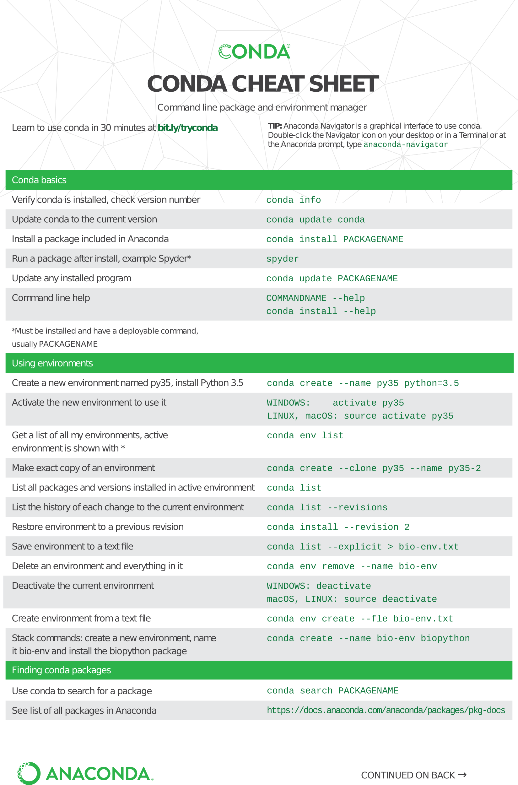

# Python

Geospatial analysis mainly uses Python for several reasons:

1. **Rich ecosystem of geospatial libraries**: Python has a vast collection of specialized geospatial libraries such as GeoPandas, Shapely, Fiona, and PySAL, which provide powerful tools for handling geospatial data, performing spatial operations, and conducting advanced geospatial analysis.

2. **Integration with other data science and analysis libraries**: Python's popularity in the data science community and its extensive ecosystem of data analysis libraries such as NumPy, Pandas, and Matplotlib make it an ideal choice for geospatial analysis. Python allows seamless integration of geospatial analysis with other data processing and visualization tasks.

3. **Flexibility and versatility**: Python is a versatile programming language known for its flexibility. It allows users to combine geospatial analysis with other functionalities, such as machine learning, statistical analysis, and web development. Python's flexibility enables the creation of custom workflows and tailored solutions for specific geospatial analysis needs.

4. **Ease of use and readability**: Python is renowned for its readability and user-friendly syntax. Its clear and concise code structure makes it easier for both beginners and experienced programmers to understand and write geospatial analysis scripts and workflows. Python's readability contributes to better collaboration and maintainability of geospatial projects.

5. **Active community support**: Python benefits from a large and active community of geospatial analysts, developers, and researchers who contribute to the development and improvement of geospatial libraries and tools. The availability of extensive documentation, tutorials, and online resources makes it easier for users to learn, troubleshoot, and get assistance when working on geospatial analysis projects.

While Python is widely used in geospatial analysis, it is important to note that other programming languages like R, Java, and C++ also have their own geospatial libraries and ecosystems. The choice of programming language ultimately depends on specific project requirements, personal preferences, and existing expertise.

##Virtual Environments

???tip "Best Practice: Working with Conda Virtual Environments"
	Using virtual environments with Conda can help you create consistent, reproducible, and isolated environments for your projects, which can save time and prevent issues caused by conflicting dependencies or system-level changes.
	  
	For example, ArcGIS products function best with *python 3.7*.  By creating a separate ArcGIS environment you can install 3.7 without causing conflicts with the modern python 3.10 release.
	
	
??? example "Create a new environment"
	```python
	conda create --name <env_name> <package>
	```
	example:
	```python
	conda create --n geoENV python=3.7
	```


??? example "Activate your environment"
	```python
	conda activate <env_name>
	```

## Installing package(s)

???info "Common Geo-Specific Packages available"
	This list is not exhaustive, but here are some of the common packages:
	
		- GeoPandas
		- Shapely
		- Fiona
		- GDAL/OGR
		- PyProj
		- Cartopy
		- Rasterio
		- Geoplot
		- Basemap
		- Bokeh
		- PySAL
		- Spatial Pandas
		- NetworkX
		- PyShp
		- TileStache
		- GdalUtils
		- Scipy
		- PyTopo
		- Geopy
		- Plotly

??? example "Conda"

	DAaaS utilizes *Artifactory* for package and library management:
	```
	https://jfrog.aaw.cloud.statcan.ca/artifactory/conda-forge-remote
	```

	**To use:**

	Miniforge (conda) has been preconfigured to use the DAS Artifactiry.  
	**You should not need to specify the channel.** 
	If this fails, we have included examples on direct connections after the simple examples:

	```python
	conda install [package]
	```

	For specific versions
	```python
	conda install geopandas
	conda install matplotlib=3.7.0
	```

	Connecting directly to the artifactory channel:

	```python
	conda install -c https://jfrog.aaw.cloud.statcan.ca/artifactory/conda-forge-remote/ [package]
	conda install -c https://jfrog.aaw.cloud.statcan.ca/artifactory/conda-forge-remote/ [package=X.X...]

	```
	
	Confirm your package installation
	```python
	conda list
	```
	
	??? example "Conda Cheat Sheet"
		

		**Link to full [Conda cheat sheet](https://docs.conda.io/projects/conda/en/4.6.0/_downloads/52a95608c49671267e40c689e0bc00ca/conda-cheatsheet.pdf)**

??? example "PIP"
	PIP has also been preconfigured to use the DAS artifactory custom index:

	```python
	pip install [package] 
	```
	
	```python
	pip list
	```
	
	If that fails and you need to specify the index url:
	
	```python
	pip install --index-url https://jfrog.aaw.cloud.statcan.ca/artifactory/api/pypi/pypi-remote/simple <package-name>
	```

##Some Basic Examples

??? quote "Connect to GAE ArcGIS Portal (Enterprise)"
	Your project group will be provided with a Client ID upon onboarding which will be used to connect to the ArcGIS Enterprise Portal. Paste the Client ID in-between the quotations
	```python
	from arcgis.gis import GIS
	gis = GIS("https://geoanalyticsdev.cloud.statcan.ca/portal", client_id=' ')
	print("Successfully logged in as: " + gis.properties.user.username)
	```
	This will trigger a pop-up window  to authenticate, then provide you with a key to enter into the IDE

??? quote "Convert a WFS into pandas DataFrame"
	```python
	import geopandas as gpd

	# Set WFS URL and layer name
	wfs_url = 'https://mywfs.com/wfs'
	layer_name = 'my_layer'

	# Read WFS into a geopandas dataframe
	gdf = gpd.read_file(wfs_url, layer=layer_name)

	# Convert geopandas dataframe to pandas dataframe
	df = gdf.drop(columns='geometry')

	# Preview the dataframe
	print(df.head())
	```
	
??? quote "Shapefile to GeoDataFrame (Spatial DataFrame)"
	```python
	import geopandas as gpd

	# Define the path to the shapefile
	shapefile_path = 'path/to/your/shapefile.shp'

	# Use geopandas to read the shapefile into a GeoDataFrame
	gdf = gpd.read_file(shapefile_path)

	# Print the GeoDataFrame
	print(gdf)
	```

??? quote "Export a GeoDataFrame to ArcGIS Enterprise"
	```python
	from arcgis.gis import GIS
	import geopandas as gpd

	# Define the URL of your ArcGIS Enterprise portal
	portal_url = 'https://geoanalytics.cloud.statcan.ca/portal/'

	# Create a connection to your portal
	gis = GIS(portal_url, client_id='')

	# Define the name of the feature layer to be created
	layer_name = 'your_layer_name'

	# Publish the GeoDataFrame to your portal as a feature layer
	feature_layer = gis.content.import_data(gdf, title=layer_name)

	# Print the URL of the feature layer
	print(feature_layer.url)
	```

??? quote "Join CSV to SHP(as sdf) then Export to ArcGIS Enterprise"
	```python
	import pandas as pd
	from arcgis.gis import GIS
	from arcgis.features import SpatialDataFrame

	# Load the CSV file into a Pandas dataframe
	csv_df = pd.read_csv('path/to/csv_file.csv')

	# Load the spatial data into a SpatialDataFrame using ArcGIS API for Python
	sdf = SpatialDataFrame.from_featureclass('path/to/spatial_data.shp')

	# Join the CSV dataframe to the spatial dataframe based on a common field
	joined_sdf = sdf.merge(csv_df, on='common_field')

	# Export the joined spatial dataframe to ArcGIS Enterprise using the ArcGIS API for Python
	gis = GIS('https://geoanalytics.cloud.statcan.ca/portal/', client_id='')
	joined_fc = joined_sdf.spatial.to_featureclass(location='path/to/output.gdb', overwrite=True)
	joined_item = gis.content.add({'type': 'Feature Service', 'title': 'Joined Data', 'tags': 'Data'}, data=joined_fc)
	joined_item.publish()
	```
	This code first loads a CSV file into a Pandas dataframe using the pd.read_csv() function. It then loads a spatial dataset into a SpatialDataFrame using the SpatialDataFrame.from_featureclass() method of the ArcGIS API for Python. The two dataframes are then joined based on a common field using the merge() method of the SpatialDataFrame.

	Finally, the joined SpatialDataFrame is exported to a feature class using the spatial.to_featureclass() method of the SpatialDataFrame, and then published to ArcGIS Enterprise using the gis.content.add() and publish() methods of the ArcGIS API for Python. Note that you will need to replace the example paths and server URL with the actual paths and URL for your data and ArcGIS Enterprise instance.

??? quote "GeoCode a dataframe using OSM API"
	```python
	import requests
	import pandas as pd

	def geocode_address(address):
		"""
		Geocode a single address using the OpenStreetMap API
		"""
		url = "https://nominatim.openstreetmap.org/search"
		params = {
			"q": address,
			"format": "json"
		}
		response = requests.get(url, params=params)
		if response.ok:
			results = response.json()
			if len(results) > 0:
				return results[0]
		return None

	def geocode_dataframe(df, address_column):
		"""
		Geocode a Pandas dataframe using the OpenStreetMap API
		"""
		# Create a new dataframe to store the geocoding results
		geocoded_df = pd.DataFrame(columns=["latitude", "longitude"])
		
		# Loop through each row in the original dataframe
		for index, row in df.iterrows():
			# Get the address from the specified column
			address = row[address_column]
			# Geocode the address using the OpenStreetMap API
			result = geocode_address(address)
			if result:
				# Add the latitude and longitude to the new dataframe
				geocoded_df.loc[index] = [result["lat"], result["lon"]]
			else:
				# If geocoding failed, add NaN values to the new dataframe
				geocoded_df.loc[index] = [float("NaN"), float("NaN")]
		
		# Add the new columns to the original dataframe
		df["latitude"] = geocoded_df["latitude"]
		df["longitude"] = geocoded_df["longitude"]
		
		return df
	```
	To use this code, simply call the geocode_dataframe function with your Pandas dataframe and the name of the column that contains the address data.
	This will add two new columns to the dataframe, "latitude" and "longitude", which contain the geocoded coordinates for each address. Note that this code uses the requests library to make HTTP requests to the OpenStreetMap API, so you'll need to make sure that it's installed in your environment before running the code. *At this time, the OSM API is blocked by the firewall*

??? quote "Raster Analysis with GDAL"
	```python
	from osgeo import gdal
	import numpy as np

	# Open the raster file
	raster_ds = gdal.Open('path/to/raster.tif')

	# Read the raster band into a NumPy array
	raster_band = raster_ds.GetRasterBand(1)
	raster_array = raster_band.ReadAsArray()

	# Perform some analysis on the raster data
	# For example, calculate the mean pixel value
	mean_value = np.mean(raster_array)

	# Print the result
	print('Mean pixel value: {}'.format(mean_value))
	```
	This code opens a raster file using the gdal.Open() method and reads the first band of the raster into a NumPy array using the ReadAsArray() method of the gdal.Band object. It then performs some analysis on the raster data, in this case calculating the mean pixel value using the np.mean() function from NumPy. Finally, it prints the result to the console.

	You can modify this code to perform other types of analysis on the raster data, such as calculating the minimum, maximum, or standard deviation of the pixel values, or performing calculations between multiple bands. GDAL provides a wide range of functions and tools for working with raster data, so the possibilities are nearly endless.


##Learn More
[Learn more about about Artifactory](https://github.com/StatCan/cae-eac/blob/Artifactory-draft/docs/en/Artifactory.md)

[Learn more about Conda](https://conda.io/projects/conda/en/latest/user-guide/tasks/manage-environments.html)