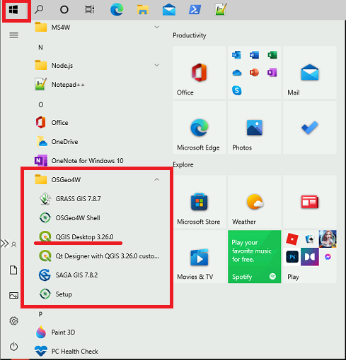

#  QGIS - Free and Open Source

??? quote "What is QGIS"
	QGIS is free geospatial analysis desktop software that provides a intuitive user interface and supports a wide variety of data types and formats.
	
	QGIS provides a large number of basic GIS analysis functions and visualizations; and the option to download extension for more complex analysis. 

## Getting Started
??? success "QGIS on a VM"
	QGIS comes installed on your VM by default. It can be found under the start menu:
		

	??? info "AAW"
		QGIS is also available on the *Remote Desktops* available through the AAW.

		<b> Setting up a workspace in the AAW: </b>
		<a href="https://statcan.github.io/daaas/en/1-Experiments/Remote-Desktop/" target="_blank"> Learn how to deploy a remote desktop in the AAW environment </a>

## Importing Data
??? example "Connect to a PostgreSQL Database"
	QGIS & PostgreSQL+PostGIS
	1. Under the browser tab, Right-click PostgreSQL, and select *New Connection*

	

	2. A new window will open:

		

	3. Enter the following information:

		|Field||Entry|
		|---||---|
		|Name||Your chosen name(alias) for the database|
		|Host||Database Instance *see onboarding info*|
		|Port||5432|
		|Database||The true name of the database *see onboarding info* |
		|SSL mode||allow|
		|Authentication||*Press the green + button, then enter your cloud info|
		|Also list tables with no geometry||YES|
		**All other fields can be left blank

	4. Select *Test Connection*

	5. The database will now appear under the *PostgreSQL* heading in the QGIS Browser

??? example "Adding a Layer- Drag and Drop"
	1. Locate your data files in your windows file explorer.
	2. Select the data files you want to add (e.g., shapefiles, raster files).
	3. Drag and drop the selected files into the QGIS window. The data will be added as layers to the project.
		
??? example "Adding a Layer- Data Source Manager"
	1. Go to the "Layer" menu and select "Add Layer" > "Add Vector Layer" or "Add Raster Layer" (depending on your data type).
	2. In the Data Source Manager dialog box, click the "Browse" button and navigate to the location where your data is stored.
	3. Select the data file(s) you want to add and click "Open" to add them to the project.	
		
??? example "Adding a Layer- Quick Map Layer"
	1. Click on the "Quick Map Layer" icon in the toolbar.
	2. In the dialog box, choose the type of data you want to add (e.g., shapefile, raster).
	3. Browse to the location of your data file and select it.
	4. Click "Add" to add the data as a layer to the project.
	

##Analysis
??? example "Using QGIS Processing Tools"

	1. Access Analysis Tools: In the QGIS interface, locate the processing toolbox. It can typically be found either in the main menu under "Processing" or as an icon in the toolbar. Click on the processing toolbox to open it.
	

	2. Choose Analysis Tool: Browse through the available analysis tools organized in different categories. These tools cover various aspects of geospatial analysis, such as spatial statistics, proximity analysis, data management, and more.

	4. Configure Tool Parameters: Once you have selected an analysis tool, a dialog box will appear where you can configure the tool's parameters. Depending on the specific tool, you may need to specify input layers, set analysis parameters, define output options, and adjust other settings.

	4. Run Analysis: After configuring the tool parameters, click "Run" or "OK" to execute the analysis. The tool will process the data based on the specified parameters and generate the desired output.

## Training
??? tip "SGC's QGIS Videos"
	STC's Statistical Geomatics Centre has produced an online lecture series that provides an into to QGIS.  These videos are great for beginners, those transitioning from a COST product to QGIS, and for the advanced user to get a refresher.

	Video 1 - [What is GIS, and why use QGIS](https://www.statcan.gc.ca/eng/wtc/online-lectures/qgis/2019001) (external link)

	<iframe width="560" height="315" src="https://www.youtube-nocookie.com/embed/8oEnJvLzDnQ" title="YouTube video player" frameborder="0" allow="accelerometer; autoplay; clipboard-write; encrypted-media; gyroscope; picture-in-picture" allowfullscreen></iframe>

	<a href="https://open.canada.ca/data/en/dataset/89be0c73-6f1f-40b7-b034-323cb40b8eff" target="_blank"> <b>View the  Full Lecture Series Catalog</b></a> (external link)

??? tip "QGIS Cheat Sheet"
	

##Learn More

??? tip "Helpful Links"
	- [QGIS Documentation](https://docs.qgis.org/testing/en/docs/user_manual/managing_data_source/opening_data.html#creating-a-stored-connection)

	- [QGIS + Azure Documentation](https://techcommunity.microsoft.com/t5/azure-database-for-postgresql/qgis-azure-database-for-postgresql-postgis/ba-p/1152249)

	- [Line 45- Using QGIS with PostGIS: A Dynamic Duo (whitepaper - English only)](https://www.line-45.com/post/using-qgis-postgis-dynamic-duo)
	
	- <a href="https://docs.qgis.org/3.16/en/docs/training_manual/index.html target="_blank""> QGIS Official Training Manual </a>

	- <a href="https://plugins.qgis.org/plugins/ target="_blank""> QGIS Python Plugins Repository </a>

	- <a href="https://www.qgistutorials.com/en/ target="_blank""> QGIS Tutorial and Tips </a>

??? tipe "Best Practices"

	-	Use a Project File: Always start by creating a project file for your work. This helps you keep your layers organized and makes it easy to share your work with others.

	-	Use Layer Styling: QGIS provides a lot of options for layer styling. Use them to make your maps look better and more professional.

	-	Keep Your Data Organized: Keep your data organized and up to date. Use descriptive file names and keep your data in logical folders.

	-	Use Plugins: QGIS has a large community of developers who create plugins to extend its functionality. Take advantage of these plugins to make your work easier and more efficient.

	-	Use Projections: Make sure you understand projections and use them appropriately. This will help ensure that your data is accurate and that your maps are meaningful.

	-	Learn Keyboard Shortcuts: QGIS has a lot of keyboard shortcuts that can save you time and effort. Take the time to learn them and you'll be more productive.

	-	Use the QGIS Community: QGIS has a large and active community of users and developers. Use the community to learn more about the software, get help with problems, and share your work with others.
