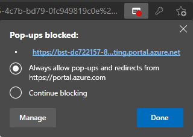
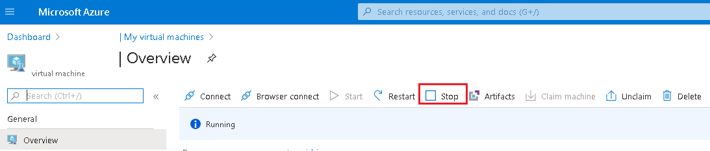

#About GAE Virtual Machines
**A DAS-GAE Virtual Machine can be created for you.** 
	
???info "The standard GAE VMs include the following:"
	Hardware:

	- 4vcpus, 14GiB Memory (larger specs available)
	- AMD Radeon Instinct MI25 GPU
	- Managed storage
	- [learn more- Microsoft](https://docs.microsoft.com/en-us/azure/virtual-machines/nvv4-series)

	Software:

	- ArcGIS Pro *(BYO-license)*  
	- QGIS 
	- Conda (via miniforge)
	- Python IDEs (pyCharm, VSCode, Jupyter)
	- & resources identified during your Project Onboarding.

	??? info "Virtual Machines on AAW and CAE"
		Depending on your project, you *may* have the ability to create a standard virtual machine via the CAE, or create a workspace in the AAW.  
		These self-serve VMs are **NOT** optimized for geospatial rendering.

##External (non-StatCan) Users:

??? example "Connecting to your VM"
	1. Visit the following link: **[Data Analytics Services Portal](https://www.statcan.gc.ca/data-analytics-services/overview)**
	
	2. In the top right, select **Sign In**
	>
	3. Follow the prompts on the pop-up window to sign-in
	
	4. Scroll down, and your DAS VM will be listed
	
	5. Use the interface to Start, Connect, then Stop your VM
	
	!!!danger "Virtual machines incur costs while they are running.     You should shut down your virtual machine when not in use to prevent unnecessary charges.     Your VM has an automatic shut-down time of 7pm CST."
	
??? example "Requesting changes to your VM"
	Contact: **statcan.dassupport-soutiendelads.statcan@statcan.gc.ca**
	
	Information to include:
	
		- Your @ext.statcan.ca account name
		- Your UCID (if known)
		- Your request with a short explanation
	
	Some Common requests:
	
		- I need my password reset
		- I would like to upscale/downscale my VM
		- I need additional/updated software
		- I would like to modify the auto-start and/or auto-stop
		- I am encountering an error and need assistance

---

##Internal (StatCan) Users:

??? info "AVD vs DAS VM"
	DAS has been carefully designed to enable users to utilize their AVDs (Azure Virtual Desktops) to access DAS-GAE services. In the majority of cases, AVD will fulfill your requirements and provide the necessary capabilities for your data analysis needs.
	
	Reasons to request a DAS VM:
	
	1- **Increased Computing Power**: DAS VMs provide an advantage when users require high-capacity virtual machines that exceed what AVD can offer. In such cases, users can also exert some control over scaling by leveraging self-service options.

	2- **Automated Tasks**: DAS VMs can be configured to AutoStart, enabling users to automate tasks using the Microsoft Task Manager. This feature streamlines repetitive processes and enhances productivity. *I need this process to run every Monday at 6am*

	<!--
	3- **Shared VMs** (Under Review): It is possible (with proper security approval) for projects to share a VM. For instance, a project may require a shared VM for Earth Observation processing, which can be accessed by multiple individuals, fostering collaboration.
	-->
	
	3- **Software Availability**: DAS VMs may offer software that is unavailable on AVD. Presently, we provide more up-to-date versions of software such as ArcPro, QGIS, and pgAdmin, enabling users to leverage the latest features and enhancements.

??? example "Finding & Claiming a VM"
	1.	Access Azure Portal URL from OZ (do **NOT** use your AVD unless for a specific reason!)
		**https://portal.azure.com/#home**

	2.	Select More Services, and filter/search for *DevTest Labs*
		  
		
	3.	Change the Subscriptions filter to: *ALL*  or *DAaaS*

		Select **geop-prod-intuser-dtl**

		  

	4.	On the left menu panel, select: *Claimable virtual machines*

		  

	5.	Locate and select your VM. Your VM will be named: *projectAccroymn-statcanID*

		*ex: gae-namenick*

		  

	6.	In the VM overview page, select *Claim machine*

		  

	7.	Claiming will take a few minutes. Wait for the ‘Successfully claimed’ message before proceeding.
		  

	8.	Select *Browser connect*. A new panel will open on the right.

		Enter your username: StatCanID *(ex: namenick)*
		
		Enter the temp password: *(provided via onboarding email)*
		
		Select *Connect*

		  
	
	??? tip "Disable pop-up blockers" 
		After attempting to login for the first time, an error may appear that a popup blocker is preventing a new window to open. To disable it, an icon will pop up on the browser's search bar, select the button and click **always allow**. 
		
  
??? example "Starting & Connecting to your VM"

	1.	Access Azure Portal url from OZ (do **NOT** use your AVD unless for a specific reason! see *Tips* section below):

		**https://portal.azure.com/#home**
		
		Select *DevTe3st Labs* from *"My Recent Resources"*
		
		Select your VM
		
		

		From the VM Overview page, click on the *Start* button.  

		  

	It takes a few minutes for your VM to start up. Monitor its start-up progress by selecting the Notifications icon at the top right of the window.   

	

	**Connect to a VM:**

	1. After staring wait for the success notification (this can take a few minutes)
		
	2. - From the **Overview** page for your VM, click on the **Browser connect** button 
		   

	3. Ensure the *Open in new window* checkbox is selected, enter the Username and Password, and click on the *Connect* button. Your VM should open in a new browser tab.
	!!!danger "Virtual machines incur costs while they are running.     You should shut down your virtual machine when not in use to prevent unnecessary charges.     Your VM has an automatic shut-down time of 7pm CST."

   
??? example  "Stop your VM"

	1. From the **Overview** page for your VM, click on the **Stop** button.  

		  

??? example  "Resize your VM (self-serve)"
	Users have the ability to re-size their VMs to conserve resources(costs) or increase performance.

	1. From the VMs overview page, select **Size** in the left-menu bar
	

	2. Select the desired size, then click **Select** at the bottom of the window
	

	If you require different specs from the VMs listed, [submit a technical support ticket to DAS-GAE](contact.md)

##Errors and Tips

??? tip "Common Errors, Fixes, and, Tips"
	|Error||Solution|
	|----||----|
	|||Your VM is still starting; wait a minute and try again|
	|||You likely entered the VM username or password incorrectly, try again.|
	|||You are experiencing some network latency; this usually resolves itself. If not, try restarting your VM|

??? tip "Tips"

	:triangular_flag_on_post: Do **NOT** use AVD to connect to a VM. AVD is also a Azure Cloud VM so you are only increasing resource costs, only use AVD if you have a specific reason.

	:triangular_flag_on_post: Visit the [Knowledge Centre](python.md) for help on configuring Python libraries and packages

	:triangular_flag_on_post: Using keyboard shortcuts while connected to a VM may not result in the same action as expected. (i.e. *ctrl + z* will close your main browser window, not the VM browser window)

	:triangular_flag_on_post: VMs have an auto-shutdown time of 7pm cst. (this can be adjusted upon request: [FAQ](contact.md)

	:triangular_flag_on_post: [Moving the taskbar](https://support.microsoft.com/hr-hr/topic/how-to-move-the-windows-taskbar-from-its-default-position-or-reset-it-to-its-default-position-71e48b52-9373-191a-d3e8-78fe78419302) to the top or side of the VM might help differentiate between your OZ-PC and VM workspace.

	:triangular_flag_on_post: Multi-screens? You can not alter the VMs display settings, however there is a way to *almost* use multiple monitors. Use the *Restore Down*   button in your browser window and then drag to resize the window across multiple displays to get a multi-screen effect.  You may need to adjust some configurations in your OZ-Laptop display settings.

	:triangular_flag_on_post: By default, the **Ubuntu** virtual machine opens in Terminal mode. You can access the GUI of your Ubuntu machine from a Windows machine using [X2Go](https://docs.microsoft.com/en-us/azure/machine-learning/data-science-virtual-machine/dsvm-ubuntu-intro#x2go).

