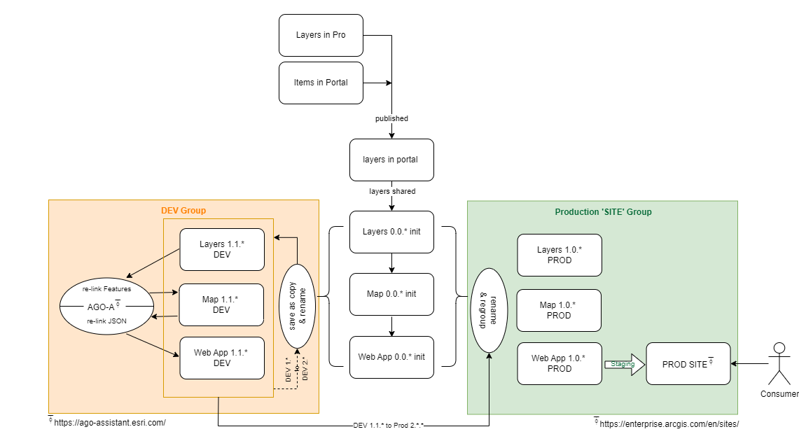
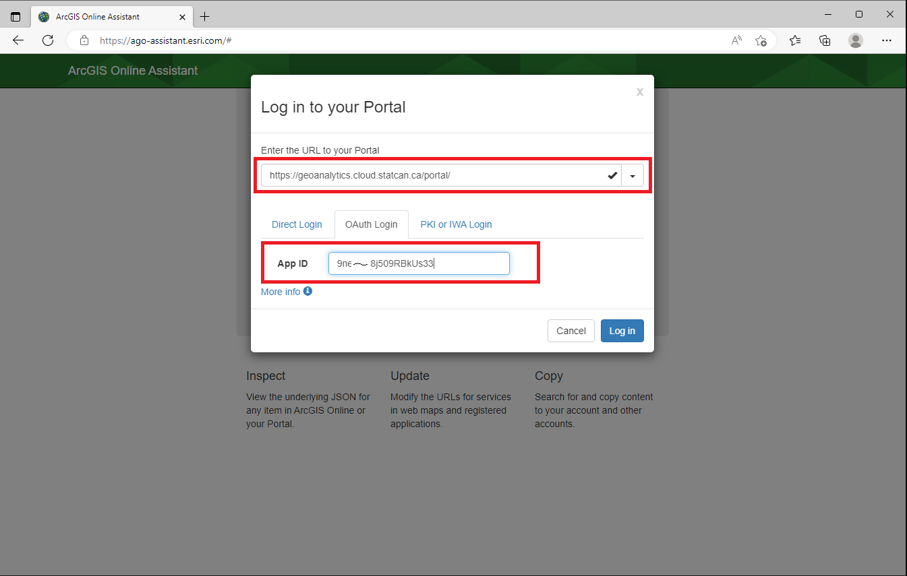
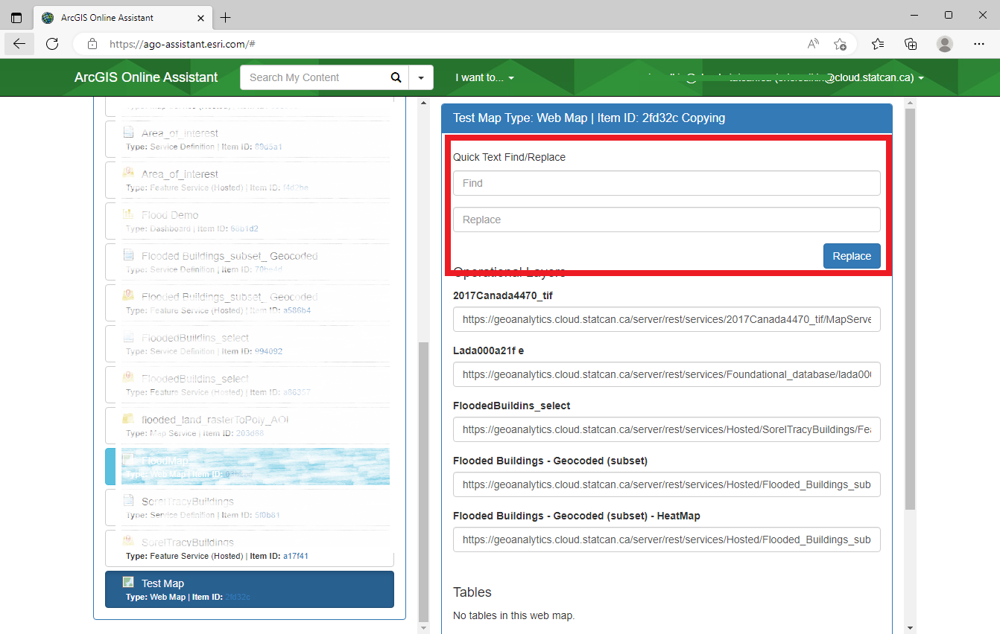
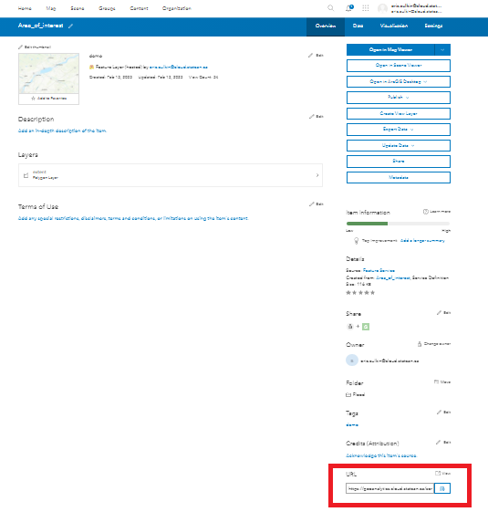

# Construire et partager des applications spatiales

??? success "Avant de commencer: Introduction à ArcGIS Portal"
	Pour créer une carte web dans Portal, commencez par vous inscrire pour un compte Enterprise, puis publiez les données dans Portal. 
	Pour des instructions détaillées, consultez cette page qui fournit un guide complet étape par étape: [GAE Storage - ArcGIS Portal](/portal)	

ArcGIS Enterprise propose une gamme d'applications sans code qui permettent aux utilisateurs de créer et de partager des applications géospatiales interactives sans compétences en programmation.

Les **applications** et les **sites** sont créés à partir de vos couches de données et de vos cartes publiées. La première étape pour créer une application/site consiste à finaliser votre analyse et à publier toutes vos couches et cartes.

> Les données sont utilisées pour créer des couches ;
>> Les couches sont utilisées pour créer des cartes ;
>>> Les cartes et les couches sont utilisées pour créer des applications ;
>>>> Les cartes et les applications sont utilisées pour créer des sites (les données peuvent être téléchargées depuis les sites).


	
## Applications sans code

Ces **applications** améliorent la visualisation des données et favorisent la prise de décisions basée sur les données.

??? example "Création d'applications interactives"

	Pour créer une application, accédez à l'onglet **Contenu** dans le ruban principal et cliquez sur **Mon contenu**. </br> Vous trouverez un bouton **Créer une application** qui vous permettra de travailler avec différents types d'applications interactives.

	
	
	1. **Applications instantanées**: Permettent de créer et de configurer rapidement des applications web basées sur des modèles avec des options simplifiées et personnalisables.

	2. **Experience Builder**: Permet de créer des expériences d'application attrayantes en combinant des cartes, des médias et d'autres contenus avec des mises en page et des thèmes personnalisables.

	3. **StoryMaps**: Permet de créer des récits guidés en combinant des cartes, du texte, des imagesFR et des supports multimédias pour engager et informer le public.

	4. **Tableaux de bord**: Permet de visualiser des données en temps réel avec des graphiques, des cartes et des jauges dynamiques pour surveiller les indicateurs de performance clés et communiquer efficacement des informations.

	- **Web AppBuilder**:warning: : Permet de créer des applications web en configurant des widgets et des modèles pré-construits à l'aide d'une interface de glisser-déposer.
		
		:warning: *AppBuilder, en tant que partie d'ArcGIS Enterprise, est considéré comme obsolète. Bien qu'il soit encore disponible, les utilisateurs devraient passer à Experience Builder à l'avenir.*

	- **Configurable Apps**:warning: : Permet de créer des applications web à partir de vos cartes web, de vos scènes et de vos groupes sans avoir à écrire de code.
		
		:warning: *Configurable Apps, bien qu'il soit encore disponible dans Enterprise, utilise JavaScript 3.x et devrait être évité. Instant Apps est préférable.*

	**En savoir plus: [Commencer avec les applications - Portal for ArcGIS | Documentation d'ArcGIS Enterprise](https://enterprise.arcgis.com/fr/portal/latest/use/get-started-with-apps.htm)**

## Sites/Pages sans code

**Sites** permet aux utilisateurs de créer des pages web interactives et des sites web sans programmation, mettant en valeur des cartes, des données et du contenu multimédia à l'aide de modèles personnalisables et d'une intégration transparente.

??? quote "Qu'est-ce qu'un site d'entreprise?"
	Les sites d'ArcGIS Enterprise vous permettent de créer une expérience de page web sur mesure pour faciliter le partage de vos produits SIG avec d'autres personnes, même si elles ne sont pas habituées à travailler dans votre SIG. Au lieu d'apprendre à naviguer dans le portail et à accéder à des groupes, les utilisateurs peuvent accéder directement à la page web personnalisée que vous créez pour naviguer dans le contenu qui les concerne. Les utilisateurs nécessiteront un rôle de *Viewer*.

	Les sites offrent un concepteur de pages web intégré qui associe une expérience de glisser-déposer avec un balisage HTML, vous donnant un contrôle total sur la conception des pages web que vous créez. Vous pouvez également ajouter du contenu non-SIG, tel que des vidéos et des documents, à votre site pour créer un emplacement central où le matériel pertinent pour vos utilisateurs peut être hébergé et accessible.
		
	Les utilisateurs plus familiers avec le déploiement/le portail d'ArcGIS Online connaîtront cette fonctionnalité sous le nom de *Hubs*.

??? example "Création d'un site d'entreprise"

	**Pour commencer :**
	
	Pour demander (initialiser) un site, contactez l'équipe DAS-GAE via le tableau Jira. [Comment soumettre une demande technique ou signaler un problème](/francais/faq/).

	Veuillez indiquer la préférence de l'URL. L'URL sera formatée comme suit :
		```https://geoanalytics.cloud.statcan.ca/portal/apps/sites/#/{VOTRE_URL_CHOISIE}```

	En plus de votre site, 2 groupes seront créés. Un pour les éditeurs et un pour les spectateurs seulement. Ces groupes contrôleront l'accès à votre site et les éléments avec lesquels ils peuvent interagir.

	**Une fois votre site initialisé :**
	
	1. Accédez à l'application ArcGIS Sites.
	2. Choisissez un modèle ou une mise en page qui convient à vos besoins.
	3. Personnalisez le site en ajoutant des cartes, des données, du contenu multimédia et du texte.
	4. Configurez l'apparence du site en sélectionnant des couleurs, des polices et des éléments de branding.
	
		>ESRI utilise un thème personnalisé et une version du système Bootstrap(3) pour la conception des pages. 
		Les utilisateurs expérimentés qui souhaitent utiliser du HTML personnalisé dans SiteApp peuvent se référer à cette ressource : [Calcite Bootstrap Theme by ESRI](http://esri.github.io/calcite-bootstrap/index.html)
			
	5. Intégrez du contenu supplémentaire d'ArcGIS, comme des cartes, des applications et des tableaux de bord, si vous le souhaitez.
	6. Prévisualisez et passez en revue le site pour vous assurer qu'il répond à vos exigences.
	7. Publiez le site pour le rendre accessible à d'autres personnes.
	8. Partagez l'URL du site ou intégrez-le dans d'autres pages web pour atteindre votre public cible.


## Travailler avec plusieurs versions (DEV-PROD)

La création d'espaces de travail de test et de production distincts peut offrir de nombreux avantages aux projets, notamment l'amélioration de leurs processus de développement, la réduction des risques et l'amélioration de la fiabilité et de la sécurité de leurs systèmes.

Cependant, la séparation physique des espaces de travail dev-test-prod n'est pas réalisable sur DAS. Néanmoins, GAE peut aider en créant des groupes distincts qui émulent des espaces de travail séparés. Étant donné que chaque projet a des besoins uniques, il n'y a pas de solution universelle.

??? info "Flux de processus typique"
	

	Si vous utilisez un site ArcGIS pour partager votre application, le flux de travail ressemblera généralement à ceci :
	
	<br>
	

	Les utilisateurs peuvent utiliser l'ArcGIS Online Assistant pour réparer/relier les couches et les cartes si nécessaire. Consultez la section suivante pour des conseils sur l'utilisation de l'outil. **Il est essentiel de suivre les meilleures pratiques, en particulier en ce qui concerne la dénomination et l'organisation des données lors du travail avec plusieurs espaces de travail.**


??? abstract "Remplacement d'une couche dans une carte Web"
	Il peut arriver que vous souhaitiez remplacer une couche dans une carte par une version mise à jour ou un jeu de données de remplacement. Il existe plusieurs façons d'accomplir cela, l'une des méthodes les plus simples consiste à utiliser l'**[ArcGIS Online Assistant](https://ago-assistant.esri.com/)**.

	??? warning "Procéder avec prudence !"
		Le changement d'une couche dans une carte existante peut avoir des conséquences imprévues. Les widgets d'application et les contrôles liés à la carte peuvent se casser et nécessiter une reconfiguration. Veillez à ce que les noms de couche et les en-têtes de table correspondent aux anciennes versions pour maintenir la compatibilité, mais cela n'est pas garanti.
		<br>
		**Les risques incluent : la corruption du contenu, la perte d'accès aux éléments, la rupture des applications construites sur la carte.**

	1. Connectez-vous à Portal for ArcGIS.
	

	2. Entrez l'URL du portail https://geoanalytics.cloud.statcan.ca/portal et votre identifiant d'application (clé API) provenant du portail ArcGIS.
	

	3. Une fenêtre contextuelle apparaîtra, **sélectionnez StatCan Azure Cloud Login**.
	

	4. Dans la page d'accueil de l'Assistant, **sélectionnez le dossier** où votre carte est enregistrée sur le portail.
	

	5. Sélectionnez **Je veux**, puis **Mettre à jour les URL des services dans une carte Web**.
	
		
	6. Dans le fichier *Find*, entrez l'URL de l'ancienne couche que vous souhaitez remplacer. Dans *Replace*, entrez la nouvelle URL. Faites défiler vers le bas et sélectionnez **Update**, puis attendez le message *Success*.
	

	??? info "Où trouver l'URL du service d'entités"
		L'URL peut être trouvée dans le portail, sur la page Aperçu des services d'entités :
	

	Les données de votre carte refléteront maintenant le nouveau service. Vous devrez peut-être ajuster le *nom* de la couche sur votre carte, car il reflétera la couche d'origine.

	Pour ceux qui préfèrent utiliser l'API Python, [suivez ces instructions fournies par ESRI](https://enterprise.arcgis.com/en/portal/10.8/administer/linux/example-update-the-url-of-a-service-in-a-web-map.htm).


??? abstract "Remplacement d'une carte Web dans une application Web"

	??? warning "Procéder avec prudence !"
		Le changement d'une carte dans une application Web existante peut avoir des conséquences imprévues. Les widgets et les contrôles peuvent se casser et nécessiter une reconfiguration. Veillez à ce que les noms de couche et les en-têtes de table correspondent aux anciennes versions pour maintenir la compatibilité, mais cela n'est pas garanti. DAS-GAE recommande de faire des expériences sur une application de démonstration/copie au préalable.
		<br>
		**Les risques incluent : la corruption du contenu, la perte d'accès aux éléments, la rupture des applications construites sur la carte.**

	Il peut arriver que vous souhaitiez remplacer une carte Web par une nouvelle carte dans une application Web déjà créée. Nous allons vous expliquer comment procéder en utilisant l'Assistant ArcGIS Online. Nous utiliserons le même outil Assistant ArcGIS Online que précédemment, mais avec un flux de travail différent.

	1. Connectez-vous à Portal for ArcGIS.
	

	2. Entrez l'URL du portail https://geoanalytics.cloud.statcan.ca/portal et votre identifiant d'application (clé API) provenant du portail ArcGIS.
	

	3. Une fenêtre contextuelle apparaîtra, **sélectionnez StatCan Azure Cloud Login**.
	

	4. Dans la page d'accueil de l'Assistant, **sélectionnez le dossier** où votre carte est enregistrée sur le portail.
	

	5. À partir du bouton *I want to...*, **sélectionnez View an Item's JSON**, puis sélectionnez l'application souhaitée dans la liste mise en évidence. Les données JSON apparaîtront sur la droite.
	

	6. **Faites défiler vers le bas** dans le volet des données JSON jusqu'à la catégorie *Data*, et **sélectionnez l'icône Edit**. La tuile de données passera en mode sombre, ce qui signifie qu'elle est en mode édition.
	

	7. Dans la tuile de données, **recherchez l'attribut *map* et remplacez le champ *itemID* par l'ID de la nouvelle carte**.
	

		??? info "Comment trouver l'ID d'une carte"
			L'ID de la carte peut être obtenu en visitant la page de présentation de la carte et en le copiant depuis l'URL
			

	8. Faites défiler vers le haut jusqu'au début de la tuile de données, puis **sélectionnez Enregistrer**.
	Confirmez les modifications dans votre application et reconfigurez les widgets si nécessaire.


??? abstract "Clonage avec l'API"

	??? warning "Procéder avec prudence : CLONER vs COPIER"
		Cette méthode de clonage ne fonctionne pas toujours. Certains ensembles de données, couches, éléments, etc., seront COPIÉS plutôt que CLONÉS. Les copies font référence à l'élément d'origine, faites attention à l'ID des éléments. Cela ne fonctionnera **PAS** pour les 'map image layers'.

	```python
	# Se connecter au portail source
	source_gis = GIS("https://geoanalytics.cloud.statcan.ca/portal", client_id='')

	# Se connecter au portail de destination
	target_gis = GIS("https://geoanalytics.cloud.statcan.ca/portal", client_id='')

	# Obtenir le contenu source
	item_id = source_gis.content.get("#################")

	# Cloner l'élément vers le portail de destination
	cloned_item = target_gis.content.clone_items(items=[item_id], copy_data=True)
	```
