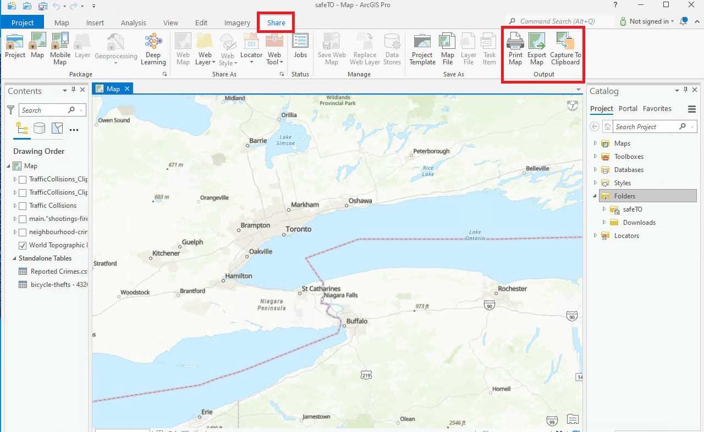
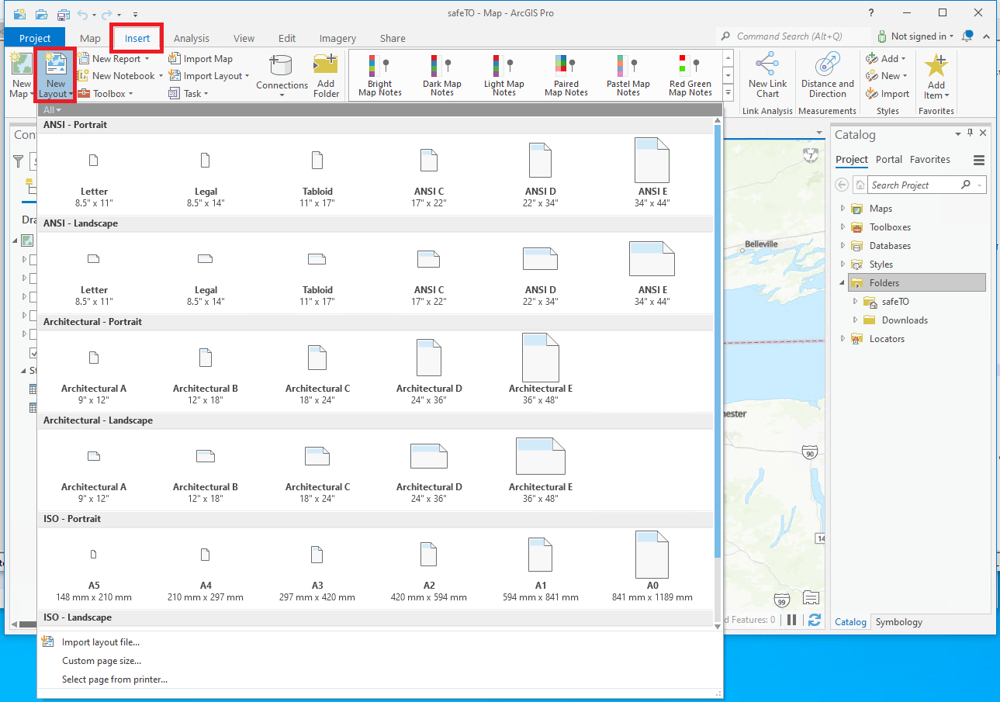

## Présentation des cartes statiques d'ArcGIS Pro

Dans ArcGIS Pro, vous pouvez créer des cartes statiques en exportant la vue actuelle ou la mise en page vers un format d'image statique, tel que PNG, JPEG ou TIFF. Cela vous permet de capturer et d'enregistrer une capture d'écran de l'affichage de la carte sans avoir besoin de fonctionnalités interactives. Voici comment vous pouvez générer des cartes statiques dans ArcGIS Pro :

??? Example "Cartes statiques basées sur la vue"
	Pour créer une carte statique basée sur la vue actuelle dans la fenêtre de la carte, suivez ces étapes :

	1. Naviguez jusqu'à l'étendue, le niveau de zoom et les couches de la carte souhaités dans la fenêtre de la carte.
	2. Accédez à l'onglet "Partager" dans le ruban.
	3. Cliquez sur le bouton "Carte" dans le groupe "Exporter".
	
	4. Spécifiez les paramètres d'exportation, tels que le format d'image, la résolution, l'emplacement de sortie et le nom de fichier.
	5. Cliquez sur "Exporter" pour générer l'image de la carte statique basée sur la vue actuelle.

??? Example "Cartes statiques basées sur la mise en page"
	Si vous avez une mise en page de carte configurée avec des éléments spécifiques, tels que le titre, la légende et l'échelle graphique, vous pouvez exporter la mise en page en tant que carte statique en suivant les étapes suivantes :

	1. Basculez en mode "Mise en page" dans ArcGIS Pro.
	
	2. Arrangez et concevez les éléments et les composants de la carte dans la mise en page.
	3. Accédez à l'onglet "Partager" dans le ruban.
	4. Cliquez sur le bouton "Mise en page" dans le groupe "Exporter".
	5. Spécifiez les paramètres d'exportation, tels que le format d'image, la résolution, l'emplacement de sortie et le nom de fichier.
	6. Cliquez sur "Exporter" pour générer l'image de la carte statique basée sur la mise en page configurée.
	
	Ajustement de la mise en page de la carte
	1. Basculez en mode "Mise en page" dans ArcGIS Pro.
	2. Ajoutez et positionnez le cadre de la carte pour définir la zone où la carte sera affichée.
	3. Insérez des éléments supplémentaires tels que des titres, des légendes, des échelles graphiques, des flèches nord et autres annotations si nécessaire.
	4. Utilisez les outils de mise en page pour aligner et organiser les éléments de la carte pour une composition visuellement agréable.
	5. Ajustez la taille et la position des éléments pour créer une mise en page équilibrée et organisée.

ArcGIS Pro propose des fonctionnalités avancées telles que la personnalisation de la symbologie, l'étiquetage et d'autres éléments cartographiques. Vous pouvez exploiter les options de style pour créer des cartes statiques visuellement attrayantes et informatives.

??? Example "Personnalisation de la symbologie"
	1. Sélectionnez la couche de carte souhaitée dans le volet de la table des matières.
	2. Accédez à l'onglet "Symbologie" dans le volet des propriétés de la couche.
	3. Choisissez le type de symbologie approprié (par exemple, remplissage simple, valeurs uniques, couleurs graduées).
	4. Configurez les propriétés de la symbologie telles que la couleur, la taille, le contour, la transparence et d'autres options pertinentes.
	5. Prévisualisez et affinez la symbologie jusqu'à ce que vous obteniez la représentation souhaitée de vos données.

??? Example "Configuration des étiquettes"
	1. Sélectionnez la couche de carte souhaitée dans le volet de la table des matières.
	2. Accédez à l'onglet "Étiquetage" dans le volet des propriétés de la couche.
	3. Activez l'étiquetage pour la couche et spécifiez l'attribut ou l'expression à utiliser pour l'étiquetage.
	4. Personnalisez le placement des étiquettes, les styles de police et d'autres propriétés visuelles.
	5. Utilisez les options avancées pour contrôler la visibilité des étiquettes, la priorité des étiquettes et l'évitement des collisions.
	6. Prévisualisez et peaufinez les étiquettes jusqu'à ce qu'elles soient lisibles et fournissent des informations précieuses.

## Présentation des cartes web ArcGIS

Les cartes web dans ArcGIS Enterprise permettent aux utilisateurs d'explorer, d'analyser et de partager des informations spatiales. En créant des cartes web, les utilisateurs peuvent organiser des couches de données, personnaliser la symbologie et configurer des interactions interactives.

Les fonctionnalités comprennent la symbologie personnalisable, le contrôle de la visibilité des couches, les fenêtres contextuelles configurables, les signets pour la navigation et les outils de collaboration. Les cartes web sont des outils puissants pour analyser et communiquer efficacement des informations géospatiales.

??? success "Avant de commencer : Introduction à ArcGIS Portal"
    Pour créer une carte web dans Portal, commencez par vous inscrire vous-même pour un compte Enterprise, puis publiez des données dans le Portail.
    Pour des instructions détaillées, consultez cette page qui fournit un guide complet étape par étape : [GAE Storage- ArcGIS Portal](/portal)

??? example "Création de cartes web"

    1. Dans le Visionneur de cartes, cliquez sur l'option "Créer une nouvelle carte" pour démarrer un nouveau projet de carte.

    2. Cliquez sur le bouton "Ajouter" pour ajouter des couches de données provenant de différentes sources, telles que le contenu de votre portail, des services en ligne, des fichiers ou en recherchant des données disponibles.

    3. Configuration des propriétés de la couche : Une fois que vous avez ajouté les couches de données, vous pouvez configurer leurs propriétés, telles que la symbologie, l'étiquetage et les fenêtres contextuelles, pour personnaliser leur apparence et leur comportement sur la carte.

    4. Personnalisation de la carte : Utilisez les outils et options disponibles dans le Visionneur de cartes pour personnaliser et améliorer votre carte. Cela inclut le changement de fonds de carte, l'ajustement de l'étendue et de l'échelle, la configuration de la mise en page de la carte et l'application d'autres éléments cartographiques.

    5. Ajout d'éléments supplémentaires : Améliorez votre carte en ajoutant des éléments supplémentaires tels que des légendes, des échelles, des flèches nord, des titres ou des annotations textuelles. Ces éléments peuvent être insérés à l'aide de l'interface du Visionneur de cartes.

    6. Enregistrement et partage : Une fois satisfait de votre carte, enregistrez-la dans votre portail ArcGIS Enterprise. Donnez-lui un nom significatif et fournissez les balises ou descriptions nécessaires. Vous pouvez également choisir de partager la carte avec des personnes ou des groupes spécifiques au sein de votre organisation ou la rendre accessible au public.

## En savoir plus sur les cartes web
[Commencez avec le Visionneur de cartes - Portal for ArcGIS | Documentation for ArcGIS Enterprise](https://enterprise.arcgis.com/fr/portal/latest/use/get-started-with-mv.htm)