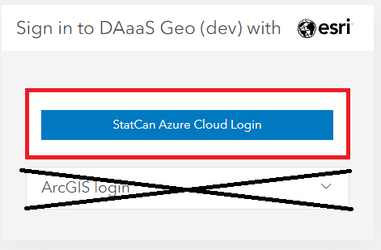

## Devenir un utilisateur

??? Success "S'inscrire et créer un compte"
	1. Rendez-vous sur le **[Portail DAaaS GAE Enterprise](https://geoanalytics.cloud.statcan.ca)** pour vous connecter au portail ArcGIS Enterprise.

	2. Sélectionnez le bouton *StatCan Azure Login*.

		

	3. Si votre mot de passe n'a pas été mémorisé par Azure, on vous demandera de le saisir et de le vérifier par téléphone.

		 

	4. Vous verrez ensuite cette fenêtre :
		

	5. Pour des raisons de sécurité, votre rôle par défaut sera *Viewer Only* (consultation seulement). Contactez l'équipe DAaaS Geo pour ajuster vos autorisations.
	Consultez la section **[Contact](contact.md)** pour obtenir de l'aide sur la façon de contacter DAS-GAE.

 

??? info "À propos des rôles d'utilisateur"
	Vous serez affecté à un rôle d'utilisateur *Project Viewer* ou *Project Member* en fonction de vos besoins.

	- **Project Viewer**<br/>
	  Afficher des éléments tels que des cartes, des applications, des scènes et des couches partagées avec le public, l'organisation ou un groupe auquel le membre appartient. Rejoindre des groupes appartenant à l'organisation. Faites glisser des fichiers CSV, texte ou GPX dans Map Viewer Classic (anciennement Map Viewer) pour géocoder des adresses ou des noms de lieux. Obtenez des itinéraires dans un visualiseur de cartes et des applications. Les membres ayant le rôle de Viewer ne peuvent pas créer ou partager de contenu, ni effectuer d'analyses.

	- **Project Member**<br/>
	  Privilèges de Project Viewer plus la possibilité de créer, mettre à jour et supprimer leur propre contenu. Les utilisateurs peuvent publier des couches d'entités hébergées, des couches de tuiles hébergées, des couches de scènes hébergées et des couches basées sur un serveur. Partager du contenu avec des groupes attribués. Créer du contenu tel que des cartes (y compris des tâches d'analyse des entités), des tableaux de bord, des applications et des récits cartographiques.


??? info "À propos de vos groupes"
	Les groupes auxquels vous appartenez sont des espaces de collaboration avec d'autres utilisateurs travaillant sur le même projet ou la même équipe. Dans l'en-tête principal, cliquez sur "Groupes". C'est là que vous pouvez voir les groupes auxquels vous avez été ajouté.
	
	Cliquez sur le nom du groupe pour voir tout le contenu partagé.

	Vous remarquerez peut-être qu'il existe deux groupes pour le même projet. Ces deux groupes sont destinés à différents rôles d'utilisateurs, garantissant une collaboration efficace et un accès contrôlé aux données au sein du portail ArcGIS.

	Le premier groupe, **Editors**, est désigné pour les membres disposant de privilèges de modification. Cela signifie qu'ils ont la possibilité de modifier et de mettre à jour les éléments du groupe. Ils peuvent ajouter, modifier ou supprimer du contenu, ainsi que apporter des modifications aux éléments existants.

	Le deuxième groupe, **Viewers**, est un groupe en lecture seule. Ses membres ont des autorisations restreintes et sont limités à la visualisation des éléments disponibles dans le groupe. Ils peuvent explorer et accéder au contenu, mais ils n'ont pas l'autorité pour apporter des modifications ou des éditions.


## Chargement/Publication de contenu

??? example "Chargement du contenu de l'interface"
	Les fichiers shapefile et les géodatabases de fichiers sont les types de fichiers les plus couramment chargés sur le portail. Cependant, une liste complète des éléments pris en charge peut être consultée en cliquant sur le point d'interrogation, comme indiqué dans l'image ci-dessous.

	Cliquez sur l'onglet "Contenu" et, sous "Mon contenu", cliquez sur "Ajouter un élément". Sélectionnez "Depuis votre ordinateur". Cliquez sur "Choisir un fichier" et accédez au dossier compressé contenant le contenu que vous souhaitez charger. Assurez-vous que le type de fichier correct est sélectionné dans le menu déroulant et que l'option "Publier ce fichier en tant que couche hébergée" est sélectionnée. Attribuez un titre et des balises au contenu. Cliquez sur "Ajouter un élément".

	Note : Si vous sélectionnez "Publier ce fichier en tant que couche hébergée", le contenu sera également publié en tant que couche hébergée pouvant être utilisée et partagée entre les membres de votre groupe. Si cette option n'est pas sélectionnée, le fichier lui-même (par exemple, une géodatabase de fichiers) sera téléchargé et disponible en téléchargement pour les autres membres du groupe, mais il ne pourra pas être utilisé par les membres du groupe tant qu'il n'aura pas été publié en tant que couche hébergée.
	

	Des étapes similaires peuvent être suivies pour charger du contenu via une URL vers une couche ou un document sur le web, ou une URL vers une application sur le web.

	Le contenu peut également être chargé directement dans une carte web en utilisant les mêmes méthodes décrites ci-dessus.

	**En savoir plus : [ArcGIS Portal ; Ajouter des éléments](https://enterprise.arcgis.com/en/portal/latest/use/add-items.htm)**

??? example "Publication de contenu - Chargement sur le portail"
	1. Les éléments peuvent être publiés directement à partir de vos fichiers, comme indiqué dans la section "Chargement de contenu".
	2. Si le fichier de l'élément est directement chargé sur le portail, comme un shapefile ou une géodatabase, l'utilisateur peut publier manuellement l'élément.
	
	3. Les éléments peuvent également être importés directement dans une carte web (voir la section Carte web pour plus d'informations) et publiés individuellement sur le portail.
	

	**En savoir plus : [ArcGIS Portal ; Publication](https://enterprise.arcgis.com/en/portal/latest/use/data-publishing-and-enterprise.htm)**


??? example "Via l'API"

	Votre groupe de projet se verra attribuer un ID client lors de l'intégration, qui sera utilisé pour se connecter au portail ArcGIS Enterprise. Collez l'ID client entre les guillemets.

	### Connexion
	```python
		gis = GIS("https://geoanalyticsdev.cloud.statcan.ca/portal", client_id=' ')
		print("Connecté avec succès en tant que : " + gis.properties.user.username)
	```
	La sortie vous redirigera vers une page web où vous pourrez vous connecter au portail en utilisant l'option de connexion Azure de StatCan. Après une connexion réussie, vous recevrez un code pour vous connecter en utilisant SAML. Collez ce code dans la sortie.

	


	### Chargement de contenu
	```python
		# Définissez le chemin d'accès au fichier que vous souhaitez charger
		file_path = "/chemin/vers/votre/fichier"

		# Chargez le fichier sur votre instance ArcGIS Enterprise
		item_properties = {"title": "Mon fichier chargé", "tags": "fichier, chargement"} # remplacez par les propriétés d'élément souhaitées
		item = gis.content.add(item_properties, data=file_path)

		# Imprimez l'URL de l'élément chargé
		print("URL de l'élément chargé : {}".format(item.url))
	```
		
	[En savoir plus sur l'API ; Documentation ESRI](https://developers.arcgis.com/python/)

---

## Meilleures pratiques


- Les éléments ne doivent être partagés qu'avec votre groupe. Ne les partagez pas au niveau de l'entreprise ou public.

- Utilisez de nombreux tags appropriés - c'est ainsi que la plupart des utilisateurs trouveront votre travail.

- Utilisez des tags communs pour les éléments qui sont liés.

- Organisez le contenu : Utilisez un système structuré et logique pour organiser le contenu dans le portail. Cela peut inclure la création de dossiers, de groupes et de catégories pour faciliter la recherche et l'accès au contenu par les utilisateurs.

- Utilisez des métadonnées : Incluez des métadonnées complètes pour tous les éléments du portail afin de faciliter la découverte, la compréhension et l'utilisation du contenu par les utilisateurs.

- Utilisez une convention de nommage
	- Utilisez la *Version Sémantique*
		- Un numéro de version à trois parties (Majeur.Mineur.Correction)
		- Exemple : Ma carte v1.2.4, EV_Viewer_App DEV v0.0.2
		- Ajoutez un attribut *Dernière mise à jour :* dans les détails de la page d'aperçu de l'élément

