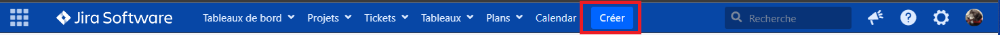
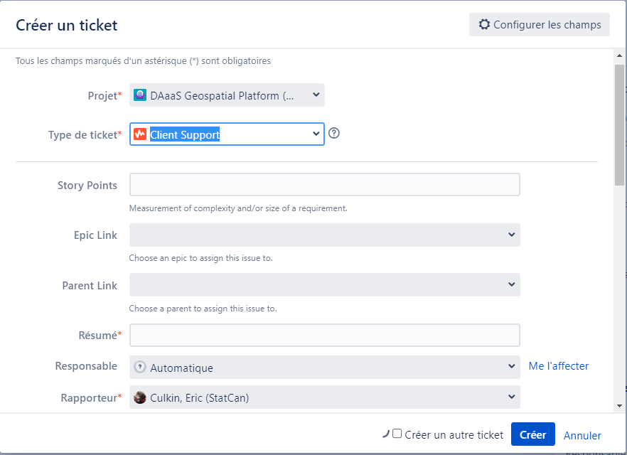

#Contactez l'équipe de réussite client de DAS

Pour les demandes commerciales et d'intégration, ou pour recevoir un support technique :

**statcan.dassupport-soutiendelads.statcan@statcan.gc.ca**
	

??? abstract "Interne - Employés de Statistique Canada" 
	<b>Comment soumettre une demande technique ou signaler un problème </b>
	Pour obtenir un support technique, veuillez soumettre un ticket via Jira :

	1. Ouvrez le logiciel Jira de Statistique Canada : [DAS Support (DASSR)](https://jirab.statcan.ca/projects/DASSR/summary)
	2. Dans la barre de menu, sélectionnez le bouton **Créer** :
		
	3. Dans la fenêtre de création de problème Jira, sélectionnez le type de problème = **Assistance client** :
		
	4. Dans la fenêtre de création de problème Jira, saisissez les informations relatives à votre demande :
		- **Résumé** (obligatoire) : Saisissez un court résumé de votre demande.
		- **Assigné à** (obligatoire) : Sélectionnez "automatique".
		- **Composant** (obligatoire) : Sélectionnez "GAE".
		- **Description** (obligatoire) : Saisissez une description détaillée de votre demande.
		- **Pièce jointe** (facultatif) : Documentation supplémentaire concernant votre demande (captures d'écran des erreurs, par exemple).
		
	Le support DAS complétera le reste des informations dans le ticket Jira si nécessaire. Vous recevrez des mises à jour sur le ticket par e-mail. 

---

<!-----------------------------------section needs work-------------------------------------------------------
	##ADMENDMENTS
			## Comment modifier les exigences de votre projet DAS 
			## How to change your DAS project requirements

--------------------------------------------------------------------------------------------------------------->

Plus de contacts DAS :

- [Page d'accueil du portail DAS](https://www.statcan.gc.ca/data-analytics-services/overview)

- [Guide de l'Espace de travail d'analyse avancée (AAW)](https://statcan.github.io/aaw/)

- [Chaîne Slack de l'AAW](https://app.slack.com/client/T013KCYQB4G)

- [Guide de l'Environnement d'analyse collaborative (CAE)](https://statcan.github.io/cae-eac/)

- [Chaîne Slack du CAE](https://app.slack.com/client/T013XR48YDQ)
