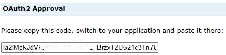

# Exploiter GAE depuis AAW ou CAE; <br> *Analyse multiplateforme*

??? quote "Qu'est-ce que AAW?"
    L'Espace de travail pour l'analyse avancée (AAW) fournit des outils d'analyse et d'intelligence artificielle open source de pointe ainsi qu'une capacité de calcul pour les charges de travail modernes de science des données. <br>
    L'AAW met l'accent sur les produits et services open source.
    
??? quote "Qu'est-ce que CAE?"
    L'Environnement d'analyse collaborative (CAE) fournit des services cloud pour l'ingestion, la transformation et la préparation des données, ainsi que l'exploration et le calcul des données. Il comprend des outils d'analyse collaborative, des environnements d'apprentissage automatique et des capacités de visualisation des données. <br>
    Le CAE met l'accent sur les produits natifs du cloud Azure.
    
??? success "Prérequis"
    1) Un projet embarqué dans les deux espaces (AAW et/ou CAE, ___ET___, GAE)<br>
    2) Un ID client ArcGIS Portal (clé API)


## Connexion aux données spatiales - Portail d'entreprise GAE
Le portail ArcGIS Enterprise peut être accédé à partir de l'AAW ou du CAE en utilisant l'API, depuis n'importe quel service qui exploite le langage de programmation Python.

Par exemple, dans l'AAW et l'utilisation des [Jupyter Notebook](https://statcan.github.io/aaw/fr/1-Experiments/Jupyter/) dans l'espace, ou dans le CAE l'utilisation de [Databricks](https://statcan.github.io/cae-eac/fr/DataBricks/), DataFactory, etc.


??? example "Connexion au portail GAE à l'aide de l'API ArcGIS"
    1. Installer les packages :

        ```python
        conda install arcgis
        ```

        ou en utilisant Artifactory

        ```python
        conda install -c https://jfrog.aaw.cloud.statcan.ca/artifactory/api/conda/esri-remote arcgis
        ```

    2. Importer les bibliothèques nécessaires dans le carnet de notes.
        ```python
        from arcgis.gis import GIS
        from arcgis.gis import Item
        ```
        
    3. Accéder au portail
        Votre groupe de projet se verra attribuer un identifiant de client lors de l'intégration. Collez l'identifiant de client entre les guillemets ```client_id='######'```.
        
        ```python
        gis = GIS("https://geoanalytics.cloud.statcan.ca/portal", client_id=' ')
        print("Connecté avec succès en tant que : " + gis.properties.user.username)
        ```

    4. - La sortie vous redirigera vers un portail de connexion.
       - Utilisez l'option de connexion Azure de StatCan et votre ID Cloud.
       - Après une connexion réussie, vous recevrez un code pour vous connecter à l'aide de SAML.
       - Collez ce code dans la sortie.

    


<!---I don't think this section below is needed:

### Display user information
Using the 'me' function, we can display various information about the user logged in.
```python
me = gis.users.me
username = me.username
description = me.description
display(me)
```

--->


??? example "Recherche de votre contenu"
    **Méthode search()**
    La méthode search() est utilisée pour récupérer une collection d'éléments correspondant à des critères de recherche spécifiques. Elle vous permet de rechercher des éléments en fonction de différents paramètres tels que des mots-clés, des types d'éléments, des propriétaires, des étiquettes, des groupes, et plus encore. La méthode search() renvoie une liste d'éléments correspondant aux critères de recherche spécifiés. Cette méthode est utile lorsque vous souhaitez récupérer plusieurs éléments répondant à certaines conditions.
    
    Il existe plusieurs façons de rechercher du contenu en fonction de la quantité de métadonnées que vous avez renseignées pour votre élément. [En savoir plus sur la méthode .search ici](https://developers.arcgis.com/python/api-reference/arcgis.gis.toc.html#arcgis.gis.ContentManager.search)
    

    ??? example "Rechercher tous vos éléments dans le portail"
        ```python
        # Obtenir l'utilisateur actuellement connecté
        moi = gis.users.me

        # Récupérer tous les éléments possédés par l'utilisateur
        mon_contenu = moi.items()

        # Afficher la collection d'éléments de l'utilisateur
        mon_contenu
        ```
    ??? example "Rechercher du contenu par nom"    
        ```Python
        # Rechercher des éléments par titre
        resultats_recherche = gis.content.search(query="Votre Titre")
		# Iterate over the search results
		for item in search_results:
		print(f"Title: {item.title}, ID: {item.id}")
		```
		
	??? example "Recherche de contenu par balise"
	```python
    # Rechercher des éléments par balises
    search_results = gis.content.search(query="", tags="votre_balise")

    # Parcourir les résultats de la recherche
    for item in search_results:
        print(f"Titre : {item.title}, ID : {item.id}")
    ```

??? example "Recherche de contenu par groupe"
	```Python
    # Spécifier l'ID du groupe ou le nom du groupe dans lequel vous souhaitez effectuer la recherche
    group_id = "votre_ID_de_groupe_ou_nom"

    # Rechercher des éléments dans le groupe spécifié
    search_results = gis.content.search(query="", inGroup=group_id)

    # Parcourir les résultats de la recherche
    for item in search_results:
        print(f"Titre : {item.title}, ID : {item.id}")
 	```  


??? example "Obtenir du contenu (récupération)"
    **Méthode .get()**
    
    La méthode .get() est utilisée pour récupérer un élément spécifique en utilisant son identifiant unique. Vous fournissez l'identifiant de l'élément en tant qu'argument à la méthode .get(), et elle renvoie l'élément correspondant à cet identifiant particulier. Cette méthode est utile lorsque vous connaissez déjà l'identifiant exact de l'élément et que vous souhaitez récupérer cet élément spécifique.
    
    La manière efficace de récupérer du contenu est d'utiliser l'identifiant de l'élément :
    ```Python
    # Récupérer un élément spécifique en utilisant son identifiant
    item_id = "votre_identifiant_d'élément"
    item = gis.content.get(item_id)
    ```
    
    Il est également possible de *.get* le contenu à partir d'une liste créée lors de la recherche (comme ci-dessus), cependant, cela peut devenir compliqué lors de l'exécution de plusieurs recherches, soyez donc prudent avec votre syntaxe.
    ```python
    # À partir de la liste des résultats de recherche
    item1 = gis.content.get(my_content[5].id)  #[5] = numéro d'index de la recherche
    display(item1)
    ```

## Travail avec des données spatiales
Le choix entre ArcGIS et les outils open-source pour les données spatiales dépend de vos besoins spécifiques et des ressources disponibles. ArcGIS offre des fonctionnalités spécialisées et un support, tandis que les outils open-source sont gratuits et personnalisables. Tenez compte de vos exigences et de l'expertise disponible pour prendre une décision éclairée. Dans certains cas, une approche hybride peut être appropriée, où vous pouvez tirer parti des points forts d'ArcGIS et des outils open-source en fonction de la tâche à accomplir.

??? example "Convertir un service d'entités en DataFrame spatial avec des outils open-source"
    Conversion d'une couche d'entités ArcGIS en un DataFrame Pandas avec des capacités spatiales en utilisant la méthode pd.DataFrame.spatial.from_layer().
    ```python
    import pandas
    
    # Obtenir l'élément du service d'entités
    item = gis.content.get(item_id)

    # Accéder à la couche d'entités à l'intérieur du service d'entités
    feature_layer = item.layers[0]
    
    # Conversion
    sdf = pd.DataFrame.spatial.from_layer(feature_layer)
    ```

	
??? example "Convertir un service d'entités en GeoDataFrame avec des outils open-source"
    Conversion d'une couche d'entités ArcGIS en un DataFrame Pandas avec des capacités spatiales en utilisant la méthode pd.DataFrame.spatial.from_layer().
    ```python
    import geopandas as gpd
    
    # Supposons que vous disposez de l'ID de l'élément du service d'entités
    item_id = "votre_id_d'élément"

    # Obtenir l'élément du service d'entités
    item = gis.content.get(item_id)

    # Accéder à la couche d'entités à l'intérieur du service d'entités
    feature_layer = item.layers[0]

    # Interroger la couche d'entités pour récupérer toutes les entités
    features = feature_layer.query().features

    # Convertir les entités en GeoDataFrame
    gdf = gpd.GeoDataFrame.from_features(features)
    ```


??? example "Publier un Spatial DataFrame en tant que service d'entités sur le portail GAE"
    ```python
    #sdf = votre spatial dataframe
    
    item_properties = {'title': '<nom du titre>', 'tags': '<tag>', 'description': '<c'est la description de mon élément>'}
    published_item = gis.content.import_data(sdf, item_properties=item_properties)
    published_item.publish()

    # Récupérer l'ID de l'élément et l'URL du service d'entités publié
    item_id = published_item.id
    feature_service_url = published_item.url

    # Afficher l'ID de l'élément et l'URL
    print("ID de l'élément:", item_id)
    print("URL du service d'entités:", feature_service_url)
    ```

	
## Visualisez vos données sur une carte interactive

Pour visualiser le widget de carte dans différents outils basés sur Python, vous devrez peut-être utiliser des fonctions d'affichage spécifiques à chaque outil ou des widgets. Par exemple, dans Databricks, utilisez la commande magique `%python` pour passer en mode Python avant de créer et d'afficher le widget de carte.

??? Example "Module de carte ArcGIS"
    ```python
    from IPython.display import display

    # Récupérer l'élément de service d'entités
    item = gis.content.get("id_de_votre_service_d'entités")

    # Créer un widget de carte
    map_widget = MapView()

    # Ajouter la couche de service d'entités à la carte
    map_widget.add_layer(item.layers[0])

    # Afficher le widget de carte à l'aide de la fonction d'affichage spécifique à Databricks
    display(map_widget)
    ```

??? Example "Bibliothèque MatplotLib"
    ```python
    import matplotlib.pyplot as plt
    # Convertir le Spatial DataFrame en GeoDataFrame (si nécessaire)
    gdf = gpd.GeoDataFrame(sdf)

    # Créer une figure et un axe
    fig, ax = plt.subplots()

    # Tracer le GeoDataFrame
    gdf.plot(ax=ax)

    # Afficher le tracé
    plt.show()
    ```


??? Example "Bibliothèque ipyleaflet"
    ```python
    from ipyleaflet import Map, GeoData

    # En supposant que vous disposez d'un GeoDataFrame appelé 'gdf'

    # Créer une carte
    m = Map(center=(gdf.geometry.centroid.y.mean(), gdf.geometry.centroid.x.mean()), zoom=10)

    # Créer une couche GeoData à partir du GeoDataFrame
    geo_data = GeoData(geo_dataframe=gdf)

    # Ajouter la couche GeoData à la carte
    m.add_layer(geo_data)

    # Afficher la carte
    m
    ```
    
---

**En savoir plus sur l'API ArcGIS pour Python**:
[Documentation complète de l'API ArcGIS](https://developers.arcgis.com/python/)

**En savoir plus sur DAS AAW**:
[Guide d'aide AAW](https://statcan.github.io/aaw/)

**En savoir plus sur DAS CAE**:
[Guide d'aide CAE](https://statcan.github.io/cae/)
