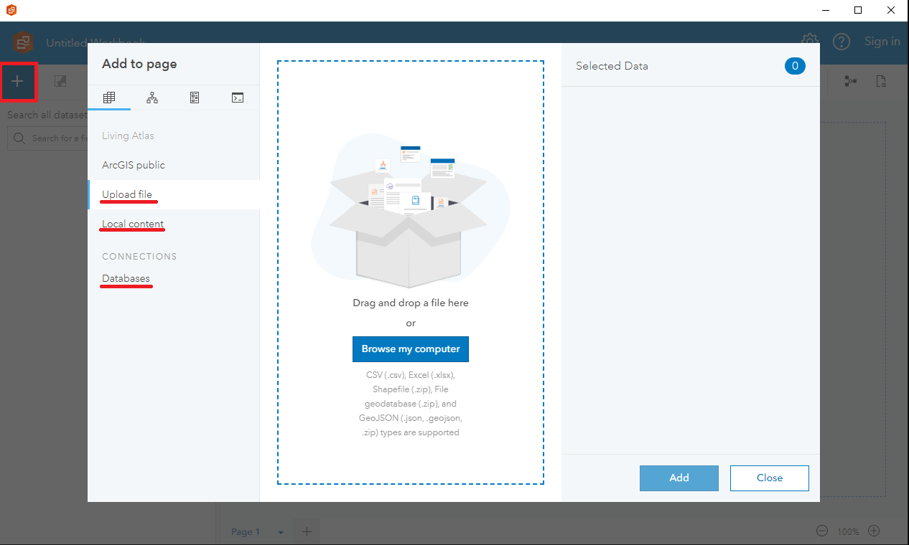
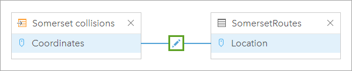
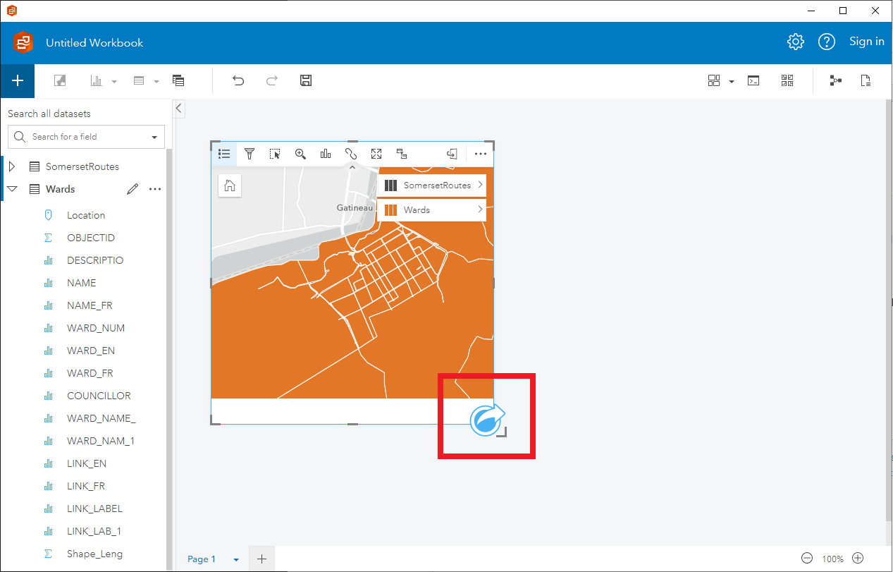
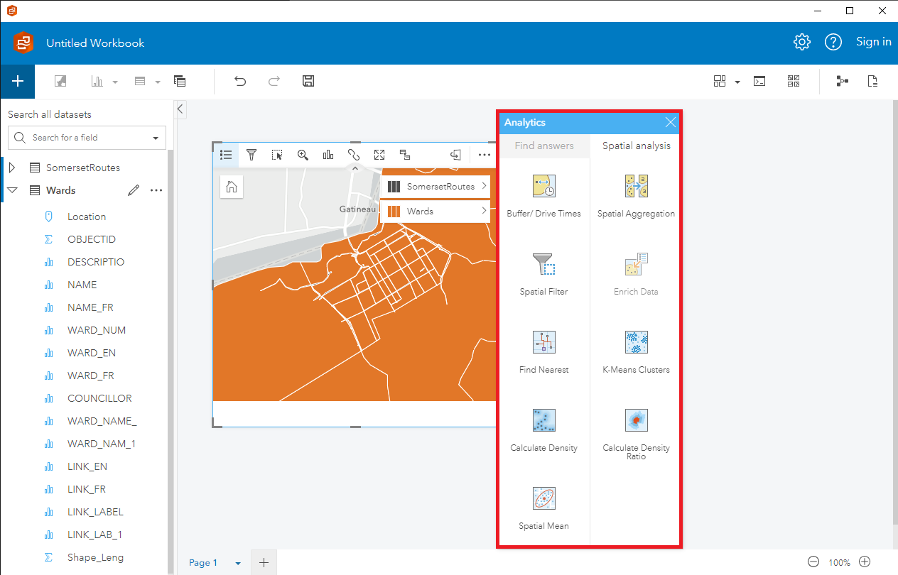

# Insights, Desktop and Portal

>Cette fonctionnalité est encore en cours d'exploration.
GAE continue d'explorer et d'apprendre à connaître ce produit, et nous sommes enthousiastes quant aux possibilités qu'il offre pour améliorer notre capacité à tirer des informations des données.

>Avec une plus grande expérience en utilisant Insights, nous serons en mesure de tirer parti de ses fonctionnalités et capacités avancées pour mieux soutenir notre travail et offrir davantage de valeur aux Canadiens.

>Apprenons ensemble ! Partagez vos connaissances !

<iframe width="560" height="315" src="https://www.youtube-nocookie.com/embed/40uI1zel6eo" title="YouTube video player" frameborder="0" allow="accelerometer; autoplay; clipboard-write; encrypted-media; gyroscope; picture-in-picture" allowfullscreen></iframe>

> Ne se charge pas ? : [https://www.youtube-nocookie.com/embed/40uI1zel6eo](https://www.youtube-nocookie.com/embed/40uI1zel6eo) (Anglais uniquement)

---

## Informations

ArcGIS Insights est un puissant outil d'analyse et de visualisation des données développé par Esri. ArcGIS Insights est disponible en deux versions différentes : ArcGIS Insights Desktop et ArcGIS Insights Portal, et il existe quelques différences clés entre les deux.

ArcGIS Insights Desktop est une application autonome. Elle offre aux utilisateurs une puissante suite d'outils d'analyse et de visualisation des données qui peuvent être utilisés pour explorer des données, créer des cartes et des graphiques, et effectuer des analyses spatiales complexes. Insights Desktop est conçu pour les utilisateurs individuels ou les petites équipes qui ont besoin d'analyser des données et de créer des rapports localement, sans dépendre d'une connexion réseau.

D'autre part, ArcGIS Insights Portal est une version basée sur le web du logiciel qui est hébergée dans le cloud. Insights Portal est conçu pour les organisations plus importantes qui ont besoin de partager des données et des outils d'analyse entre plusieurs équipes ou départements. Insights Portal offre aux utilisateurs un accès aux mêmes outils puissants d'analyse et de visualisation des données que Insights Desktop, mais avec l'avantage supplémentaire d'un référentiel de données centralisé et de fonctionnalités de collaboration qui permettent aux équipes de travailler ensemble sur des projets d'analyse de données.

En résumé, ArcGIS Insights Desktop et ArcGIS Insights Portal sont tous deux des outils puissants d'analyse et de visualisation des données qui offrent des fonctionnalités similaires. Cependant, Insights Desktop est conçu pour les utilisateurs individuels ou les petites équipes qui ont besoin de travailler localement, tandis que Insights Portal est conçu pour les grandes organisations qui ont besoin de partager des données et des outils d'analyse entre plusieurs équipes ou départements.

## Exemples d'analyse

Voici quelques exemples de tâches d'analyse de données que vous pouvez effectuer dans ArcGIS Insights :

- **Analyse spatiale** : Vous pouvez utiliser ArcGIS Insights pour effectuer une large gamme de tâches d'analyse spatiale, notamment le regroupement spatial, l'analyse de proximité, et plus encore. Par exemple, vous pouvez utiliser la fonction "Trouver le plus proche" pour trouver les emplacements les plus proches d'un emplacement donné, ou utiliser la fonction "Agrégation spatiale" pour regrouper vos données par emplacement.

- **Analyse des séries temporelles** : Vous pouvez utiliser ArcGIS Insights pour analyser des données de séries temporelles, y compris les tendances, la saisonnalité, et plus encore. Par exemple, vous pouvez utiliser la carte "Visualisation des séries temporelles" pour visualiser vos données de séries temporelles, ou utiliser la fonction "Prévision des séries temporelles" pour prévoir les tendances futures.

- **Analyse statistique** : Vous pouvez utiliser ArcGIS Insights pour effectuer une large gamme de tâches d'analyse statistique, y compris les tests d'hypothèses, l'analyse de régression, et plus encore. Par exemple, vous pouvez utiliser la carte "Matrice de corrélation" pour visualiser les corrélations entre vos variables, ou utiliser la fonction "Régression linéaire" pour effectuer une analyse de régression.

- **Exploration de données** : Vous pouvez utiliser ArcGIS Insights pour effectuer des tâches d'exploration de données, y compris l'analyse des associations, le regroupement, et plus encore. Par exemple, vous pouvez utiliser la fonction "Règles d'association" pour trouver des motifs dans vos données, ou utiliser la fonction "Regroupement K-means" pour regrouper vos données.

Dans l'ensemble, ArcGIS Insights est un puissant outil d'analyse de données qui peut être utilisé pour analyser et visualiser une large gamme de données spatiales et non spatiales.

## Instructions

A continuación se presentan algunas instrucciones sobre cómo utilizar ArcGIS Insights para el análisis de datos:

1. **Crear un nuevo libro de trabajo**: Para comenzar a utilizar ArcGIS Insights, debes crear un nuevo libro de trabajo. Haz clic en el botón "Nuevo libro de trabajo" en la página de inicio de Insights, o selecciona "Archivo" > "Nuevo libro de trabajo" en el menú superior.

   

2. **Conectar con los datos**: El siguiente paso es conectar con tus datos. Insights admite una amplia gama de fuentes de datos, incluyendo hojas de cálculo, bases de datos y ArcGIS Online/Enterprise. Haz clic en "Conectar con los datos" para acceder a tus fuentes de datos.

   

3. **Crear una nueva página**: Una vez que te hayas conectado con tus datos, puedes comenzar a crear páginas para analizar y visualizar tus datos. Haz clic en "Nueva página" para crear una nueva página.

   

4. **Arrastrar y soltar datos**: Para comenzar a analizar tus datos, arrastra y suelta tus datos en la página. Insights creará automáticamente tarjetas para visualizar tus datos. Puedes elegir entre varios tipos de tarjetas, incluyendo mapas, gráficos, tablas y más.

   

5. **Filtrar y resumir datos**: Puedes filtrar y resumir tus datos agregando filtros y resúmenes a tus tarjetas. Por ejemplo, puedes filtrar tus datos por fecha, ubicación u otros atributos, y resumir tus datos contando, promediando u otros medidas estadísticas.

   

   También puedes filtrar el conjunto de datos original:

   

   Un filtro de tarjeta solo afecta a la tarjeta y crea un conjunto de datos filtrado, mientras que el conjunto de datos original sin filtrar sigue disponible para su uso en tu análisis. Cuando aplicas un filtro a un conjunto de datos, no se crea un nuevo conjunto de datos. Todas las tarjetas que utilizan el conjunto de datos filtrado cambian para incluir el filtro.

6. **Crear relaciones**: Insights te permite crear relaciones entre tus fuentes de datos, lo que puede ayudarte a analizar y visualizar tus datos de manera más efectiva. Haz clic en "Crear relación" para conectar tus fuentes de datos.

   
   
   

7. **Agregar análisis de Insights**: Insights cuenta con una amplia gama de funciones que puedes utilizar para analizar y manipular tus datos. Por ejemplo, puedes utilizar la función "Encontrar ubicaciones similares" para encontrar ubicaciones similares a una ubicación dada, o la función "Agregar datos de ubicación" para agregar datos de ubicación a tus datos no espaciales.

   
   

8. **Compartir tus resultados**: Una vez que hayas analizado y visualizado tus datos, puedes compartir tus resultados con otros. Haz clic en "Compartir" para compartir tu libro de trabajo con otros usuarios de Insights, o exporta tus resultados en varios formatos, incluyendo PDF, CSV y más.

   

---

## Conseils et meilleures pratiques

- **Sauvegardez régulièrement** : Insights ne dispose pas d'une fonction de sauvegarde automatique. Il est important de sauvegarder votre travail fréquemment, surtout après la création d'un nouvel ensemble de données ou d'une carte.

- **Planifiez et organisez vos données** : Avant de commencer à analyser vos données dans ArcGIS Insights, il est important de les planifier et de les organiser correctement. Assurez-vous que vos données sont propres, bien organisées et dans un format pouvant être facilement importé dans Insights.

- **Utilisez des techniques de visualisation appropriées** : ArcGIS Insights offre une large gamme d'outils de visualisation, notamment des graphiques, des tableaux et des cartes. Choisissez la technique de visualisation adaptée à vos données et utilisez la couleur et les étiquettes pour rendre vos visuels plus efficaces.

- **Choisissez les bons outils d'analyse** : ArcGIS Insights propose une variété d'outils d'analyse, notamment l'analyse spatiale, l'analyse statistique et la modélisation prédictive. Choisissez l'outil adapté à vos besoins d'analyse et assurez-vous de bien comprendre comment l'utiliser efficacement.

- **Collaborez avec d'autres personnes** : ArcGIS Insights facilite la collaboration avec d'autres personnes sur des projets d'analyse de données. Utilisez les fonctionnalités de partage et de collaboration pour travailler avec les membres de votre équipe, partager des données et des informations et obtenir des commentaires.

- **Documentez votre travail** : Au fur et à mesure de vos projets d'analyse dans ArcGIS Insights, veillez à documenter votre travail. Suivez vos sources de données, les techniques d'analyse utilisées et les conclusions obtenues, et créez des rapports et des présentations pour partager vos informations avec d'autres personnes.

- **Restez à jour** : ArcGIS Insights est un outil puissant en constante évolution. Assurez-vous de vous tenir au courant des nouvelles fonctionnalités et mises à jour, et profitez des ressources en ligne, de la formation et des communautés d'utilisateurs pour tirer le meilleur parti du logiciel.
