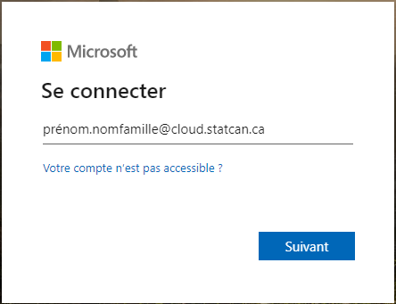
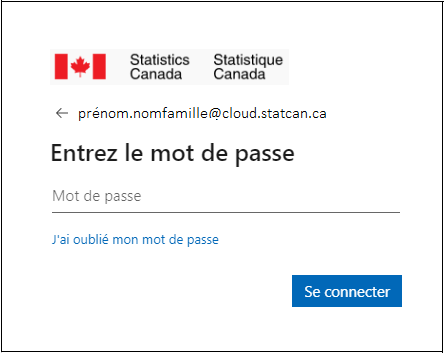

# Connexion - Accès à DAS

??? info "Utilisateurs externes (non-employés de StatCan)"
	1. Rendez-vous sur le lien suivant : **[Portail des services d'analyse de données](https://www.statcan.gc.ca/data-analytics-services/overview)**
	
	2. En haut à droite, sélectionnez **Se connecter**
	>
	3. Suivez les instructions qui s'affichent dans la fenêtre contextuelle pour vous connecter
	
	4. Faites défiler vers le bas, et votre VM DAS sera répertoriée
	
	5. Utilisez l'interface pour démarrer, vous connecter, puis arrêter votre VM
	

??? info "Utilisateurs internes (employés de StatCan)"
	1. À l'aide de Chromium ou Edge, ouvrez le **[Portail Azure](https://portal.azure.com/#home)** 

	2. Il se peut que vous deviez entrer ou sélectionner un compte :  

		- Lors de votre première connexion, vous recevrez la fenêtre de connexion Microsoft, comme indiqué ci-dessous.  
	  
	- Entrez vos informations d'identification du compte **cloud** (prenom.nom@**cloud.statcan.ca**), puis cliquez sur **Suivant**.

	- Lors des connexions suivantes, vous recevrez la fenêtre de sélection du compte Microsoft, comme indiqué ci-dessous. Cliquez sur votre compte **cloud.statcan.ca**.  
	  

	3. Vous serez ensuite invité(e) à saisir votre mot de passe du compte cloud, comme indiqué ci-dessous. Une fois saisi, cliquez sur **Se connecter**.  
	
		
		??? info "Est-ce la première fois que vous accédez au cloud STC ?"
			- Utilisez le mot de passe temporaire qui vous a été envoyé par l'équipe du cloud.
			
			- Vous serez ensuite invité(e) à configurer *2MFA* sur votre téléphone et à répondre à 5 questions de *récupération de mot de passe*.
			
			- Suivez les instructions indiquées. Cela devrait prendre environ 2 à 5 minutes.
	   
	   
	4. Enfin, il se peut que vous deviez confirmer votre compte via votre appareil mobile.  
	:telephone_receiver:

	5. Vous devriez maintenant voir la page d'accueil du cloud Azure.
