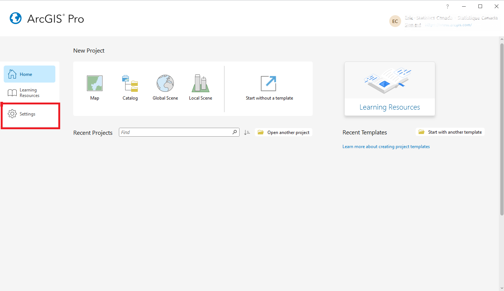

# ArcGIS Pro sur DAS GAE

## Configuration initiale

??? success "Connectez votre licence ArcPro"
    
    ArcGIS Pro devrait déjà être connecté à notre serveur de licences. Les instructions suivantes sont fournies en cas de problème.

    Les licences ArcGIS Pro sont gérées par l'équipe **StatCan GeoHelp**.
    **Veuillez contacter GeoHelp pour obtenir de l'aide : geohelp@statcan.gc.ca**

    1. Dans le menu Paramètres, sélectionnez "Licence" dans la liste à gauche. Il est normal que le gestionnaire de licences mette plusieurs minutes à s'initialiser.
    2. Cliquez sur **Configurer vos options de licence**
    
    3. Dans le menu déroulant *Type de licence*, sélectionnez l'option **Utilisation simultanée**.
    4. Dans le champ *Gestionnaire de licences*, saisissez le nom d'hôte : **5200@stmcapp-200statcan.ca**
    <!-- replace -->
    5. Cliquez sur le bouton "OK" pour enregistrer vos modifications.
    6. Redémarrez ArcGIS Pro pour activer les nouveaux paramètres de licence.

    Une fois connecté au serveur de licences simultanées, vous devriez pouvoir voir les licences du logiciel ArcGIS Pro et toutes les extensions incluses.

??? success "Connecter Pro à DAS Enterprise Portal"
    Une connexion au portail ArcGIS Enterprise DAaaS GEO doit être établie afin de publier depuis ArcGIS Pro vers le portail. Suivez ces étapes :

    1. *a:* À partir de l'écran d'accueil d'ArcGIS Pro, sélectionnez **Paramètres**, puis sélectionnez **Portails**  
        
        
        **OU**
        
        *b:* Dans un projet, faites un clic droit sur votre nom en haut à droite de la fenêtre et sélectionnez : **Gérer les portails**
        

    2. Sélectionnez **Ajouter un portail** et saisissez l'URL suivante : **https://geoanalytics.cloud.statcan.ca/portal/**
        

    3. La connexion sera ensuite répertoriée. Sélectionnez le bouton **plus** **'...'**, puis sélectionnez *Se connecter*.  
        
        Nous vous suggérons également, une fois la connexion établie, de sélectionner le **Définir comme portail actif** dans le menu déroulant **plus...**.
        
    4. Une fenêtre de navigateur s'ouvrira, cliquez sur le bouton de connexion **'Azure Cloud Login'** et suivez les instructions. Une fois l'authentification Azure terminée, vous serez renvoyé à l'écran d'ArcGIS Pro.

     

    En savoir plus sur [l'auto-inscription dans le portail](portal.md)
    
    En savoir plus : [Gérer les connexions de portail depuis ArcGIS Pro](https://pro.arcgis.com/fr/pro-app/latest/help/projects/manage-portal-connections-from-arcgis-pro.htm)

## Ajout de données à votre projet

??? example "Ajouter des données à partir d'un champ ou d'un dossier local"
    1. Dans le volet Catalogue, qui se trouve généralement sur le côté droit de l'interface d'ArcGIS Pro; Faites un clic droit sur Dossiers, sélectionnez Ajouter une connexion de dossier, localisez le dossier souhaité et sélectionnez-le.
	
    2. Développez la source de données qui contient les données que vous souhaitez ajouter. Par exemple, si vous avez des fichiers shapefile stockés dans un dossier, développez le dossier.

    3. Localisez l'ensemble de données spécifique que vous souhaitez ajouter à votre projet.

    4. Pour ajouter les données à la carte en cours, faites simplement glisser-déposer l'ensemble de données sur la vue de la carte ou faites un clic droit sur l'ensemble de données et sélectionnez "Ajouter à la carte en cours" ou "Ajouter au projet".

    5. Après avoir ajouté les données, elles seront visibles dans le volet Contenu, qui se trouve généralement sur le côté gauche de l'interface d'ArcGIS Pro. Vous pouvez interagir avec les données ajoutées en les sélectionnant dans le volet Contenu et en utilisant les outils et fonctionnalités disponibles en haut.

??? example "Connexion à une base de données PostgreSQL"
    
    GAE a simplifié le processus de connexion ArcGIS Pro-PostgreSQL en utilisant un fichier de connexion *.sde*.

    1. Dans le volet Catalogue, faites un clic droit sur *Bases de données* et sélectionnez *Ajouter une base de données*
    

    2. Dans la nouvelle fenêtre, développez *This PC* et localisez le partage de fichiers de votre projet (monté en tant que lecteur)
    

    3. Sélectionnez le fichier *.sde* et cliquez sur *Ok*

    4. La base de données PostgreSQL apparaîtra dans *Bases de données* dans le volet *Catalogue*.

    En savoir plus : [Documentation d'ArcGIS Pro](https://pro.arcgis.com/fr/pro-app/2.8/help/data/databases/connect-postgresql.htm)

??? example "Importer des données depuis ArcGIS Enterprise"
    En tant que membre sur GAE, vous aurez soit le rôle d'utilisateur Project Member, soit le rôle d'utilisateur Project Viewer. Les mêmes privilèges s'appliqueront à la fois à ArcGIS Enterprise et à ArcGIS Pro.

    Les utilisateurs ayant les rôles Project Member et Project Viewer auront la possibilité de consulter (afficher) des données partagées à partir de leurs groupes de projet dans ArcGIS Pro, ainsi que des données personnelles.

    Dans le volet **Catalogue** (si le volet **Catalogue** est fermé, cliquez sur l'onglet **Affichage** dans le ruban principal. Dans le groupe **Fenêtres**, cliquez sur **Volet Catalogue**), sélectionnez l'onglet **Portail**. Les mêmes onglets **Contenu** d'ArcGIS Enterprise apparaîtront ; *Mon Contenu*, *Mes Favoris*, *Mes Groupes*, *Mon Organisation*, *ArcGIS Enterprise* et *Living Atlas*.
    

	
??? example "Analyse via la barre d'outils"
    Une fois que vous avez ajouté les données nécessaires à votre projet :
    
    1. Dans l'onglet "Analyse" du ruban d'ArcGIS Pro, cliquez sur le bouton "Boîtes à outils". Le bouton "Boîtes à outils" permet d'accéder à différentes boîtes à outils de géotraitement.
	
    2. Parcourez et explorez les boîtes à outils disponibles pour trouver celle qui contient les outils spécifiques dont vous avez besoin pour votre analyse. Les boîtes à outils sont organisées en fonction de leur fonctionnalité, telle que la gestion des données, les statistiques spatiales, la conversion, et plus encore.

    3. Développez la boîte à outils sélectionnée pour afficher son contenu, qui comprend des outils de géotraitement individuels.

    4. Localisez l'outil que vous souhaitez utiliser pour votre analyse. Chaque outil effectue une fonction spécifique et peut nécessiter des paramètres d'entrée spécifiques.

    5. Double-cliquez sur l'outil pour ouvrir sa boîte de dialogue. La boîte de dialogue vous permet de définir les paramètres d'entrée et de configurer les paramètres de l'outil.

    6. Remplissez les paramètres requis, tels que les données d'entrée, les emplacements de sortie et toute autre information pertinente. Les noms et les options des paramètres varieront en fonction de l'outil sélectionné.

    7. Consultez la documentation de l'outil ou les ressources d'aide si vous avez besoin de plus d'informations sur les paramètres ou le fonctionnement de l'outil.

    8. Une fois que vous avez défini les paramètres, cliquez sur le bouton "Exécuter" pour lancer l'analyse à l'aide de l'outil sélectionné. L'outil traitera les données et générera les résultats en fonction des paramètres spécifiés.

    9. Après la fin de l'analyse, vous pouvez examiner et explorer les résultats. Les résultats peuvent être affichés sur la carte, dans le volet de géotraitement ou dans une nouvelle couche ou table.

    10. Affinez davantage les résultats de votre analyse en visualisant et en interrogeant les données, en effectuant des analyses supplémentaires ou en partageant vos découvertes via des cartes, des graphiques ou des rapports.

    [En savoir plus sur les outils disponibles ici](https://pro.arcgis.com/en/pro-app/latest/tool-reference/main/arcgis-pro-tool-reference.htm)

??? example "Analyse via ModelBuilder (réutilisable)"
    ??? quote "Qu'est-ce que ModelBuilder ?"
        ModelBuilder dans ArcGIS Pro est un outil visuel pour créer des flux de travail d'analyse spatiale automatisés. Il simplifie les tâches complexes en vous permettant de connecter visuellement des outils et des données. Avec ModelBuilder, vous pouvez personnaliser vos flux de travail, collaborer avec d'autres personnes et réutiliser vos modèles de manière cohérente et efficace.

    1. Dans l'onglet "Analyse" du ruban d'ArcGIS Pro, cliquez sur le bouton "ModelBuilder". Cela ouvrira l'interface ModelBuilder ; vous verrez un canevas vide où vous pouvez créer votre flux de géotraitement.
	
    2. Commencez à construire votre modèle en ajoutant des outils au canevas. Pour ajouter un outil, vous pouvez soit le rechercher dans la barre de recherche située sur l'interface ModelBuilder, soit naviguer dans les boîtes à outils en cliquant sur le bouton "Boîtes à outils" dans l'onglet "Analyse" et en sélectionnant l'outil souhaité.

    3. Faites glisser et déposez l'outil sélectionné sur le canevas. Connectez les outils en cliquant sur le connecteur de sortie d'un outil et en le faisant glisser jusqu'au connecteur d'entrée d'un autre outil. Cela représente le flux de données entre les outils.

    4. Configurez les paramètres de chaque outil en cliquant dessus avec le bouton droit de la souris et en sélectionnant "Propriétés". Remplissez les paramètres requis et ajustez les autres paramètres si nécessaire.

    5. Continuez à ajouter des outils et à les connecter jusqu'à ce que vous ayez construit votre flux de travail souhaité.

    6. Testez votre modèle en cliquant sur le bouton "Exécuter" dans l'interface ModelBuilder. Cela exécutera le flux de travail et traitera les données en fonction des paramètres spécifiés.

    7. Une fois que le modèle a été exécuté avec succès et a produit les résultats souhaités, vous pouvez l'enregistrer pour une utilisation ultérieure. Pour enregistrer le modèle, allez dans le menu "Fichier" et sélectionnez "Enregistrer" ou "Enregistrer sous". Choisissez un emplacement et donnez un nom au modèle, puis cliquez sur "Enregistrer". Le modèle sera enregistré avec une extension de fichier .tbx, qui représente une boîte à outils ModelBuilder.

    ASTUCE : Vous pouvez également créer des paramètres de modèle pour rendre votre modèle plus flexible et réutilisable. Les paramètres vous permettent de spécifier les emplacements des données d'entrée et de sortie et d'autres variables lors de l'exécution du modèle. Pour créer un paramètre de modèle, cliquez dessus avec le bouton droit de la souris, sélectionnez "Paramètre de modèle" et définissez les propriétés du paramètre.

    ASTUCE : Pour exécuter le modèle avec différentes données d'entrée ou valeurs de paramètres, vous pouvez l'ouvrir à partir du volet Catalogue ou du volet de géotraitement, modifier les valeurs d'entrée ou les paramètres, puis l'exécuter à nouveau.
    
??? example "Analyse via Python et Notebook dans Pro"
    ??? quote "Qu'est-ce qu'un notebook Python et pourquoi l'utiliser ?"
        Un notebook Python dans ArcGIS Pro combine du code, de la documentation et des visualisations, offrant un environnement interactif pour l'analyse spatiale. Il offre une flexibilité, des fonctionnalités de scripting avancées et une intégration avec des packages Python externes, ce qui en fait un outil idéal pour les flux de travail personnalisés et les techniques d'analyse avancées.
    Dans l'interface du notebook, vous pouvez commencer à écrire et à exécuter du code Python pour effectuer votre analyse. Vous pouvez utiliser diverses fonctions ArcPy, des bibliothèques et d'autres packages Python pour l'analyse spatiale.

    1. Depuis l'onglet "Analyse", sélectionnez "Python", puis sélectionnez soit "Notebook" soit "Python Window", selon votre préférence. Vous pouvez commencer à écrire et à exécuter du code Python pour effectuer votre analyse dans le notebook ou la fenêtre Python nouvellement ouverte. Vous pouvez utiliser diverses fonctions ArcPy, des bibliothèques et d'autres packages Python pour l'analyse spatiale.
	
    2. Importez les bibliothèques et modules nécessaires en incluant des instructions d'importation au début du notebook. [Apprenez comment installer des packages ici](https://pro.arcgis.com/en/pro-app/latest/arcpy/get-started/what-is-conda.htm)

    3. Utilisez les fonctions ArcPy et les outils de géotraitement pour effectuer des tâches d'analyse spatiale. Vous pouvez accéder et manipuler des jeux de données spatiales, effectuer des calculs, exécuter des outils de géotraitement, créer des cartes et générer des sorties. [En savoir plus sur Arcpy](https://developers.arcgis.com/documentation/arcgis-add-ins-and-automation/arcpy/)

    4. Écrivez votre code d'analyse dans des cellules distinctes du notebook. Chaque cellule peut être exécutée individuellement en cliquant sur le bouton "Exécuter" ou en utilisant le raccourci Shift + Entrée.

    5. Exécutez les cellules séquentiellement pour exécuter votre analyse étape par étape, en examinant les résultats et les résultats intermédiaires au fur et à mesure de votre progression.

    6. Vous pouvez ajouter des cellules de texte formaté (markdown) pour inclure du texte explicatif, de la documentation ou des visualisations dans le notebook afin d'améliorer la lisibilité et la clarté.

    7. Enregistrez périodiquement votre notebook Python pour conserver votre code et l'avancement de votre analyse. Utilisez l'option "Enregistrer" dans l'interface du notebook pour sauvegarder vos modifications.

    ASTUCE : Une fois votre analyse terminée, vous pouvez exporter le notebook Python sous forme d'un fichier .ipynb autonome à des fins de partage ou d'archivage.

	
	
## Partage des résultats

??? abstract "Partage des données avec ArcGIS Enterprise"
    Seuls les utilisateurs ayant le rôle de membre du projet peuvent télécharger et partager du contenu sur le portail.

    Cliquez avec le bouton droit sur une couche dans le volet **Contenu** (si le volet **Contenu** est fermé, cliquez sur l'onglet **Affichage** dans le ruban principal. Dans le groupe **Fenêtres**, cliquez sur **Contenu**) et sélectionnez **Partage** > **Partager en tant que couche web** dans le menu déroulant. Une nouvelle fenêtre **Partager en tant que couche web** apparaîtra.
    

??? abstract "Archivage de votre projet"
    **Ajoutez des métadonnées !**
    
    Couches de données et tables :
    
    1. Cliquez avec le bouton droit sur la couche/table dans le volet **Contenu**.
    2. Sélectionnez **Propriétés**. Accédez à l'onglet **Métadonnées**.
    3. Cliquez sur **Modifier** et remplissez les détails. Enregistrez.
    
    ModelBuilder :
    
    1. Accédez au menu **Modèle**, puis à **Propriétés du modèle**. Ouvrez l'onglet **Métadonnées**.
    2. Cliquez sur **Modifier** et fournissez les détails. Enregistrez les métadonnées.
    
    Carnets Python/Scripts :
    
    - Carnets : Ajoutez des cellules de texte en markdown avec des métadonnées (titre, description, auteur).
    - Scripts : Incluez des commentaires au début pour les métadonnées (objectif, auteur, description).

    **Packagez votre projet**
    
    ArcGIS Pro propose un outil d'emballage qui vous permet de créer un package de projet contenant l'ensemble des données du projet, des cartes et des paramètres d'analyse.
    
    Pour créer un package de votre projet, accédez à l'onglet **Partage** dans le ruban d'ArcGIS Pro et cliquez sur le bouton "Projet".
    
    Suivez les instructions pour spécifier les paramètres du package, y compris l'emplacement de sortie, le nom du package et les options de données ou d'analyse que vous souhaitez inclure. Ce package servira d'archive autonome de votre projet.
    
    **Exporter des données**
    
    Si vous souhaitez archiver séparément des couches de données spécifiques ou des résultats d'analyse, vous pouvez les exporter à partir d'ArcGIS Pro.
    
    Cliquez avec le bouton droit sur la couche de données ou le résultat dans le volet **Contenu**, sélectionnez **Données** ou **Exporter**, puis choisissez le format d'exportation souhaité.
    
    Enregistrez les données exportées dans l'emplacement de votre choix pour les archiver.

---

## En savoir plus :

### Meilleures pratiques

- Organisez vos données : Créez une structure de dossiers logique et utilisez des noms descriptifs pour vos couches et jeux de données afin de les rendre faciles à trouver et à comprendre.

- Limitez le nombre de dossiers : Ne créez pas trop de niveaux de dossiers au sein de votre projet, car cela peut rendre la navigation et la localisation des éléments difficiles. Limitez le nombre de niveaux à trois ou quatre au maximum.

- Utilisez les sous-dossiers avec parcimonie : Utilisez des sous-dossiers uniquement lorsque cela est nécessaire, par exemple lorsque vous avez un grand nombre d'éléments ou lorsque vous devez les organiser par emplacement ou thème.

- Séparez les données de travail des données publiées : Gardez vos données de travail séparées de vos données publiées. Cela peut vous aider à éviter toute modification ou suppression accidentelle de données importantes.

- Utilisez le volet du projet : Utilisez le volet du projet pour gérer vos données, cartes et mises en page. Cela facilite le passage entre les différentes parties de votre projet.

- Utilisez des signets : Utilisez des signets pour enregistrer des vues spécifiques de votre carte. Cela facilite le retour à un emplacement et un niveau de zoom spécifiques.

- Utilisez les étiquettes avec parcimonie : Utilisez les étiquettes de manière parcimonieuse et assurez-vous qu'elles sont claires et faciles à lire. Envisagez d'utiliser des contours ou des remplissages de fond pour mettre en évidence les étiquettes.

- Utilisez une symbologie cohérente : Utilisez une symbologie cohérente sur vos cartes pour les rendre plus faciles à lire et à comprendre.

- Documentez votre travail : Documentez votre travail à l'aide des outils de métadonnées d'ArcGIS Pro. Cela facilite le partage de votre travail avec d'autres personnes et vous aide à suivre les modifications au fil du temps.

- Utilisez des paquets de cartes : Utilisez des paquets de cartes pour partager vos cartes et données avec d'autres personnes. Cela garantit que toutes les données et les paramètres nécessaires sont inclus.

- Privilégiez les géodatabases par rapport aux shapefiles : Dans l'ensemble, les géodatabases sont un format de stockage de données plus robuste et polyvalent que les shapefiles.

- Optimisez votre flux de travail : Optimisez votre flux de travail en utilisant les outils et raccourcis disponibles dans ArcGIS Pro. Cela vous permet de gagner du temps et de travailler de manière plus efficace.

- Profitez des ressources disponibles : Profitez de la documentation, de la formation et des communautés d'utilisateurs d'ArcGIS Pro pour en savoir plus sur les meilleures pratiques et obtenir de l'aide lorsque vous en avez besoin.

### Documentation officielle d'ArcGIS Pro

[En savoir plus : Documentation officielle d'ArcGIS Pro](https://pro.arcgis.com/fr/pro-app/latest/help/main/welcome-to-the-arcgis-pro-app-help.htm)
