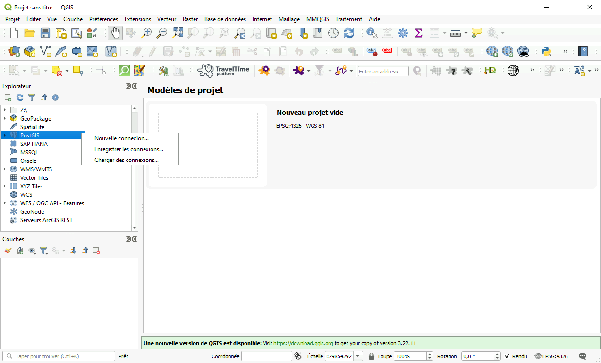

#  QGIS - Source libre et ouverte

??? quote "Qu'est-ce que QGIS"
	QGIS est un logiciel de bureau d'analyse géospatiale gratuit qui offre une interface utilisateur intuitive et prend en charge une large variété de types et de formats de données.
	
	QGIS propose un grand nombre de fonctions d'analyse SIG de base et de visualisations ; ainsi que la possibilité de télécharger des extensions pour des analyses plus complexes.

## Pour commencer
??? success "QGIS sur une machine virtuelle"
	QGIS est préinstallé sur votre machine virtuelle par défaut. Vous pouvez le trouver dans le menu Démarrer :
		

	??? info "AAW"
		QGIS est également disponible sur les *Bureaux à distance* accessibles via l'AAW.

		<b> Configuration d'un espace de travail dans l'AAW : </b>
		<a href="https://statcan.github.io/daaas/fr/1-Experiments/Remote-Desktop/" target="_blank"> Apprenez comment déployer un bureau à distance dans l'environnement AAW </a>

## Importation de données
??? example "Connexion à une base de données PostgreSQL"
	QGIS & PostgreSQL+PostGIS
	1. Sous l'onglet Explorateur, faites un clic droit sur PostgreSQL, puis sélectionnez *Nouvelle connexion*

		

	2. Une nouvelle fenêtre s'ouvrira :

		

	3. Entrez les informations suivantes :

		|Champ||Entrée|
		|---||---|
		|Nom||Le nom choisi (alias) pour la base de données|
		|Hôte||Instance de la base de données *voir les informations de configuration*|
		|Port||5432|
		|Base de données||Le nom réel de la base de données *voir les informations de configuration* |
		|Mode SSL||allow|
		|Authentification||*Appuyez sur le bouton vert +, puis saisissez vos informations d'identification cloud|
		|Afficher également les tables sans géométrie||OUI|
		**Tous les autres champs peuvent être laissés vides.

	4. Sélectionnez *Tester la connexion*

	5. La base de données apparaîtra désormais sous l'en-tête *PostgreSQL* dans l'Explorateur de QGIS

??? example "Ajout d'une couche - Glisser-Déposer"
	1. Localisez vos fichiers de données dans l'explorateur de fichiers Windows.
	2. Sélectionnez les fichiers de données que vous souhaitez ajouter (par exemple, shapefiles, fichiers raster).
	3. Faites glisser les fichiers sélectionnés dans la fenêtre de QGIS. Les données seront ajoutées en tant que couches dans le projet.

??? example "Ajout d'une couche - Gestionnaire de source de données"
	1. Allez dans le menu "Couche" et sélectionnez "Ajouter une couche" > "Ajouter une couche vecteur" ou "Ajouter une couche raster" (selon le type de vos données).
	2. Dans la boîte de dialogue Gestionnaire de source de données, cliquez sur le bouton "Parcourir" et naviguez jusqu'à l'emplacement où vos données sont stockées.
	3. Sélectionnez le(s) fichier(s) de données que vous souhaitez ajouter et cliquez sur "Ouvrir" pour les ajouter au projet.

??? example "Ajout d'une couche - Ajout rapide de couche"
	1. Cliquez sur l'icône "Ajout rapide de couche" dans la barre d'outils.
	2. Dans la boîte de dialogue, choisissez le type de données que vous souhaitez ajouter (par exemple, shapefile, raster).
	3. Parcourez l'emplacement de votre fichier de données et sélectionnez-le.
	4. Cliquez sur "Ajouter" pour ajouter les données en tant que couche dans le projet.

	

## Analyse
??? example "Utilisation des outils de traitement de QGIS"

	1. Accéder aux outils d'analyse : Dans l'interface de QGIS, localisez la boîte à outils de traitement. Elle peut généralement être trouvée soit dans le menu principal sous "Traitement", soit sous forme d'icône dans la barre d'outils. Cliquez sur la boîte à outils de traitement pour l'ouvrir.

	2. Choisissez l'outil d'analyse : Parcourez les différents outils d'analyse disponibles, organisés dans différentes catégories. Ces outils couvrent différents aspects de l'analyse géospatiale, tels que les statistiques spatiales, l'analyse de proximité, la gestion des données, et bien plus encore.

	3. Configurez les paramètres de l'outil : Une fois que vous avez sélectionné un outil d'analyse, une boîte de dialogue apparaîtra où vous pourrez configurer les paramètres de l'outil. Selon l'outil spécifique, vous devrez peut-être spécifier les couches d'entrée, définir les paramètres d'analyse, définir les options de sortie et ajuster d'autres paramètres.

	4. Exécutez l'analyse : Après avoir configuré les paramètres de l'outil, cliquez sur "Exécuter" ou "OK" pour lancer l'analyse. L'outil traitera les données en fonction des paramètres spécifiés et générera la sortie souhaitée.

## Formation
??? tip "Vidéos QGIS du SGC"
	Le Centre de géomatique statistique (SGC) de STC a produit une série de conférences en ligne qui offre une introduction à QGIS. Ces vidéos sont idéales pour les débutants, ceux qui passent d'un produit COST à QGIS, et les utilisateurs avancés souhaitant se remettre à niveau.

	Vidéo 1 - [Qu'est-ce qu'un SIG et pourquoi utiliser QGIS](https://www.statcan.gc.ca/fra/wtc/online-lectures/qgis/2019001) (lien externe)

	<iframe width="560" height="315" src="https://www.youtube-nocookie.com/embed/8oEnJvLzDnQ" title="Lecteur vidéo YouTube" frameborder="0" allow="accelerometer; autoplay; clipboard-write; encrypted-media; gyroscope; picture-in-picture" allowfullscreen></iframe>

	<a href="https://ouvert.canada.ca/data/fr/dataset/89be0c73-6f1f-40b7-b034-323cb40b8eff" target="_blank"> <b>Voir le catalogue complet de la série de conférences</b></a> (lien externe)

??? tip "Feuille de triche QGIS"
	

## En savoir plus

??? tip "Liens utiles"
	- [Documentation de QGIS](https://docs.qgis.org/testing/fr/docs/user_manual/managing_data_source/opening_data.html#creating-a-stored-connection)

	- [Documentation QGIS + Azure](https://techcommunity.microsoft.com/t5/azure-database-for-postgresql/qgis-azure-database-for-postgresql-postgis/ba-p/1152249)

	- [Ligne 45 - Utilisation de QGIS avec PostGIS: Un duo dynamique (livre blanc - uniquement en anglais)](https://www.line-45.com/post/using-qgis-postgis-dynamic-duo)
	
	- <a href="https://docs.qgis.org/3.16/fr/docs/training_manual/index.html" target="_blank"> Manuel de formation officiel de QGIS </a>

	- <a href="https://plugins.qgis.org/plugins/" target="_blank"> Répertoire des plugins Python QGIS </a>

	- <a href="https://www.qgistutorials.com/fr/" target="_blank"> Tutoriels et astuces QGIS </a>

??? tip "Meilleures pratiques"

	- Utilisez un fichier de projet : Commencez toujours par créer un fichier de projet pour votre travail. Cela vous aide à organiser vos couches et facilite le partage de votre travail avec d'autres personnes.

	- Utilisez le style des couches : QGIS offre de nombreuses options de style pour les couches. Utilisez-les pour rendre vos cartes plus belles et professionnelles.

	- Gardez vos données organisées : Tenez vos données organisées et à jour. Utilisez des noms de fichiers descriptifs et conservez vos données dans des dossiers logiques.

	- Utilisez les plugins : QGIS dispose d'une grande communauté de développeurs qui créent des plugins pour étendre ses fonctionnalités. Profitez de ces plugins pour rendre votre travail plus facile et plus efficace.

	- Utilisez les projections : Assurez-vous de comprendre les projections et utilisez-les de manière appropriée. Cela garantira que vos données sont précises et que vos cartes ont du sens.

	- Apprenez les raccourcis clavier : QGIS propose de nombreux raccourcis clavier qui peuvent vous faire gagner du temps et des efforts. Prenez le temps de les apprendre et vous serez plus productif.

	- Utilisez la communauté QGIS : QGIS dispose d'une communauté nombreuse et active d'utilisateurs et de développeurs. Utilisez la communauté pour en savoir plus sur le logiciel, obtenir de l'aide pour résoudre des problèmes et partager votre travail avec d'autres personnes.
