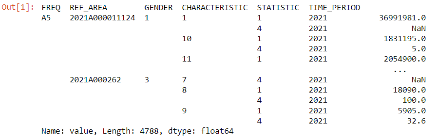

!!! bug "Cette page est incomplète"
	Plus d'informations et de services à venir !

??? quote "Qu'est-ce que SDMX ?"
    SDMX, qui signifie Statistical Data and Metadata eXchange, est une initiative internationale visant à normaliser et à moderniser les mécanismes et processus d'échange de données statistiques et de métadonnées entre les organisations internationales et leurs pays membres.

    En simple, SDMX est une nouvelle technologie qui simplifie la transmission de données statistiques. SDMX est un standard et une technologie permettant de structurer et de transmettre des données à l'aide d'un langage machine à machine. C'est :
    
    - Un modèle logique pour décrire et structurer le contenu
    - Un standard pour la communication automatique
    - Une technologie qui soutient la standardisation

### SDMX à Statistique Canada
Actuellement, les informations du Profil du recensement sont disponibles à tous les niveaux géographiques via une API SDMX. Cela offre une méthode moderne et simplifiée pour accéder aux données du recensement de Statistique Canada.

À l'avenir, tous les produits CODAR seront disponibles via une API SDMX. Un petit exemple est inclus ci-dessous.

<b> [En savoir plus sur l'API SDMX du Profil du recensement de 2021](https://www12.statcan.gc.ca/wds-sdw/2021profile-profil2021-fra.cfm) </b>

<br>

>NOTE:
>Cette fonctionnalité est encore en cours d'exploration. Alors que GAE continue d'explorer et d'apprendre à propos de SDMX, nous sommes enthousiastes à propos des possibilités qu'elle offre pour améliorer notre capacité à tirer des informations à partir des données.

### Exemple d'API
``` py title="STC Census Profile SDMX Python API"

import pandas as pd
import pandasdmx as sdmx
info = {
  "id": "STC_CP",
  "url": "https://api.statcan.gc.ca/census-recensement/profile/sdmx/rest",
  "name": "STC Census Profiles"
}
sdmx.add_source(info, id=None, override=True)
stc = sdmx.Request('STC_CP')
resp = stc.data('df_pr')
#df_pr- Canada, provinces and territories dataflow
data = resp.to_pandas()
#returns a series with a multi-index, "2-d series; 3-d data frame"
data

```
Le code ci-dessus renvoie ce cadre de données à indices multiples:

Après conditionnement de la colonne *Ref_Area*, vous pouvez ensuite la joindre à un cadre de données spatiales ou à une couche géographique.


|Code du flux de données||Nom du flux de données|
|---||---|
|DF_PR *||Canada, provinces et territoires <br> *utilisé dans l'exemple ci-dessus*|
|DF_ADA||zone de diffusion agrégée|
|DF_CD||divisions de recensement|
|DF_CMACA||régions métropolitaines de recensement et agglomérations de recensement|
|DF_CSD||subdivisions de recensement (municipalités)|
|DF_CT||secteurs de recensement|
|DF_DA||zones de diffusion|
|DF_DPL||lieux désignés|
|DF_ER||régions économiques|
|DF_FED||circonscriptions électorales fédérales (Ordre de représentation de 2013)|
|DF_POPCNTR||centres de population|


<b> [CHEAT SHEET DE L'API SDMX](https://github.com/sdmx-twg/sdmx-rest) : Le Groupe de travail technique sur le SDMX a également publié une fiche de triche de deux pages (PDF, 83 Ko) qui résume les points principaux de l'API RESTful SDMX 2.1. </b>
