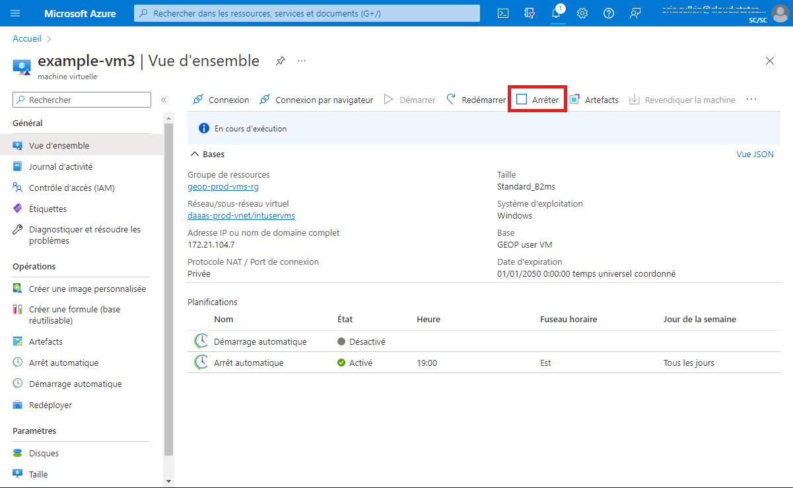
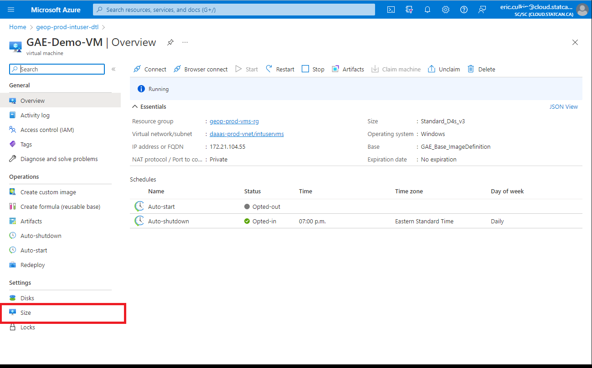
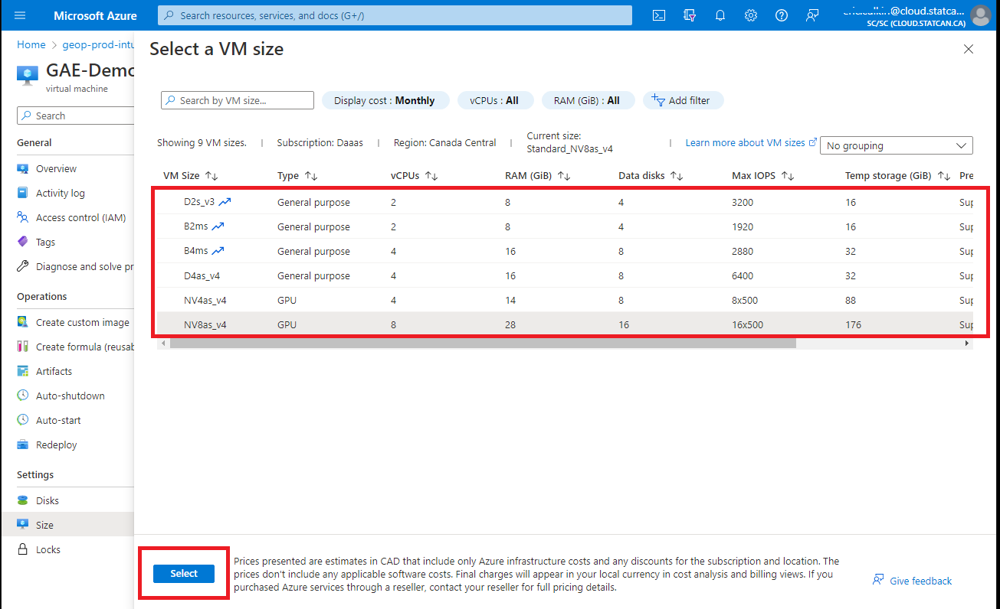
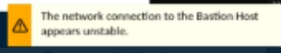

# À propos des machines virtuelles GEA
**Une machine virtuelle DAS-GEA peut être créée pour vous.**

???info "Les machines virtuelles GEA standard comprennent les éléments suivants :"
	Hardware:

	- 4vcpus, 14GiB Memory (plus grandes spécifications disponibles)
	- AMD Radeon Instinct MI25 GPU
	- Managed storage
	- [en savoir plus - Microsoft](https://docs.microsoft.com/fr-ca/azure/virtual-machines/nvv4-series)

	Software:

	- ArcGIS Pro *(licence personnelle requise)*
	- QGIS
	- Conda (via miniforge)
	- Python IDEs (pyCharm, VSCode, Jupyter)
	- & ressources identifiées lors de votre intégration au projet.

	??? info "Machines virtuelles sur AAW et CAE"
		Selon votre projet, il est possible que vous ayez la possibilité de créer une machine virtuelle standard via le CAE ou de créer un espace de travail dans l'AAW.
		Ces machines virtuelles en libre-service **ne sont PAS** optimisées pour le rendu géospatial.

## Utilisateurs externes (non-StatCan) :

??? example "Connexion à votre VM"
	1. Rendez-vous sur le lien suivant : **[Portail des services d'analyse de données](https://www.statcan.gc.ca/data-analytics-services/overview)**
	
	2. En haut à droite, sélectionnez **Se connecter**
	>
	3. Suivez les instructions de la fenêtre contextuelle pour vous connecter
	
	4. Faites défiler vers le bas, et votre machine virtuelle DAS sera répertoriée
	
	5. Utilisez l'interface pour démarrer, vous connecter, puis arrêter votre machine virtuelle
	
	!!!danger "Les machines virtuelles génèrent des coûts lorsqu'elles sont en cours d'exécution.     Vous devriez arrêter votre machine virtuelle lorsque vous ne l'utilisez pas afin d'éviter des frais inutiles.     Votre machine virtuelle est programmée pour s'éteindre automatiquement à 19 h, heure normale du Centre."
	
??? example "Demande de modifications à votre VM"
	Contactez : **statcan.dassupport-soutiendelads.statcan@statcan.gc.ca**
	
	Informations à inclure :
	
		- Votre nom de compte @ext.statcan.ca
		- Votre UCID (si connu)
		- Votre demande avec une brève explication
	
	Demandes courantes :
	
		- J'ai besoin de réinitialiser mon mot de passe
		- Je souhaite augmenter/réduire la capacité de ma machine virtuelle
		- J'ai besoin de logiciels supplémentaires/mis à jour
		- Je souhaite modifier la fonction de démarrage automatique et/ou d'arrêt automatique
		- Je rencontre une erreur et j'ai besoin d'aide

## Utilisateurs internes (StatCan) :

??? info "AVD vs DAS VM"
	DAS a été soigneusement conçu pour permettre aux utilisateurs d'utiliser leurs AVD (Azure Virtual Desktops) pour accéder aux services DAS-GEA. Dans la majorité des cas, AVD répondra à vos besoins et fournira les fonctionnalités nécessaires pour vos besoins en analyse de données.
	
	Raisons de demander une machine virtuelle DAS :
	
	1- **Puissance de calcul accrue** : Les machines virtuelles DAS offrent un avantage lorsque les utilisateurs ont besoin de machines virtuelles à haute capacité dépassant ce que peut offrir AVD. Dans de tels cas, les utilisateurs peuvent également exercer un certain contrôle sur la mise à l'échelle en utilisant les options en libre-service.

	2- **Tâches automatisées** : Les machines virtuelles DAS peuvent être configurées pour un démarrage automatique, ce qui permet aux utilisateurs d'automatiser des tâches à l'aide du gestionnaire des tâches Microsoft. Cette fonctionnalité simplifie les processus répétitifs et améliore la productivité. *J'ai besoin que ce processus s'exécute tous les lundis à 6 heures du matin.*

	3- **Disponibilité des logiciels** : Les machines virtuelles DAS peuvent offrir des logiciels qui ne sont pas disponibles sur AVD. Actuellement, nous proposons des versions plus récentes de logiciels tels que ArcPro, QGIS et pgAdmin, permettant aux utilisateurs de tirer parti des dernières fonctionnalités et améliorations.
	
	<!-- OMITTED
	**Machines virtuelles partagées** (En cours d'examen) : Il est possible (avec une approbation de sécurité appropriée) que des projets partagent une machine virtuelle. Par exemple, un projet peut nécessiter une machine virtuelle partagée pour le traitement des observations terrestres, accessible par plusieurs personnes, favorisant ainsi la collaboration.
	-->

??? example "Trouver et réclamer une machine virtuelle"
	1. Accédez à l'URL du portail Azure à partir d'OZ (NE PAS utiliser votre AVD à moins d'une raison spécifique !)
		**https://portal.azure.com/#home**

	2. Sélectionnez **Plus de services**, et filtrez/recherchez *DevTest Labs*
		  
		
	3. Modifiez le filtre des abonnements en : *ALL* ou *DAaaS*

		Sélectionnez **geop-prod-intuser-dtl**

		  

	4. Dans le menu de gauche, sélectionnez : *Machines virtuelles réclamables*

		  

	5. Localisez et sélectionnez votre machine virtuelle. Votre machine virtuelle sera nommée : *projectAccroymn-statcanID*

		*ex : gae-namenick*

		  

	6. Sur la page d'aperçu de la machine virtuelle, sélectionnez *Réclamer la machine*

		  

	7. La réclamation prendra quelques minutes. Attendez le message "Réclamation réussie" avant de continuer.
		  

	8. Sélectionnez *Connexion par navigateur*. Un nouveau panneau s'ouvrira à droite.

		Saisissez votre nom d'utilisateur : StatCanID *(ex : namenick)*
		
		Saisissez le mot de passe temporaire : *(fourni via l'e-mail d'intégration)*
		
		Sélectionnez *Connecter*

		  
	
	??? tip "Désactiver les bloqueurs de fenêtres contextuelles"
		Après avoir tenté de vous connecter pour la première fois, une erreur peut apparaître indiquant qu'un bloqueur de fenêtres contextuelles empêche l'ouverture d'une nouvelle fenêtre. Pour le désactiver, une icône apparaîtra dans la barre de recherche du navigateur, sélectionnez le bouton et cliquez sur **toujours autoriser**.
		

  
??? example "Démarrage et connexion à votre machine virtuelle"

	1. Accédez à l'URL du portail Azure à partir d'OZ (NE PAS utiliser votre AVD à moins d'une raison spécifique ! voir la section *Conseils* ci-dessous) :
	
		**https://portal.azure.com/#home**
		
		Sélectionnez *DevTest Labs* dans la section *"Mes ressources récentes"*
		
		Sélectionnez votre machine virtuelle
		
		

		À partir de la page d'aperçu de la machine virtuelle, cliquez sur le bouton *Démarrer*.  

		  

		La machine virtuelle met quelques minutes à démarrer. Suivez sa progression de démarrage en sélectionnant l'icône de Notifications en haut à droite de la fenêtre.   

	

	**Connexion à une machine virtuelle :**

	1. Après le démarrage, attendez la notification de succès (cela peut prendre quelques minutes)
		
	2. - À partir de la page **Aperçu** de votre machine virtuelle, cliquez sur le bouton **Connexion par navigateur** 
		   

	3. Assurez-vous que la case à cocher *Ouvrir dans une nouvelle fenêtre* est sélectionnée, saisissez le nom d'utilisateur et le mot de passe, puis cliquez sur le bouton *Connecter*. Votre machine virtuelle s'ouvrira dans un nouvel onglet du navigateur.
	!!!danger "Les machines virtuelles entraînent des coûts lorsqu'elles sont en cours d'exécution.     Vous devriez éteindre votre machine virtuelle lorsque vous ne l'utilisez pas pour éviter des frais inutiles.     Votre machine virtuelle a une heure d'arrêt automatique à 19h CST."

   
??? example  "Arrêter votre machine virtuelle"

	1. À partir de la page **Aperçu** de votre machine virtuelle, cliquez sur le bouton **Arrêter**.  

		  

??? example  "Redimensionner votre machine virtuelle (autoservice)"
	Les utilisateurs ont la possibilité de redimensionner leurs machines virtuelles pour économiser des ressources (coûts) ou augmenter les performances.

	1. À partir de la page d'aperçu des machines virtuelles, sélectionnez **Taille** dans la barre de menu de gauche
	

	2. Sélectionnez la taille souhaitée, puis cliquez sur **Sélectionner** en bas de la fenêtre
	

	Si vous avez besoin de spécifications différentes de celles des machines virtuelles répertoriées, [envoyez un ticket de support technique à DAS-GAE](contact.md)

##Erreurs et conseils

??? tip "Erreurs courantes, correctifs et conseils"
	|Erreur||Solution|
	|----||----|
	|||Votre machine virtuelle est encore en cours de démarrage ; attendez une minute et réessayez|
	|||Vous avez probablement saisi le nom d'utilisateur ou le mot de passe de la machine virtuelle de manière incorrecte, réessayez.|
	|||Vous rencontrez une latence réseau ; cela se résout généralement de lui-même. Sinon, essayez de redémarrer votre machine virtuelle|

??? tip "Conseils"

	:triangular_flag_on_post: N'utilisez **PAS** AVD pour vous connecter à une machine virtuelle. AVD est également une machine virtuelle Azure Cloud, vous augmentez donc seulement les coûts des ressources. Utilisez AVD uniquement si vous avez une raison spécifique.

	:triangular_flag_on_post: Rendez-vous au [Centre de connaissances](python.md) pour obtenir de l'aide sur la configuration des bibliothèques et des packages Python.

	:triangular_flag_on_post: L'utilisation de raccourcis clavier lors de la connexion à une machine virtuelle peut ne pas donner le même résultat attendu. Par exemple, *ctrl + z* fermera votre fenêtre principale du navigateur, pas la fenêtre du navigateur de la machine virtuelle.

	:triangular_flag_on_post: Les machines virtuelles ont une heure d'arrêt automatique à 19h CST. (cela peut être ajusté sur demande : [FAQ](contact.md))

	:triangular_flag_on_post: [Déplacer la barre des tâches](https://support.microsoft.com/hr-hr/topic/how-to-move-the-windows-taskbar-from-its-default-position-or-reset-it-to-its-default-position-71e48b52-9373-191a-d3e8-78fe78419302) en haut ou sur le côté de la machine virtuelle peut aider à différencier votre espace de travail OZ-PC de celui de la machine virtuelle.

	:triangular_flag_on_post: Plusieurs écrans ? Vous ne pouvez pas modifier les paramètres d'affichage des machines virtuelles, mais il existe un moyen d'utiliser *presque* plusieurs moniteurs. Utilisez le bouton *Restaurer*   dans votre fenêtre du navigateur, puis faites glisser pour redimensionner la fenêtre sur plusieurs écrans pour obtenir un effet multi-écran. Vous devrez peut-être ajuster certaines configurations dans les paramètres d'affichage de votre ordinateur portable OZ.

	:triangular_flag_on_post: Par défaut, la machine virtuelle **Ubuntu** s'ouvre en mode Terminal. Vous pouvez accéder à l'interface graphique de votre machine Ubuntu depuis une machine Windows en utilisant [X2Go](https://docs.microsoft.com/en-us/azure/machine-learning/data-science-virtual-machine/dsvm-ubuntu-intro#x2go).

